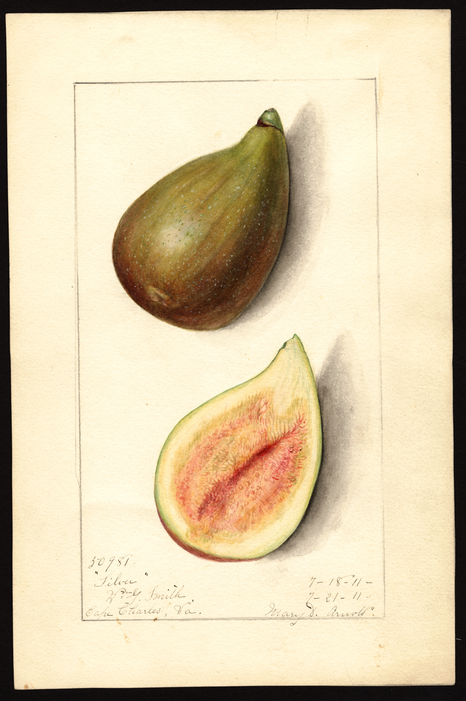

<figure>

<figcaption>Figure 1. Open eye, closed eye, and the canopy you owe the rain. Staged stand-in (prune.46.usda-pom-celeste-1911); USDA NAL POM00007441 (Celeste), Mary Daisy Arnold, PD. Prefer publish photo from D:\FIGS\Fig Fruit — closed-eye vs open-eye canopy air. See RIGHTS.md.</figcaption>
</figure>
Pruning will not redesign a fruit. Celeste’s closed ostiole is why it shrugs off a rain that sours a Magnolia. LSU Gold’s open eye is why UF says pick it as soon as it is ripe. Kadota has an open eye that a honey plug only partly forgives. You cannot cut a closed eye onto an open-eye fig.

You can decide whether the fruit sits in a wet leafy bowl or in moving air.

## The humidity prune

This is not a heading. Headings make more leafy laterals if you do them at the wrong time. This is a winter thinning of the interior: two arms that cross, a sucker that is a wall, a low skirt that never dries after the dew.

In 8a Piedmont and in every Gulf yard, that thinning is fruit quality. In a dry western 8a, it is optional and sometimes unwise (draft 37).

## Open-eye varieties in this climate

Magnolia/Brunswick, Kadota, LSU Gold, some Missions, anything the birds and the rain can enter. If you keep them:

- Counted leaders, not a thicket.
- Fruit toward the sun, not in a green cave.
- Pick on the early side for preserves if the forecast is a three-day rain.
- Do not late-summer heading-cut them into a new nursery of soft leaves on top of ripening fruit.

If that sounds like work, plant Celeste, LSU Purple, Hunt, or another closed or tight eye, and prune those for flavor and size instead of for damage control.

## Closed-eye varieties

They still rust. They still drop leaves in a wet August and then take winter worse because they went into the cold tired. A little air still helps. You just do not have to treat every rain as a crisis.

## 8a center

Rain at harvest is normal. The canopy is the only prune that talks to rain. The breba/main vote talks to the calendar. Do not mix the two motions. You can leave tips *and* open a hallway in the middle. That is the grown-up 8a bush: early fruit on the rim, weather moving through the room.
