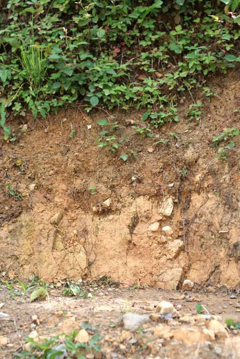

<!-- orchard_slot: D:\FIGS\Figs — hero still before publish -->
<figure>

<figcaption>Figure 1. Heavy clay soil holds water — fine in a pantry layer, deadly in a sealed planting bowl. PD/CC staging fill — swap for a Keith still from PHOTO_NOTES (`D:\FIGS` first) before publish. Credits: RIGHTS.md.</figcaption>
</figure>

South Arkansas clay gets blamed for every yellow leaf in the county. Some of
that blame is earned. A lot of it is lazy. Clay holds nutrients. Clay holds
water through a dry week. Old Southern figs lived in it for a century without
a bag of perlite. The tree did not need loam. It needed the water to leave
after the storm.

Texas A&M will grow a fig in “relatively heavy clay” if the water moves. That
sentence is the one people skip so they can buy a soil conditioner. Clay that
sheds is a pantry. Clay that ponds is a bowl. Same mineral. Different shape.

I walk a yard after a thunderstorm before I walk it with a catalog. Where did
the water sit? How long? Did it smell like a ditch the next morning? A fig
root wants oxygen as much as it wants a drink. In a bowl, the drink wins for
twelve hours and the oxygen loses for a week. Leaves yellow. You add
nitrogen because yellow means hungry in every video. Yellow is often wet
feet. Dig before you dump.

Clay also bakes. July sun on bare red dirt makes pottery around a shallow
mat. That is the other clay injury, and it looks like drought even though the
county had rain last Tuesday. The water is down there. The surface sealed.
Mulch is how you stop the pottery. A hoe is how you cut the roots. NC State
will not cultivate a shallow fig. I am with them on the hoe.

People try to “fix clay” by mixing a truck of sand into a hole. That is how
you make a low-rent adobe brick. Sand plus clay plus water plus time is
concrete enough to make a root turn around. If you want to change clay, you
change the *grade* — berm, ridge, raised bed — and you add organic matter at
the surface, slowly, for years. You do not reinvent the subsoil on a
Saturday.

Zone 7 clay that sits wet into a freeze is a different fight than our 8a
clay that sits wet into a humid August. Same bowl. Different second injury.
In 7 the wet crown plus a hard night can take the plant at the soil line. In
8a the wet crown plus heat is phytophthora weather and a sour smell. Zone 9
clay on the Gulf just stays wet longer than your patience. Raise it anyway.

I have used topsoil, compost, manure that has aged enough not to burn. I have
also killed time and money trying to turn a wet spot into a fig orchard. The
wet spot won. I would rather plant high on honest clay than deep in a fantasy
loam. The pantry was always there. The bowl is the part you built with a
shovel.

I still plant in clay on purpose. The pantry holds a dry week
better than a sand sheet I would have to baby. What I will not
do is plant in the lowest clay on the lot because it looked
open. Walk the yard when it is ugly. The pretty Saturday in
May is a liar. The morning after a two-inch rain is the tour
I want. If you only remember one clay sentence: raise the
crown, mulch the mat, leave the subsoil alone. The bowl is a
shape you can change with dirt you already own. The pantry
was the clay’s gift. Stop trying to return it.
