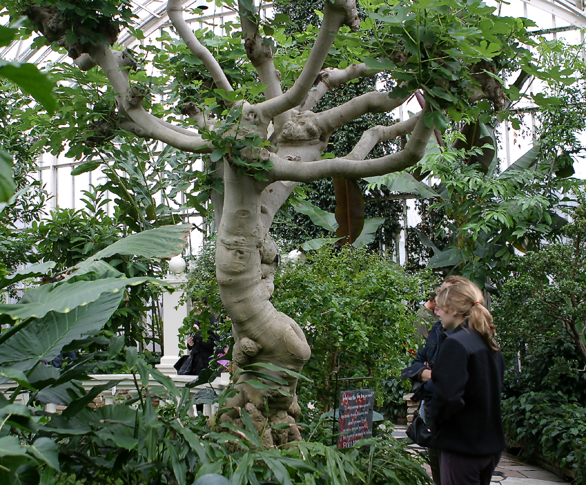

<!-- orchard_slot: D:\FIGS\Figs — hero still before publish -->
<figure>

<figcaption>Figure 1. Common fig tree in the landscape — planting depth and berm shape matter more than variety hype. PD/CC staging fill — swap for a Keith still from PHOTO_NOTES (`D:\FIGS` first) before publish. Credits: RIGHTS.md.</figcaption>
</figure>

Texas A&M says plant a fig 2 to 3 inches deeper than it grew in the
nursery. I say plant high so the crown is not in a lake. Those two
sentences look like a fight. They are not, if you hear where each one
is standing.

TAMU is talking freeze and a nursery ball. Deeper planting buries a
little trunk, encourages roots above the old line, and gives you
insurance when the top dies. That is a Gulf and Texas winter
sentence. It assumes the hole *drains*. It does not assume you
lowered the crown into a dish.

I am talking a clay bathtub in South Arkansas. If I take TAMU’s two
inches and apply them at the bottom of a puddle, I have buried a
collar in a lake. That is how you grow slime at the crown. The extra
inches belong *relative to the berm surface*, not relative to the
flood grade. Plant the tree a little deeper in the mound. Keep the
mound above the lake. Both instructions survive.

UC IPM wants the graft union two inches above the soil if you have
one. Most common figs in our world are cuttings, not grafts, so that
line is a reminder more than a rule: do not bury a union, and do not
bury a crown in a sump. On a cutting, I still want to see where the
trunk meets the mix after the soil settles. A little extra depth on a
berm is fine. A trunk that disappears into a wet hole is not.

I do not fertilize at planting. TAMU: the first growth comes from
stored carbohydrate. Water to settle. Cut back a dormant plant some
to match lost roots if that is the job. Do not strip a leafy July
plant to plant it, and do not dump a lawn spreader in the hole to
“help.”

Spacing is the other depth people get greedy about. TAMU: no closer
than 16 feet if the tree can reach 20. UAEX talks 25 to 30 on a
well-fed, unfrozen tree. Most of ours never get that speech. Still:
do not plant two keepers in a bathtub and call it a collection. A
nursery row at 4-inch spacing is a nursery. Dig the keepers out.

Zone 7 should steal TAMU’s extra inches *and* the berm. They need
the buried insurance and they need the crown out of ice water. Zone
9 can take the extra inches more casually if the hole sheds; their
fight is nematodes and rust, not a 10°F night. 8a takes both. Deep
enough in the mound. High enough on the yard.

If you only remember one picture: a fried-egg berm, the yolk a
little thicker than the nursery line, the white wide enough that a
storm cannot put the yolk underwater. That is TAMU and the puddle
test in the same hole.
