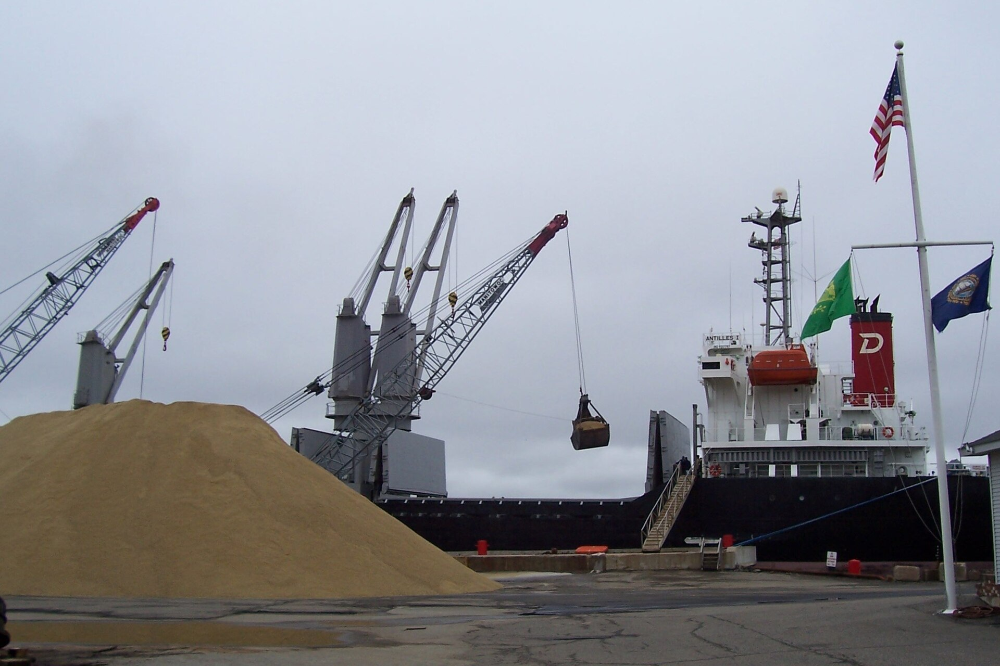

<!-- orchard_slot: D:\FIGS\Figs — hero still before publish -->
<figure>

<figcaption>Figure 1. Gypsum stockpile — gypsum adjusts chemistry on some sodic soils; it does not empty a bathtub hole. PD/CC staging fill — swap for a Keith still from PHOTO_NOTES (`D:\FIGS` first) before publish. Credits: RIGHTS.md.</figcaption>
</figure>

The bag is hopeful. Clay buster. Soil conditioner. A picture of
a garden that drains. I have dumped gypsum on a puddle and
still had a puddle. The chemistry and the grade are different
jobs.

Gypsum is calcium sulfate. In a sodic soil — too much sodium
on the clay — calcium can help the crumbs come back. That is
a real mechanism. It is also a mechanism most fig holes in
South Arkansas do not have. Our clay is wet because it sits
in a dish, or because we glazed the bottom with a shovel, or
because the county delivers a storm faster than a profile can
take it. Calcium will not cut a new outlet.

If you do not have a soil test that talks sodium, you do not
have a gypsum diagnosis. You have a bag. I would rather you
run the puddle test and build a berm. If the test comes back
sodic, talk to the agent about rate and timing.
**[VERIFY]**. I will not print a pounds-per-hundred-square-
feet number I did not measure on your clay.

Gypsum is also a sulfur and calcium source some container
growers like. That is a pot conversation, and even there I
will not turn it into a law. A #3 that drains does not need a
conditioner so much as it needs perlite you can see and a
hose that is not a softener. A #3 that does not drain needs a
new mix, not a powder.

People stack gypsum with sand and Promix in the same pretty
hole. That is three wishes in one sump. The sump still wins.
Do the grade. Then, if you want, feed the surface. Powder is
not a drain.

Zone 7 winters do not care about your bag. Zone 9 rains will
wash the hopeful powder into the next county if you broadcast
it on a crust. 8a clay will swallow a bag and ask for a berm
anyway. I have bought the bag. I have also bought the lesson.
The puddle was not confused. The label was optimistic.

If a neighbor swears gypsum saved their garden, ask whether
they also raised the bed, added chips, and stopped parking on
the ring. Those three do more in a year than a conditioner
does in a slogan. Credit the work. Leave the magic on the
shelf until a sheet says sodium.

I will use gypsum as a calcium talk in a pot if the mix
is peat-heavy and I want a buffer, and even then I am
not married to it. Lime and crushed oyster are other
talks. None of them empty a dish in the yard. If a
YouTube soil doctor stacks gypsum, sand, and wetting
agent in one hole, that is three products and still one
bowl. Walk away from the cart. Bring a shovel and a
morning. The puddle test does not sell a bag. That is
why I trust it.
