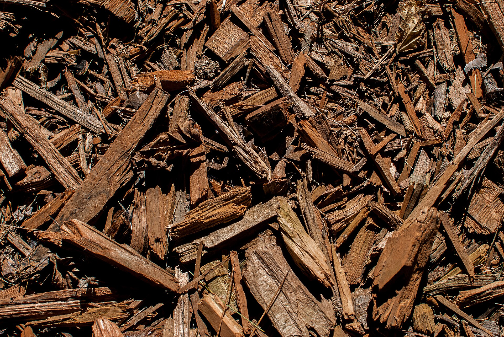

<!-- orchard_slot: D:\FIGS\Figs — hero still before publish -->
<figure>

<figcaption>Figure 1. Wood chip mulch texture — chips, hay, and straw each change how fast the top two inches dry. PD/CC staging fill — swap for a Keith still from PHOTO_NOTES (`D:\FIGS` first) before publish. Credits: RIGHTS.md.</figcaption>
</figure>

I do not care which church of mulch you attend. I care that
August sun is not hitting bare clay that baked into pottery
around the roots. That said, the churches fail in different
ways, and I have sat in most of them.

Arborist chips are my default. Coarse enough to let rain in.
Ugly enough that guests comment. They last. They do not blow
to the fence in one wind. If they came off a walnut or a
diseased oak I ask questions. If they came off a clean
street tree I spread them wide and I sleep. Fresh chips can
tie up a little nitrogen at the interface. I do not panic. I
do not dump a lawn fertilizer on the ring to “correct” a
theory. The fig is eating below that interface if the hole
drains.

Spoiled hay is what Texas A&M pictures around a winter cage,
then pulls back as mulch in spring. We have used farm
leftovers when we also keep chickens. Hay seeds. Hay mats
when it stays wet. Hay against a trunk is a collar. I like
hay as a winter stuff-the-cage material more than as a
year-round carpet, but a thin hay layer on clay in June
still beats pottery. Pull the slugs out with your eyes open.

Pine straw is clean to look at and it sheds water if you pile
it like a thatch. A light layer is fine. A thatch is a roof.
Figs want a blanket, not a roof. Straw does the same roof
trick if you buy the pretty bales and stack them. Break them
up. Let them look messy.

Leaves are free and they mat. Oak leaves in a wet 8a winter
can become a slick page on the soil. I run the mower over
them or I mix them with chips so they cannot seal. Do not
rake rust leaves into the ring and call it cycling. The rust
draft in the pest set can have that blanket. This pack says:
diseased litter leaves the yard.

Grass clippings cook and stink in a pile. A thin scatter
dries and disappears. I will not build a fig ring out of
weekly clippings from a lawn you treated with a weed-and-feed.
That is how you write a bad year into a shallow mat.

Zone 7 people love leaves because they have them. Zone 9
people love chips because hay is a fire and a seed. 8a can
use all of it if the trunk stays visible and the rain can
enter. Pick the ugly that you can get for free and refresh
before July. The church does not matter. The pottery does.

Walnut chips I treat as a question, not a panic. I do
not make a fig ring out of a fresh walnut pile I cannot
name. Mixed street-tree chips I use. Colored playground
mulch I do not use — dye and fines and a look I do not
need. If the only free pile is painted, I would rather
buy a raw yard of chips or use leaves I shredded. The
church can be poor. It should not be a product that was
trying to be a playground.
