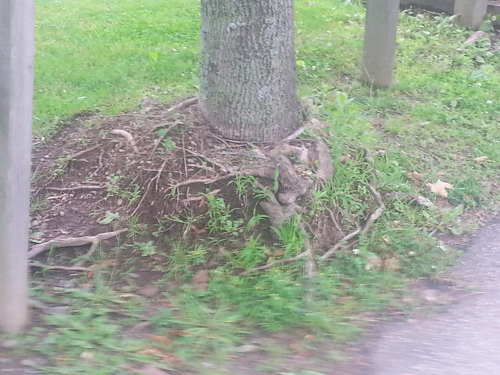

<!-- orchard_slot: D:\FIGS\Figs — hero still before publish -->
<figure>

<figcaption>Figure 1. Volcano mulch piled on a tree trunk — the habit that cooks bark and invites rot on figs. PD/CC staging fill — swap for a Keith still from PHOTO_NOTES (`D:\FIGS` first) before publish. Credits: RIGHTS.md.</figcaption>
</figure>

Every year the chips creep in. Every year I rake them back. That
is not fussiness. That is how you keep a crown from living in a
wet sock.

A fig collar that stays dark and soft is a place for slime,
borers if you have them, and a freeze injury that looks like
disease in March. I want to see the flare. I want air on the
bark at the soil line. The blanket starts a hand away, then
goes wide. People pile a volcano because the bag said 3 inches
and they measured at the trunk. Measure at the dripline. Starve
the trunk of the pile.

Kids and dogs and a mower will kick the chips back in. So will
a storm. This is a spring and a fall five-minute job, not a
personality. If you do not want the job, you will still do it
the year the bark sloughs and you think you have a canker. You
will have a collar.

Hay and leaves are worse than chips against bark because they
mat. A mat is a poultice. Pull it. If you stuff a winter cage
with hay, as TAMU describes, pull that hay back after the last
frost and use it as a ring, not as a turtleneck. The cage was
a coat. The turtleneck is a problem.

Pots get a version of this. A chip layer on a #3 helps the
surface stay from baking. A chip layer piled against a green
trunk in a can that already stays wet is a gnat farm. Thin on
pots. Wide on the ground.

I have used a ring of small rocks to remind me where the
blanket stops. I have also watched the rocks sink and the
chips win. The reminder is for me, not for the tree. The tree
only needs the air.

Zone 7 collars plus ice are how you take a plant at the soil
line after a winter you thought you wrapped. Zone 9 collars
plus heat are how you grow a sour smell you will blame on
rust. 8a collars do the August smell and the January slime if
you let them. Rake. It is not a theory. It is a hand.

If the trunk already looks wet and dark at the line, pull the
mulch, let it dry, and stop watering the collar. Water the
dripline. The tree drinks out there. The sock was never a
drink. It was a habit.

Winter hay in a cage is the one pile I allow near a
young trunk, and I still want air, not a soaked
turtleneck. TAMU stuffs cages and then pulls the hay
back as mulch. That pull-back is the job people skip.
They leave the turtleneck until May, the bark stays
dark, and they call it winter injury. Some of it is.
Some of it is a sock. Pull the hay. Show the flare.
Then the chips can start a hand away like they should
have all year.
