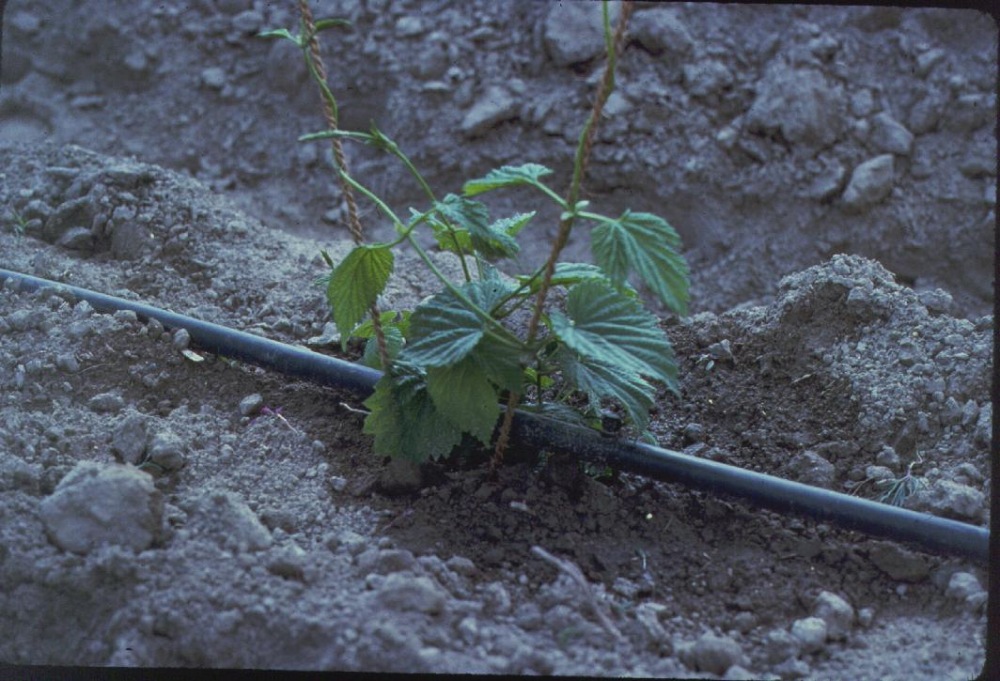

<!-- orchard_slot: D:\FIGS\Greenhouse photos — hero still before publish -->
<figure>

<figcaption>Figure 1. Drip irrigation line — deep, infrequent water once roots own the county, not the pot. PD/CC staging fill — swap for a Keith still from PHOTO_NOTES (`D:\FIGS` first) before publish. Credits: RIGHTS.md.</figcaption>
</figure>

UC IPM wants established fruit trees watered deeply and
not often — hours, not minutes, to wet feet, every couple
of weeks, drip line and beyond, not at the trunk. That is
a California orchard sentence that still has a use in an
Arkansas yard *once the fig owns some dirt*. A first-year
tree does not own dirt. A pot does not own dirt. Do not
steal the established clock for a baby.

What “deep” means on our clay: a slow drink that wets
below the pottery and out past the dripline, then a wait
until the finger says the top of the root zone has dried
back. What it does not mean: a blast from a jet nozzle
that runs off the berm and waters the lawn. What it does
not mean: a daily sprinkle that never leaves the chips.

I do not water the trunk. Wet collars are a disease
conversation. I water the ring. If I have drip, the
emitters live out where the mat is going, and I move them
out as the tree grows. If I have a hose, I set it and I
walk away long enough to be bored. Bored is how you know
it was not a sprinkle.

Sandy ground steals the wait. UC says every 3 to 5 days
on sand, a week and a half to two on heavy dirt, more in
heat. That matches a hand better than a timer. Clay that
sheds can wait. Clay that ponds should not be watered
because a clock said so.

Late summer I ease off an in-ground tree that is ripening
and still sitting in our rain. UC says reduce water in
late summer and fall. I will not cargo-cult a California
deficit percentage onto a #3. I will stop flooding a
softening crop the night before a storm. Even is the
word. Hero is the split.

Zone 7 established trees still lose the plot in a dry
fall — water before a freeze, then wait. Zone 9
established trees may never see the “every two weeks”
dream because the heat does not blink. 8a can use the
deep-and-infrequent clock on a keeper in clay that
drains, year three on, if the rain is not already doing
the job. The year the county is crunchy, I do not
perform Mediterranean. I drag the hose.

The tree has to earn this clock. Wood, a mat that has
left the planting circle, a hole that emptied in the
morning. Until then you are in the first-two-summers
draft. After that, you can put the timer in a drawer and
use a finger. The county is the reservoir. The hose is a
guest.

I move emitters out as the dripline moves. Year-three
emitters still hugging the trunk are a wet collar and
a dry edge. The mat left. The plastic did not. Walk
the wet spots after a cycle. If the wet is a doughnut
against bark, you are watering a sock. Slide the line.
The county is the reservoir. The hose is a guest that
has to sit in the right chair.
