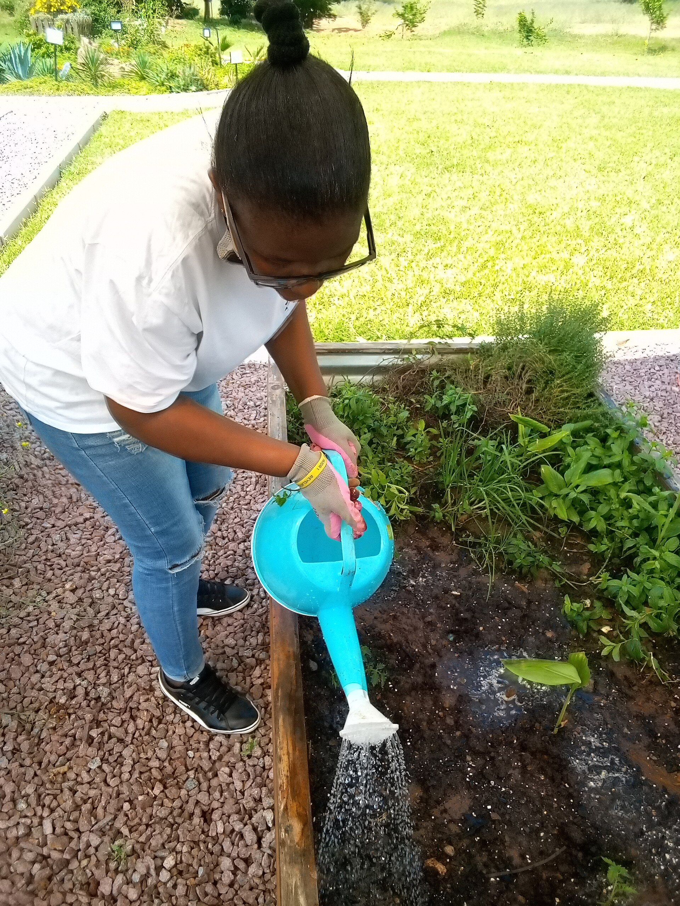

<!-- orchard_slot: D:\FIGS\Figs — hero still before publish -->
<figure>

<figcaption>Figure 1. Watering young plants — year-one fig water is establishment, not the July drought game. PD/CC staging fill — swap for a Keith still from PHOTO_NOTES (`D:\FIGS` first) before publish. Credits: RIGHTS.md.</figcaption>
</figure>

I already said the first two summers are a hose job. This
is the close-up. Year one is not “deep and infrequent.”
Year one is “do not let the ball dry into a brick while
the native dirt around it is still a stranger.”

The nursery ball and the county do not speak yet. Water
follows the mix, hits the clay wall, and may sit — or it
follows the mix, runs out, and the ball shrinks away from
the wall. Both happen. I water the ball until the native
dirt at the edge is damp, then I wait until the top of
*that* zone says so. I do not soak a pretty Promix shaft
into a soup. If I planted high in native backfill like I
asked you to, the soup is less likely. If I planted in a
pretty hole, year-one water is how I finish the drowning.

A basin on a berm holds a slow drink. A hose left to jet
off the slope is a performance. I want gallons that stay.
UC’s 3 to 5 gallons a week for a young tree is a starting
whisper, not a law. Heat and sand raise it. Clay and rain
lower it. **[VERIFY]** with your finger in your week.

I would rather miss a feed than miss a July drink on a
baby. I would rather miss a drink than water a bowl that
still holds yesterday’s storm. Those two sentences live
together. The puddle test did not retire after planting.
I still look at the hole after thunder.

Sprinklers that kiss the leaves every afternoon teach
nothing useful to an in-ground baby and they feed rust.
A drip loop or a soaker ring is cleaner. A hose on a
slow trickle is honest. We use sprinklers on the *pot*
block because the count is hundreds. A year-one in-ground
tree is one plant. It can have a trickle.

Zone 7 year-one water has to leave the plant going into
winter slightly moist, not a swamp, not a bone. Zone 9
year-one water is almost a pot schedule if the dirt is
thin. 8a year-one water is a spring that lies and a
summer that bills you. Stay for the bill.

If the baby wilts at 2 p.m. and stands up at dusk, I
check the dirt before I panic. Afternoon wilt on a hot
day can be theater. Afternoon wilt on a plant whose ball
is dust is a funeral starting. Poke. Then decide. The job
is not a personality. It is a year of paying attention
until the county takes over.

A basin on a berm that you refresh after it washes is
worth more than a gadget. I rebuild the basin twice
the first summer because storms take it. That is
normal. A jet nozzle is how you lose the basin and
the mulch in one minute. Trickle. Bored. Then poke.
Year one is attention. Year three is the county. Do
not skip the bill in between.
