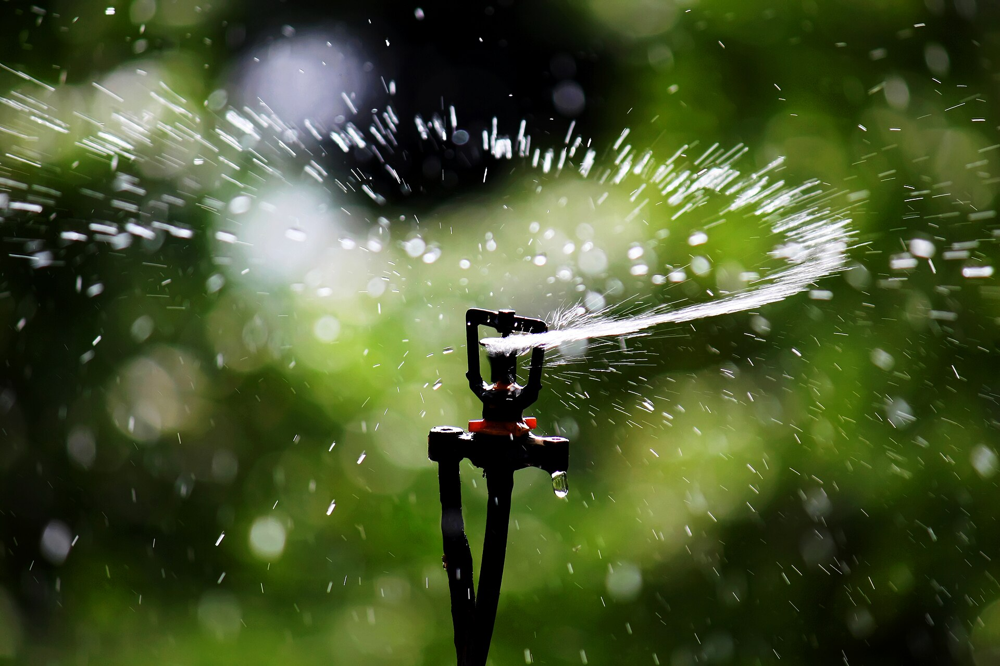

<!-- orchard_slot: D:\FIGS\Figs-summer-23 — hero still before publish -->
<figure>

<figcaption>Figure 1. Sprinkler irrigation head — overhead water wets leaves and feeds rust in sticky zone 8a air. PD/CC staging fill — swap for a Keith still from PHOTO_NOTES (`D:\FIGS` first) before publish. Credits: RIGHTS.md.</figcaption>
</figure>

UC IPM says avoid overhead when you can. Morning sun
dries leaves after a wet night. TAMU wants an east or
south wall for the same dry-off after evening rain.
Fig rust is worse in rainy seasons. I know all of
that. We still run sprinklers on the pot block.

That is not hypocrisy I am proud of. That is a count.
Jack’s least-favorite chore was walking fertilizer
around hundreds of pots. Hand-watering that many cans
is how you start skipping rows. A brass siphon and
sprinklers on days it does not rain is how we kept
trees alive. Ten trees can have drip. Three hundred
cannot, not on the hardware we actually walk.

What I will own: dusk sprinklers are a gift to a
fungus. Morning is saner. Leaves can dry. Fruit can
dry. I would rather run early than run pretty at
sunset. Near harvest I skip when the sky is working,
and I skip when the fruit is open-eyed and soft. Tight-
eye names forgive more. I still do not need to bathe
them for fun.

In-ground keepers can have a soaker or a drip loop at
the dripline. They do not need a shower. A year-one
tree can have a trickle. The overhead argument is a
collection argument. If you have four figs and you
overhead every afternoon because the lawn timer is
right there, you are not us. You are a lawn. Move the
heads. The rust will still come in a wet year. You do
not have to help.

I rake rust leaves. I do not pretend sprinklers are
free. We have not published a trial that says they
cost us X percent of a crop. **[VERIFY]** on your
fruit in a wet August. I will not invent the percent.
I will say I have seen more rust on the wet side of a
row than on the side the house shadowed in the
afternoon. Water and shade stack.

Zone 7 overhead in a short humid spell is still a
choice. Zone 9 overhead is how you write a rust
calendar. 8a overhead is the compromise I live with
and the compromise I will talk you out of if your
count is ten. Be honest about the count. Do not copy
our sprinklers onto a backyard of four names and call
it how FigRoots does it. FigRoots does it because the
library is a library.

If your count is ten, do not copy our sprinklers and
call it how FigRoots does it. FigRoots does it because
the library is a library. Four names can have drip at
the dripline and a morning hour. Dusk is a gift to a
fungus even when I run heads on the block. Be honest
about the count. Then pick the tool. Then rake the
leaves the tool does not excuse.

I still rake. Sprinklers do not buy a pass on dirty
rings. Morning if I run heads. Skip when the fruit is
soft. The fungus does not care that the library is
large. It cares that the leaf stayed wet.
