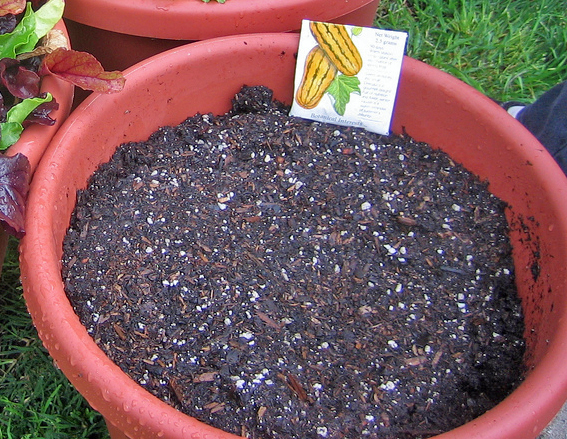

<!-- orchard_slot: D:\FIGS\Greenhouse photos — hero still before publish -->
<figure>

<figcaption>Figure 1. Moisture-retaining potting mix — moisture-control bags are a drowning kit in humid summers. PD/CC staging fill — swap for a Keith still from PHOTO_NOTES (`D:\FIGS` first) before publish. Credits: RIGHTS.md.</figcaption>
</figure>

The bag says you will water less. The gel and the fine
peat say the fig will sit in a wet cake that never
tells you the truth. I have tipped those cans. They
are heavy when the plant is yellow. They are heavy
when the plant is dead. The bag kept its promise. You
watered less. The roots drowned on a schedule you
thought was easy.

Figs want a mix that dries on a two-day rhythm in June
in a #3, not a two-week rhythm. If you cannot tell wet
from dry by lifting, the mix is too much like clay.
Moisture-control is engineered to erase the lift test.
That is the feature. That is the bug.

I will not name every SKU. If the front of the bag
brags about watering less, I walk past it. If the mix
smears like pie dough, I walk past it. If I already
bought it, I cut it hard with perlite until a
vegetable gardener argues, or I use it on a geranium
that asked for it. I do not put a dessert name in it.

Peat-heavy mixes without the gel can still drown if
you treat them like HP. They collapse. They go
hydrophobic when they finally dry, so the next drink
runs down the wall. You water more. The cake in the
middle stays dry, then stays wet, then sours. Perlite
you can see is the argument. Bark fines are another
argument. Gel is not an argument I accept.

Zone 7 moisture-control in a can you forget in a
garage is a freeze puck with extra hold. Zone 9
moisture-control in a can you water because August
scared you is a warm swamp. 8a moisture-control is
the yellow plant on a porch that “should have been
easy.” Easy was the marketing. The fig wanted air.

If a neighbor swears by a moisture bag, ask what they
grow. A hanging basket of petunias is not a fig. A
fig is a small tree in a plastic can that must dry
back. Steal their watering can if you want. Leave
their bag on their porch.

If the front of the bag brags about watering less, I
walk past it. Gel erases the lift test. That is the
feature and the bug. Cut a bag you already bought
with perlite until a vegetable gardener argues, or
give it to a petunia. A fig is a small tree in a can
that must dry back. Easy was the marketing. The roots
wanted air, and a two-day rhythm in June, not a
two-week cake you could not read.

Peat-heavy bags without gel can still drown if you
treat them like HP. They collapse, then they shed,
then they sour. Perlite you can see is the argument.
Gel is a product I will not accept under a dessert
name, even on sale.
