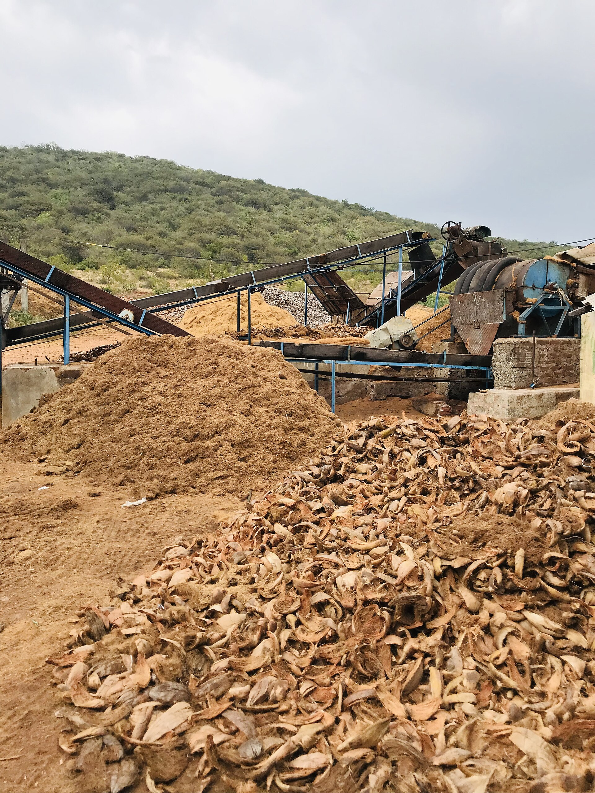

<!-- orchard_slot: D:\FIGS\Greenhouse photos — hero still before publish -->
<figure>

<figcaption>Figure 1. Coconut coir fiber — coir holds water like a cup; language matters when you compare to perlite. PD/CC staging fill — swap for a Keith still from PHOTO_NOTES (`D:\FIGS` first) before publish. Credits: RIGHTS.md.</figcaption>
</figure>

Coir and DE are the rooting room more than the
5-gallon language. The
[Fig Pop](https://figroots.com/fig-pops/) page already
taught the squeeze: wet the coir, squeeze until no
water comes, then add about 30 percent dry, pack,
leave the 1–2 inch gap under the stick. Heat mat with
a thermostat, about 75–78°F. Pencil-thick wood. The
industry cutting is still 6–8 inches and three nodes.
None of that is a 3-gallon recipe.

A #3 of the same sopping coir you used in a pop will
sit heavy and grow gnats. Open it up. Perlite you can
see is how I sleep. Coir holds. That is why it is
kind to a stick. Holding is less kind to a tree you
will fertigate every drink all summer. Salt from the
mill and salt from the mixer stack. Rinse cheap coir
if you use it in a can. **[VERIFY]** your brand; some
arrive cleaner than others. I will not invent a salt
number I did not measure.

DE in our 2023 basement test needed more watering
attention and was harder to wet from above. Both coir
and DE worked when we did not flood them. That post
has the counts: 64 varieties × 2 cuttings. I will not
invent a sequel. Cite those numbers as *that* test,
not as a universal law. And do not turn that test
into a #3 recipe either. It was a cup test.

Peat is the older hold. It acidifies. It collapses.
It is in Promix whether we lecture about it or not.
I am not starting a peat-vs-coir morality play. I am
saying the cup and the can are different climates.
Steal the squeeze. Do not steal the recipe.

Zone 7 coir in a can dries slower in a cold shop and
then freezes if you left it wet. Zone 9 coir in a can
is a gnat farm if you water like sand. 8a coir in a
can is fine as a *fraction* next to rocks. Straight
coir is a pop. I have used it as a pop. I have also
used it as a mistake in a #3. The gnats remember.

If you love coir, love it with perlite you can see
and a lift test you actually do. The stick was easy
to please. The tree will bill you.

Steal the squeeze. Do not steal the pop recipe into
a #3. Open coir with rocks you can see. Rinse cheap
bricks if you use them in a can. The 2023 cup test
stays a cup test. Straight coir is kind to a stick
and heavy on a tree you fertigate all summer. The
gnats remember the mistake. I do too.

A #3 wants a two-day dry-back in our June. Sopping
coir will not give you that clock. Rocks will. The
pop page can keep the 30 percent dry add. The can
can keep the lift.
