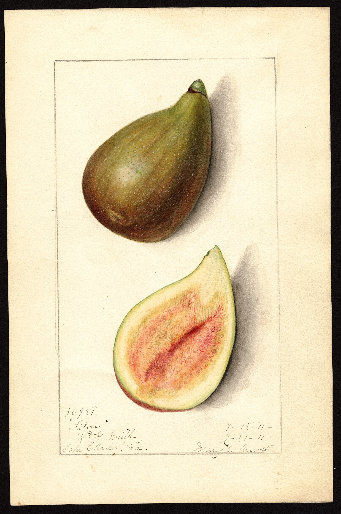

Ed O’Rourke bred figs in the 1950s so the Gulf could have something better than a grandpa Celeste that sulked. The program slept. Charlie Johnson’s orchard woke the elite sticks up. One of the six they named is **O’Rourke**. Also known, in LSU’s own 2025 sentence, as improved Celeste.

<!-- orchard_slot: D:\FIGS\Fig Fruit — hero still before publish -->
<figure>

<figcaption>Figure 1. Celeste-type USDA plate — O'Rourke hangs like Improved Celeste; plate our fruit from D:\FIGS. PD/CC fill for staging. Replace with a Keith still from PHOTO_NOTES (`D:\FIGS` first) before publish. Full credits: RIGHTS.md.</figcaption>
</figure>

That lowercase “improved” is a description. The trade turned it into a cultivar. Then the trade split. Official release: O’Rourke. Unofficial creature walking around as Improved Celeste, often called **ICON** — Improved Celeste O’Rourke Not. FigPotter and a dozen threads will tell you the Improved Celeste most people have is ICON, 30 percent larger and a couple of weeks earlier than Celeste. That is grower talk. It is not a release document.

I will not pretend I can see a DNA test from the porch. I will tell you what LSU wrote about the plant they named, and I will tell you to wait for fruit before you mail the name.

## Official six, then the driveway

Polozola and Stagg, 2025: the six are O’Rourke, [Champagne](lsu-champagne), [Tiger](lsu-tiger), [LSU Gold](lsu-gold), [LSU Purple](lsu-purple), [Scott’s Black](lsu-scotts-black). O’Rourke sits in the 2007 group with Champagne and Tiger on the older clips. [Hollier](lsu-hollier) and [Jack Lily](lsu-jack-lily) are unofficial. ICON is unofficial on purpose — the name is an argument.

## Do not confuse the brown sugar pile

[Celeste](celeste) is the grandpa sugar fig. Small, tight, eye stays green until late, hates a hard late-winter prune. Condit wanted Malta. The yard still says Celeste. I am not a fan of Celeste so far. I said that on [The Fig Jam](https://www.thefigjam.co/p/interview-with-a-fig-grower-keith).

O’Rourke is the official plant LSU was willing to put a man’s name on in that class: tan-to-light-brown, moderate-sized, closed eye, long peduncle, hangs when ripe.

ICON / “Improved Celeste” in the trade may be larger and earlier than Celeste. It may be O’Rourke. It may be a third brown fig. Photograph the neck. Photograph the hang. Do not eat three stickers as one plant.

[Hunt](hunt) is the Georgia fig with a long slender stem — Alabama says to ¾ inch — bred to shed rain. O’Rourke’s long stalk is in the same conversation: hang, dry, maybe sour less. Hunt is not O’Rourke. A long stem does not cancel a storm.

[Champagne](lsu-champagne) is the yellow 2007 cousin, tested as Golden Celeste. Same climate-class talk. Different color. [Brown Turkey](brown-turkey) is the rebound pile, not a closed-eye Celeste improvement. If your “O’Rourke” is open and souring like [Magnolia](magnolia), you do not have the release, or you have a week that would sour anything.

## What the sheets actually wrote

Polozola and Stagg, 2025: also known as improved Celeste. Tan-to-light-brown, moderate-sized fruit, closed eye. Fruit sets upright on a **long peduncle** and hangs upside down when ripe.

The 2021 AgCenter piece: O’Rourke is a medium-sized light brown fruit with excellent flavor. “Excellent” is their word. I will not upgrade it into my mouth. I did not put O’Rourke on the Fig Jam list.

Alabama ANR-1145 does not give O’Rourke its own paragraph. It gives Celeste the closed-eye, green-until-ripe field mark and the “finest southern fig” sentence I still disagree with on the plate. Florida HS27 lists O’Rourke among cultivars UF has not tested.

UAEX: if you severely prune a Celeste in late winter, you will greatly limit that season’s fruit. O’Rourke sits in that class. Texas A&M’s disease handbook files Celeste, Texas Everbearing, and Alma as closed-eye / souring-resistant. Magnolia and Kadota sit on the other side. O’Rourke’s closed-eye sentence is LSU putting it with the Celeste door, not with Kadota. [VERIFY] the ostiole on your fruit. [Pick The Right Fig](https://figroots.com/2025/07/02/pick-the-right-fig-for-you/) already unpacked why tight eye matters in a wet August.

Common type. No wasp. Jack’s [Types of Figs](https://figroots.com/2025/08/17/types-of-figs/) primer. UAEX’s common-figs-only rule. This one qualifies.

## How the driveway argument goes

Someone sells Improved Celeste. Someone else says that *is* O’Rourke. A third person says ICON. Cuttings move. Three years later four neighbors have four plants and one name.

Do this. Photograph the unripe fruit upright on the long neck. Photograph the ripe fruit hanging. Photograph the ostiole. Write dates. Compare to a known Celeste on the same week. If it is Celeste, call it Celeste. If it matches LSU’s hanging-peduncle note and you got it from a careful source, call it O’Rourke. If it is earlier and larger and the source said ICON, write ICON. If you do not know, write unknown-brown-tight. Unknown is a clean name. Improved Celeste is a blender.

The [introduction](https://figroots.com/an-introduction-to-figs/) already said 1–3 years to prove type. A first-year cup can lie about size and neck.

## The 8a week

Pick: morning. Soft. The hang is a cue LSU wrote down — fruit that was upright on the long stalk turns and hangs when ripe. Neck wilt. Give. I will not invent a Saline County date. [VERIFY] your first soften. Season is Celeste-class, not Gold-late. Earlier fruit is why people wanted an improvement. ICON talk says even earlier. If your plant is earlier and larger than every Celeste on the place, you may have the leak, not the release. Keep it if you like it. Change the label until you are sure.

Rain: closed eye is Celeste’s gift. Tight is a screen, not a vault. A long peduncle may shed. A storm still splits a balloon. Pick.

Birds: brown fruit. They find the dark ones faster. Net or pick.

Rust: rake litter. Yellow then reddish spots, blisters under the leaf. O’Rourke did not get Gold’s “moderate” rust sentence. Do not write one.

Sun: **6–8 hours**. East wall. Afternoon cloth in July. Celeste turns tough and falls in hot, dry weather on Alabama’s trouble table. A Celeste-class brown fig can sulk the same week.

Pots versus ground: we run hundreds of pots, about 25–30 in-ground. One **#3**. Pot up before June. Fertigate once it is a plant. Do not push nitrogen into September. In-ground next to a true Celeste if you have the room. Same week, two plates. That is the only comparison that matters.

Wood: **6–8 inches**, three nodes, from a source that says O’Rourke and has hanging-fruit pictures, not a marketplace “IC.”

Prune like Celeste. Leave last year’s wood. A Turkey-type chop is how you decide Louisiana “doesn’t fruit here.” Freeze: better cold talk than Gold. Not a Chicago Hardy. Resprout and wait. Five or six trunks.

## Culinary, honest

Fresh: Celeste-family sugar with whatever increment the orchard liked enough to name. I am not a fan of Celeste so far. O’Rourke has a chance to be the brown fig I will eat without duty. It also has a chance to be Celeste in a longer suit. I will not fake the plate.

Jam: this is the sugar-fig kettle if the tree loads. Brown fruit, brown jar, grandpa preserves. If you already put up Celeste, you know the job. If you do not like Celeste jam, do not plant a row of O’Rourke hoping the name changes the sugar.

Kid bowl: small-to-moderate brown figs a child will eat if they like sweet. Not a berry conversation. Jack’s kid-to-collector story started on a grandpa fig. You can add the berry plate later.

## How I would run it

If you want a Celeste that LSU was willing to put a man’s name on, this is the official stick.

If you already like Celeste, you may not need this tree. If you do not like Celeste — I don’t, so far — trial O’Rourke before you give up on the whole brown sugar class. A long trial. We graft before we throw a hole away.

Write O’Rourke on the pot when the tan-brown fig hangs on a long peduncle and repeats. Write Improved Celeste only as a footnote, and only after you admit you might be holding ICON. The footnote is cheaper than a lie.
