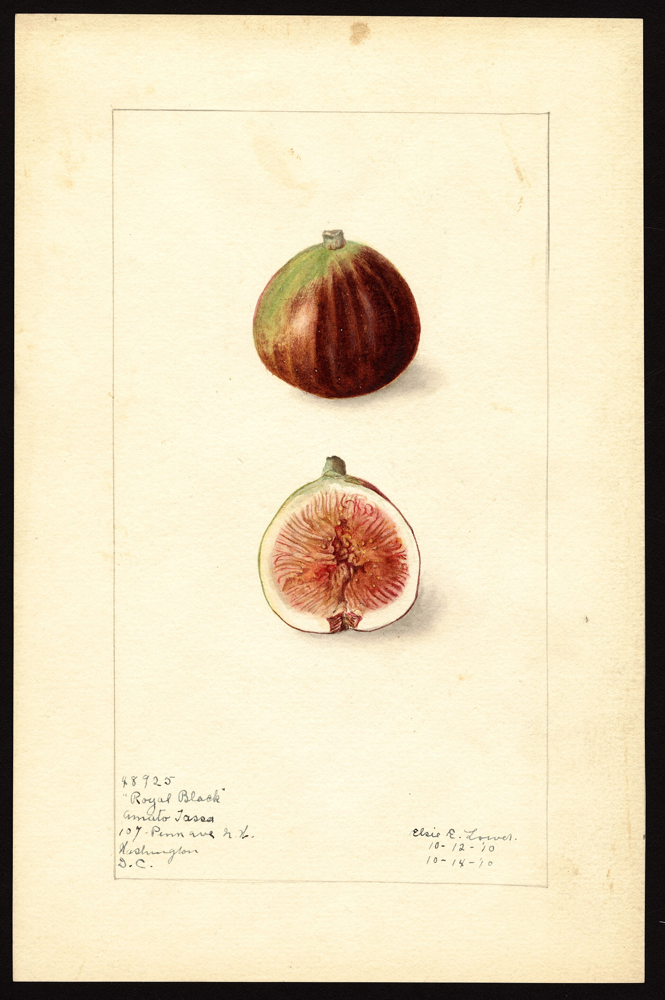

We have a folder on the KC-PC called `Malta_Black_Fig`. That is a stills folder of a tree we grew. It is not a certificate from Condit.

<!-- orchard_slot: D:\FIGS\Malta_Black_Fig — hero still before publish -->
<figure>

<figcaption>Figure 1. Dark fig USDA plate — Malta Black hero must be D:\FIGS\Malta_Black_Fig only. PD/CC fill for staging. Replace with a Keith still from PHOTO_NOTES (`D:\FIGS` first) before publish. Full credits: RIGHTS.md.</figcaption>
</figure>

Condit wanted **Malta** as the proper name for Celeste. Celeste is a small brown sugar fig. Malta Black, in collector talk, is a dark fig. Those two sentences do not merge because the word Malta is in both. The island named a lot of fruit. So did tired nurseries.

This draft is an identity page as much as a cultivar page. I would rather be small and true than big and wrong.

## Caption the clone

If we eat a dark fig off the tree we filed under Malta Black, we say: this is our Malta Black. We describe the eye, the size, the pulp, the week it softened. We do not say “a classic Maltese fig” as if that were a USDA grade. We do not say “this is Condit’s Malta.” We do not say “this is Violette de Bordeaux” because the photo is dark.

Jack’s Malta-adjacent talk on the site is not this folder unless the review says so. Red Sicilian is Bordeaux family on the [Fig Reviews](https://figroots.com/fig_reviews_archive/) card. Negra d’Agde is its own card. VdB is the small black, deep-red fight. Ronde de Bordeaux is the early round dark. Do not pour them into Malta Black to tidy INDEX.

Alabama [ANR-1145](https://www.aces.edu/blog/topics/crop-production/fig-production-guide/) is blunt on Celeste: Condit writes that its proper name is Malta, but no one uses that name. Synonyms there: Celestial, Conant, Sugar Fig, Tennessee Mountain Fig. Light brown to violet. Strawberry pulp. Small closed eye that stays green until almost ripe. That is the grandpa sugar fig. I am not a fan of Celeste so far. I said that on [The Fig Jam](https://www.thefigjam.co/p/interview-with-a-fig-grower-keith). I will not launder Celeste through a dark folder to make either name prettier.

Common type unless the tree teaches us otherwise. If it drops like a Smyrna, we write that. I do not expect it to. [Jack’s type page](https://figroots.com/2025/08/17/types-of-figs/) already drew the four types. A dark pot that sets without a wasp is a common fig until it isn’t.

The [introduction page](https://figroots.com/an-introduction-to-figs/) already said trusted sellers and 1–3 years to prove type. A folder name is not a seller. It is a memory aid.

## Why we keep honest names

Three hundred varieties. Six hundred pots. Paint-pen labels. The Fig Jam already said the name walks off if you let it. A folder on `D:\FIGS` is a memory aid. It becomes a lie when a draft upgrades it.

Unknown is allowed. Unknown-dark-tight is allowed. Malta Black-ours-2023 is allowed. “Malta (Celeste)” is allowed only on a brown sugar fig that matches Celeste.

I will not invent a homestead score for this clone. I will not hang Jack’s Negra numbers on it. I will not hang Red Sicilian’s card on it. I will not write a ripening date for Saline County. When we have a clean plate off *this* tree, we write what we ate, with the folder name attached. Until then the caption stays smaller than the internet.

PHOTO_NOTES already said named folders are not proof of type. `Malta_Black_Fig` and `El Dorado Fig` are stills of those trees. Caption the clone we have. Skip `.dtrash`. Stills over video. No nursery scrape.

If a second plant arrives labeled Malta Black and does not match the folder, it is not a debate. It is two plants. Unknown-malta-black-B until it repeats.

## How I run this tree in 8a

Like any keeper dark fig. **#3** until it earns ground. Pot up before June. Fertigate once it is a plant. Photograph the ostiole after rain. Write dates.

Sun: **6–8 hours**. UAEX’s minimum if you hope to harvest. Afternoon cloth in July. East wall if you have one. The [Pick The Right Fig](https://figroots.com/2025/07/02/pick-the-right-fig-for-you/) page already unpacked South shade plus water, tight eye, birds. A dark fig in deep shade is still shade.

Wood: **6–8 inches**, three nodes, off *this* tree. Lignified if you can. Wood off this tree is “Malta Black (our clone)” until a plate-and-leaf match says more. Do not mail it as Celeste. Do not mail it as Condit. Do not mail it as VdB. Do not mail it as Negra because you wanted a name people recognize.

Prune: dead wood, crossing wood. Leave crop wood until the plant teaches you it is a Turkey type. A January hat-rack on an untyped dark fig is how you delete a year and then blame the folder. UAEX already wrote the Celeste version of that warning.

Water: even. Drought then flood splits fruit. Alabama said the riper the fig, the more it splits and sours. Morning pick. Neck wilt. Give. Soft. [VERIFY] the first soften on *this* clone and write it on the tag. Not a calendar I will invent.

Rain: UAEX’s souring sentence — water in the eye plus heat after rain — is the test that matters more than the island word. Photograph the eye after a storm week. Tight or open, the still is the argument. A day-early fig in the fridge at about **40°F** is still a fig. A split fig on the ground is a beetle farm.

Birds: dark fruit is a billboard. Net or pick. UAEX said daily picking may be needed when a tree is in production. One neglected bowl teaches the address.

Winter: shuffle the pot. [Our winter page](https://figroots.com/winter-protection/) already said barely moist, not a heated den. Chicago Hardy and Smith are the names that page used for colder talk. This folder does not inherit their hardiness because it is dark. Container roots still freeze at the rim around the 15°F talk.

Late nitrogen: stop so September wood can lignify. Green shoots die first.

Nematodes: dirty ground stays in a pot. A named folder is not a nematode solution.

## How I would run this tree

If the fruit matches a better-known name two years running — Negra, RdB, a VdB — we can add the synonym as a *hypothesis* and keep Malta Black as the inventory name until we are sure. Hypothesis is cheaper than a merge.

If the fruit is ordinary, we still have stills that teach eye and color. The folder stays useful. The tree can become rootstock. We graft. We do not throw a live hole away because the name was smaller than a forum celebrity.

If the fruit is a small brown sugar fig with an eye that stays green until ripe, we have a Celeste-class problem wearing an island word. Relabel. I still may not love the plate. The identity is the point.

Write Malta Black on the pot that matches the folder. Write nothing fancier in the caption. The drive already did the naming. The plate does the confirming.
