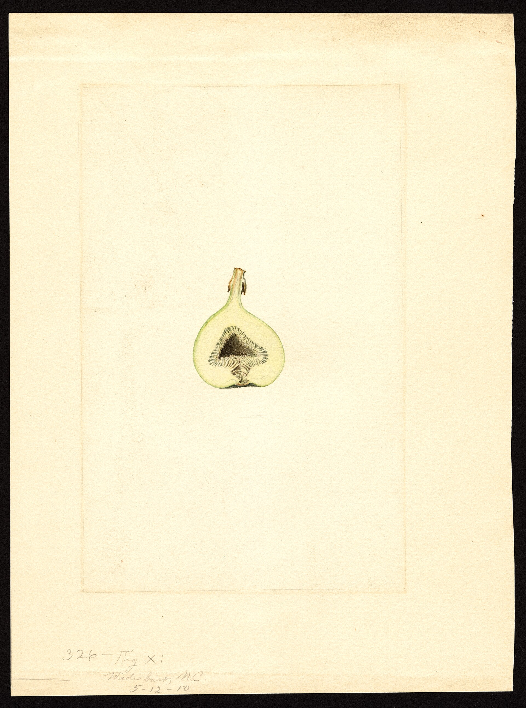

The FigRoots [winter protection](https://figroots.com/winter-protection/) page names Smith next to Chicago Hardy as a variety that can take more cold than the tender celebrities. That is a climate tool sentence. This page is the fruit.

<!-- orchard_slot: D:\FIGS\Fig Fruit — hero still before publish -->
<figure>

<figcaption>Figure 1. USDA fig cross-section watercolor — Smith strawberry-type from D:\FIGS. PD/CC fill for staging. Replace with a Keith still from PHOTO_NOTES (`D:\FIGS` first) before publish. Full credits: RIGHTS.md.</figcaption>
</figure>

Grower and extension-adjacent talk out of North Carolina: large, productive, strawberry pulp, a fig that made it around the Piedmont because it fed people. I did not plate Smith on [The Fig Jam](https://www.thefigjam.co/p/interview-with-a-fig-grower-keith). I will not invent a berry score next to Negra. I will say it is a Southern name worth one hole if you want large fruit that is not an LSU sticker.

Common type. Persistent. No wasp. Jack already defined that on [Types of Figs](https://figroots.com/2025/08/17/types-of-figs/). If a plant labeled Smith drops at marble size every year, look at water and type before you write a curse. We do not keep a wasp in Bradley County.

## What to prove

Size. Pulp. Eye after rain. A winter it survives. If your “Smith” is a copper Turkey that rebounds, you may have the pile. If it is a small tight Celeste, you have a grandpa tree and a hopeful label. If it is a dark resprout story with a city on the tag, you may have Chicago Hardy wearing a Carolina last name.

The introduction page already said it takes **1–3 years** to prove type. A first-year cup can lie about size. A first-year pot can lie about winter. Write the source on the tag the day the stick arrives. NC Smith, Hardy Smith, a neighbor’s Smith from a named county — those are passports. A marketplace “Smith” with no address is a wish.

Season: mid to late in a lot of talk. Large means growing degree days. [VERIFY] dates on *our* tree. I will not invent a Saline County soften. [Pick The Right Fig](https://figroots.com/2025/07/02/pick-the-right-fig-for-you/) already said GDD is a count, not a vibe. A large fig that is still hard when the first cool night writes on it is a calendar lesson, not a moral failure.

I am not a fan of Brown Turkey or Celeste so far. Smith sits in the Southern large-and-useful class those two also occupy. That is not a compliment I will dress up. It is a job description. If Smith eats like a tool fig, I will say so when the plate repeats. If it eats like a strawberry conversation, I will say that too. Until then I will not write a tasting note I would not sign.

## Cold is a conversation, not a warranty

Alabama ANR-1145 puts dormant wood in a **15–20°F** talk and names Celeste, English Brown Turkey, Alma, and Hardy Chicago as the hardier set. Smith is not on that Alabama list. Our winter page still named it. That is our sentence, not Auburn’s. Treat it as colder-tolerant than Mission and the late French celebrities, not as a skip-the-shuffle charm.

Pots still freeze at the rim. Roots in a **#3** are not a Carolina trunk. Barely moist in the shop. Not a heated den. The winter page already said that.

In-ground in 8a we are on the kind side of hardy. Tips still burn after a warm spell. A late freeze after budbreak is cruel to any fig that moved early. Cover or take the hit. If it dies to the crown, TAMU’s freeze chapter still applies: five or six trunks when the shoots are about two feet, same as a Turkey type or a Chicago. Leave the wood if you wanted a shape. Leave the tree if you wanted a hole.

NC State said Brown Turkey and Brunswick produce fair-to-good crops on suckers the season after freeze injury. Smith sometimes gets that same “fruits anyway” talk. [VERIFY] on our tree after a bite. A resprout year is a short year. Short years want an early partner. Do not make Smith the only fig if food is the point.

Do not hat-rack a healthy Smith in a civil January just because it might rebound. Rebound is insurance. Crop wood is the plan. Celeste will not forgive that prune. I treat any Southern fig I have not measured as Celeste-class with the saw until the plant proves it is a Turkey.

## Rain, split, birds, rust

Large means GDD. Large also means a balloon. Split is water and skin. Sour is water in the eye plus heat — UAEX’s sentence, Alabama’s trouble table, TAMU’s open-eye column. Smith is not on TAMU’s souring table next to Magnolia and Kadota. Look at the ostiole on *your* fruit after the first storm. [VERIFY]. Photograph it wet.

Morning pick. Neck wilt. Give. Soft. Do not wait for a prettier color if the forecast is a Gulf steam bath. A day-early large fig in the fridge at about **40°F** is still a fig. A split fig on the ground is a beetle farm.

Birds: large. They will take a bite out of each one as if they were sampling. Net or pick. A green fig lasts longer. If Smith colors copper or violet, it is a billboard.

Rust is the Gulf leaf tax. Yellow-green flecks, then yellowish-brown, blisters under the leaf, defoliation while large fruit is still trying to finish. Smith sometimes gets “holds leaves” talk. [VERIFY] on our tree. Do not advertise rust-proof. Rake. Do not leave a wet skirt of last year’s leaves. Alabama will sell you a Bordeaux spray calendar. Sanitation is the part that does not need a sprayer.

Nematodes: pots if the ground is dirty. Smith is not a nematode solution. Alma and some LSU Purple talk get that rumor. Different plants.

## Sister slugs

**Chicago Hardy** is the other name on our winter page. Small-to-medium, long slender neck, resprout story. If your Smith is small and dark and comes back from a kill, you may have Chicago with a Carolina sticker.

**Southern Brown Turkey / Texas Everbearing** is the rebound workhorse UAEX actually recommends. Copper, useful, not rich. I am not a fan so far. If your Smith is that plate, write the pile. Do not steal a last name for a Turkey.

**Celeste** is the small tight sugar fig. Different size. Different prune rule. Different mouth.

**LSU Gold** is the official large yellow. Different color. Different Gulf sticker.

**Nuestra Señora del Carmen** is our large berry with a large eye. Jack already said it splits if there is much rain. If your Smith splits like NSDC and eats like a berry, that is a compliment to the week, not a synonym.

## How I would run it

If you want a Southern large fig without a French invoice, trial Smith. Wood from a fruiting Carolina or Gulf tree with a last name you can write down. **6–8 inches**, three nodes. Alabama’s chapter likes 3–6 inch pencil wood. We run a little longer. Pot up to a **#3** before June. Fertigate once it is a plant, not while it is a stick.

Sun: **6–8 hours**. Alabama wants a full eight so fruit dries after rain. We give morning sun and afternoon cloth in July. A large fig in a west fry on black plastic will sulk or split when you finally water it.

In-ground in 8a is the conversation the winter page already started. East wall if you have one, clay that drains, mulch over shallow roots. Do not plant it in last year’s tomato hole. Do not fertilize late. Succulent September wood is how a hardy name writes a tender will.

Pair with a small tight-eye fig for the wet weeks. Smith is not Alma. Smith is not Syrian Dark #2. Large is the job. Tight-and-small is the insurance.

If it never finishes two years running, believe your GDD. Graft an earlier fig and keep the hole. We graft. We do not perform funerals for live roots.

Write Smith on the pot when a large Southern strawberry fig repeats and the wood takes a bite like the winter page implied. Write unknown-large-south if the passport is missing. The South is full of good unnamed figs. We do not have to steal a last name for them.
