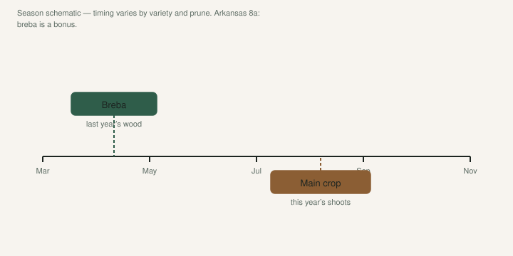
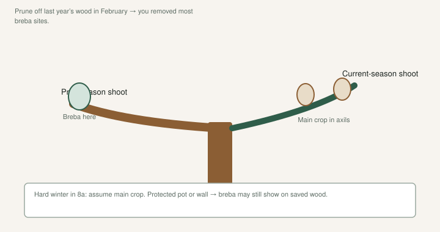

Somebody on a forum swears their tree is “everbearing.” They prune it like a rose in March. Then they wait for the June figs that live on the wood they just threw in the burn pile.

Two crops. Two kinds of wood. Mix them up and you will swear the variety is a dud.

## The two crops, in plain wood

<!-- figroots-graphic: breba-timeline -->

*Season schematic — timing shifts with prune and variety.*

**Breba** is the early crop. It sets on last season’s shoots — the wood that already went through a winter. In a mild-winter climate those figs overwinter as little nubbins and finish in late spring or early summer.

**Main crop** sets in the leaf axils of **this year’s** growth. New shoot, new figs, mid to late summer. That is the crop a frozen-back tree can still give you, because it is not asking last year’s twigs to survive.

University of Arkansas Extension says the quiet part out loud: in our climate, breba figs **rarely persist and thrive over winter**. The second crop — current-season wood — is predominantly what we harvest. Common figs only. No wasp types.

So if you are in Arkansas, or anywhere that regularly bites wood into the teens, plan the year around main crop. Breba is a bonus you get after a soft winter, a protected wall, or a pot you kept from freezing.

## Why a hard prune feels like sabotage

<!-- figroots-graphic: breba-branch-wood -->

*Where fruit sets — February hard prune removes breba wood.*

Celeste is the example UAEX uses, and it is a good one. Most cold-hardy of the common yard figs here. Tight eye. Earlier than Brown Turkey. Chop it hard in late winter and you **greatly limit that season’s fruit**. Celeste does not shrug and re-shoot a full crop the way some trees do.

Brown Turkey (the one often sold as Texas Everbearing) is less hardy, but it rebounds. Freeze it, prune it, and it still tends to bear. That is why people call it everbearing. A lot of that “second crop” talk is main-crop figs on new wood after the first flush, not a true breba you can take to the bank.

If you want breba on purpose, you are signing up to **keep last year’s wood alive**. That means:

- No hat-rack prune in February.
- Winter protection on in-ground trees if your zone steals wood (barrel, wrap, lights — we already keep a [Winter Protection](https://figroots.com/winter-protection/) page for the methods).
- Pots that spend the cold months somewhere that stays above a hard freeze on the roots, without cooking them in a heated living room. Figs want a dormant rest. A 70°F den is not rest.

I would not build a whole collection around breba in South Arkansas. We are **8a**. We get rollercoaster winters. UAEX says the north counties take the worst of the swing. Chase main crop. If a breba shows up after a gentle year, eat it and do not rewrite the orchard plan.

## Pots change the argument

Most of our trees have lived in 3- and 5-gallon pots. A pot you can roll into a shop or a hoop house still has last year’s wood in the spring. That pot can show breba a ground tree in the same county will not.

It can also fool you. A pot that dried out in a cold snap, or sat wet and sour, will drop those early figs and look like a main-crop-only variety. The wood was alive. The fruit was not.

If you are hunting a true breba variety — the kind people in California talk about as a June crop — keep the plant in a container you can protect, or plant it on the east wall of a building that holds heat. Give it two winters before you decide the variety “doesn’t breba.” One ugly freeze is not a verdict.

## How I decide before I pick up the loppers

I ask what I want this tree to do *this year*.

**I want a crop after a bad winter.** Leave the root system. Let it sucker. Thin the thicket to a handful of strong shoots once they are a couple of feet tall. That is Texas A&M’s freeze-recovery picture: pick five or six trunks, do it over a couple of weeks so you do not strip every leaf at once. You are building next year’s main crop.

**I want this variety’s early figs.** Do not cut last year’s shoots back to stubs. Tip if you must. Take cuttings from what you prune, but do not confuse “I needed scionwood” with “the tree needed a haircut.”

**I want a small pot bush I can move.** You will prune. You will lose breba. Own it. Main crop on new growth is the deal.

Jack’s job on a prune day is usually cuttings: **6–8 inches, three nodes**, lignified if we can get it. That wood can be last year’s breba wood. Every stick in a bag is a fig you will not eat in June. Take what you need. Leave a tree.

## “Everbearing” on a tag

Read the tag as a hint, not a contract. Texas Everbearing / Brown Turkey types fruit over a long stretch on new wood. LSU Purple is often described as a heavy July main crop and a later tail. [VERIFY] the tail in your yard; “into December” is a Gulf sentence, not an Ozark sentence.

A fig that sets two crops on a website may set one crop here. That is not a scam by itself. That is climate.

If a seller promises breba in zone 6 without a pot-and-garage plan, keep your money. The tree might be real. The crop plan is not.

## A one-season checklist

- Label the wood. Tie a bit of tape on a last-year shoot in fall if you care about breba. In spring you will remember what you meant to save.
- After budbreak, walk the tree once. Nubs on old wood = breba attempt. Figs in new axils = main crop starting. Photograph both. Memory cheats.
- Do not judge a variety’s breba in a year the wood died.
- Do not judge main crop on a tree you starved in July. Fruit drop has a lot of fathers. UAEX lists drought, storms, cool weather after set, and a weak tree.

Pick The Right Fig asked, “Will you try to get breba?” Answer it with a prune plan, not a wish. In our county the honest answer is usually: main crop, and I will not cry if June is empty.
