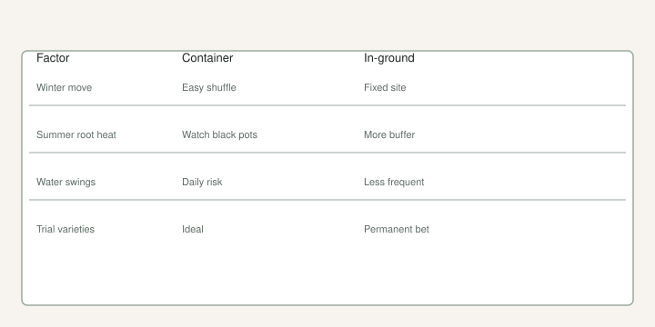

We have lived this argument in hardware, not in theory.

A few years back the honest count was hundreds of trees in 3- and 5-gallon pots and a couple dozen in the ground. The ground ones are the ones I want long-term. The pots are how you keep 300 names alive while you learn which names deserve a hole.

[Pick The Right Fig](https://figroots.com/2025/07/02/pick-the-right-fig-for-you/) asked it as a bullet: pots or in-ground, and how much space do you have. If you have root-knot nematodes, the same page said pots. That one sentence has saved more trees than a new fertilizer.

## What a pot is for

A pot is a movable climate.

You can roll it into a shop when a hard freeze is coming. You can pull it under a bench when July turns the gravel into a griddle. You can throw out the mix if it goes sour. You can keep last year’s wood through winter and maybe see a breba a ground tree in the same county will not.

You also water it like a livestock chore. Jack’s least-favorite job on the Fig Jam interview was fertilizing that many pots. I do not disagree. Hand-watering a collection gets old. We moved to sprinklers and a brass siphon mixer on days it does not rain, and we fertigate with a water-soluble feed once the trees are growing. That is our system, not a commandment. Ten trees can be a watering can. Three hundred cannot.

Pots cook. Black plastic in full South sun will heat roots past what the leaves can explain. Afternoon shade is not a northern luxury here. A pot on a concrete slab is a different plant than a pot in the dirt under a tree line. Lift it. Light means water. Heavy means wait. A #3 on gravel in July will lie if you poke the top inch.

Size matters. A cutting can live in a cup, then a trade gallon, then a #3. We pot up before the roots circle themselves into a knot, and we try to do that **before June** so you are not shocking a plant into midsummer. That timing is already on the [Introduction](https://figroots.com/an-introduction-to-figs/) page. The before-June draft in this set is the deadline. This page is why the plant is in a can at all. Late pot-ups sulk.

A #3 is not a forever home. Most of our library has lived in **3- and 5-gallon** cans. The Fig Jam interview already put the honest count in public: hundreds of trees, most in those sizes, a couple dozen in the ground.

## What the ground is for

An in-ground fig that likes the spot will outgrow your interest in moving pots.

Once the roots are out in the county, you water less in a normal week. You mulch. You pick. The tree can take a winter hit to the wood and still throw main-crop figs on new shoots, which is why UAEX bothers to mention freeze-to-the-ground recovery at all.

The ground also holds nematodes, poor drainage, and lawnmower disease. Texas A&M is plain: figs grow in sand to heavy clay, and water still has to move. Sand is where root-knot gets ugly — that hole gets the next heading, not a rare cutting.

Clay is not an automatic no. Standing water is. If the hole you dug is a bathtub after a thunderstorm, you planted a fig in a pond. Raised beds and berms are how we make clay behave. Dig the hole, fill it, come back in the morning. If the puddle is still there, do not donate a name to it. The drainage draft in this set is that test. This page is the chooser.

## Nematodes decide the hole before you do

Sandy ground is where root-knot gets ugly. Infested roots look like they swallowed BBs. NC State treats nematodes as one of the two limits on fig culture there, with cold as the other. If you already know you have them, I would not donate a rare cutting to that hole. Keep it in sterile mix. Pick The Right Fig already said pots.

I will not invent a soil-test number for your county. [VERIFY] with a sample if you are planting a keeper in sand that grew tomatoes or okra. LSU’s disease notes warn against old tomato/okra/tobacco ground for the same galls. Louisiana label law is not Arkansas law. The warning about the hole still travels.

A pot lets you throw out bad mix. The ground does not.

## Our mix, without turning it into a recipe cult

Jack has said the potted trees run a lot of worm castings and perlite. I have also built mix out of perlite we buy from an expander, plus topsoil, castings, leaf compost, and aged chicken manure from the place. Coir and DE show up in the rooting room, not as the only language for a 5-gallon tree.

What I will stand on: the mix has to **drain**. Figs drown quieter than they dry. A heavy bagged “garden soil” in a pot with one sad hole is how you get a yellow tree and a sour smell when you tip it.

Promix HP is what we already told beginners to buy if they do not want to think. It is not cheap. It is consistent. Field capacity — damp, not dripping — is the same idea we use in a cup.

Fertigate after the plant is rooted and growing. We saw a jump in shoot length when we got serious about feeding with the water. One to three feet of spring push is the kind of number I will say because we watched it one season. I will not turn it into a guarantee. [VERIFY] on your fertilizer and your water.

Winter pots do not get that treatment. Cool shop, rain barrels, little or no feed. They are not supposed to grow a jungle under glass in January.

## When I would plant in the ground in Arkansas

Zone 8 or warmer, after the plant has a real root system, in late winter through spring so it can settle before the next winter. UAEX’s planting window is the same idea. North counties: pick the east wall of a house or a brick pile that knocks the wind down and throws heat back. You still need **6–8 hours** of sun if you want fruit. A warm grave in deep shade is still shade.

Do not plant a one-year cutting at the final spacing of a 25-foot tree and then forget it in a weed patch. Water the first two summers. Shallow roots do not go find the creek for you. The first-two-summers draft in this set is that hose. TAMU: fibrous, shallow, drought-sensitive. Mulch. UAEX: dry trees drop fruit.

A late-winter or early-spring plant has a season to settle. A July transplant into clay is a dare. I would not take it. LSU talks fall through early spring for Louisiana yards. Our window is the same idea. [VERIFY] your last freeze before you brag on a February hole in the north of the state.

If you are north of the reliable fig belt, in-ground is a bush you bury or wrap, and you are growing main crop on whatever wood the winter leaves you. That can be a fine life. It is not a California orchard.

## A blunt chooser

<!-- figroots-graphic: pot-vs-ground-chart -->

*Arkansas-weighted tradeoffs — your site may differ.*

**Stay in a pot if** you are collecting names, you have nematodes, you need to hide the tree from a hard freeze, or you do not have a drained hole yet.

**Put it in the ground if** the variety has fruited true, you like the fruit enough to keep it, the spot drains, and you are done playing musical chairs with a wagon.

**Do both.** That is what we are doing. The ground is the keepers. The pots are the library.

Winter is a move for cans and a wrap-or-wall problem for trunks. The [Winter Protection](https://figroots.com/winter-protection/) page already said pots above about **40°F**, barely moist, not a heated den. The shuffle draft is the wagon. This page is which plant even belongs on the wagon.

A #3 is not a forever home. An in-ground hole is not a favor to a tree if it holds water. Pick the container that matches the problem you actually have.
