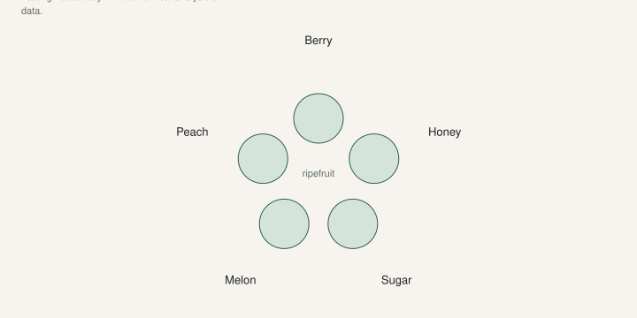

I used to think I did not like figs. I had not had a good one.

That sentence is already on [An Introduction to Figs](https://figroots.com/an-introduction-to-figs/). It is still the right sentence. Grocery figs are picked for freight. A ripe fig off a tree is a different food. Some eat like jam and berries. Some eat like honey on bread. Some are just sugar and a little grit, and you wonder why anyone mailed a cutting of it across the country.

[Pick The Right Fig](https://figroots.com/2025/07/02/pick-the-right-fig-for-you/) listed the families: berry, honey, sugar, melon, peachy. Those words are a map. They are not a lab panel. Two honest growers will put the same fruit in different buckets, and both can be right enough to pick a tree.

## How we taste (so the words mean something)

Wait until the fig is soft. Neck bent. Skin maybe cracking. If you pick it “almost” so it ships, you are tasting water and latex.

Cut it. Smell the inside before you talk. Then eat it at room temperature, not out of a cold fridge. Write three words, the eye, the size, and the date. Next year your memory will lie.

Do this on a tree you believe. A mislabeled cutting will teach you the wrong family for a name, and you will argue with people who have the real thing.

## The five words we actually use

<!-- figroots-graphic: flavor-wheel -->

*Tasting vocabulary only — not lab chemistry or Brix.*

**Berry.**  
Red to strawberry pulp. Smell like raspberry jam or dark berries, sometimes with a wine note. This is the fig that converts people who “don’t like figs.” Jack’s 2025 short list was heavy here: Red Sicilian (productive, sweet, medium, berry), Negra d’Agde (not the sweetest, more berry than anything else he had on that list), Syrian Dark #2 (strong berry, small, extremely tight eye). Those are *our* notes on *our* fruit. I will not hang a score on them. Your soil and your year will move the needle.

**Honey.**  
Amber or gold pulp. Smell like honeycomb, caramel, sometimes tea. Light-skinned figs get dumped here by default, which is lazy. A dark fig can run honey. A gold fig can be bland sugar. Taste it.

**Sugar.**  
Very sweet, not much else. Celeste often lands here in backyard talk: small, brown, early, gone. Useful. Not a conversation fruit. I have not been a Celeste fan for eating. I still respect it as a climate tool. Those are not the same job.

**Melon.**  
Cantaloupe, muskmelon, a wetter perfume. People fight about this word more than the others. If you do not smell melon, do not force it. [VERIFY] any famous “melon fig” against fruit you cut yourself.

**Peach (and the cousins).**  
Peach, apricot, sometimes a citrus edge. The Introduction page already bunched peach / cherry / orange / unique together because that is how people talk when the fruit is not berry and not honey. Cherry and orange are real notes on some figs. They are also how you start sounding like a wine list. Keep it honest.

Families overlap. A fig can be sweet *and* berry. The point of the word is to stop you from planting twelve trees that all taste like the same brown paste.

## Names that will not save you

“Black Madeira” on a bag is not a flavor. It is a hope.

The Introduction page already warned you: variety decides flavor, quality, ripening time, and whether the thing even belongs in your county. It also takes **a year, sometimes two or three**, to prove the fruit is the fruit. Marketplace reviews close before anyone has eaten a fig.

UAEX says the other ugly part: a lot of name confusion. The same plant sold under two tags. Fifty cultivars in the nursery trade, hundreds in the lists. Brown Turkey is a pile of clones. If your “berry fig” tastes like mild sugar, you may not have a bad palate. You may have a wrong stick.

Trusted wood first. Taste second. Argument third.

## Climate changes the sentence

A berry fig that finishes in a dry week tastes like the stories. The same fig after a rain, picked a day late, tastes like a wet sponge with a red center. That does not move it to the honey family. That is weather.

Heat and water also change sugar. A starved pot can throw small, intense fruit. A flooded pot can throw large, dull fruit. Do not write a variety off — or write a love letter — on one ugly week.

In humidity, I still want the flavor *and* a tight eye. Jack’s notes keep pairing berry with tight, small fruit for a reason. A giant open-eye peach bomb is a fine fig in a dry climate. Here it is a race with the beetles.

## How I would stock a first tasting row

I would not start with twelve names from a ranked internet list.

I would start with one early, tight-eye fig that actually ripens here (the county extension tree, even if I do not love it), one honey type, and one berry type from a person who has fruited it in the South. Eat them in the same week. Then spend money.

If you already have a collection, pick a Saturday, harvest what is truly ripe, and put the families on paper. You will find you own four names in one family and zero in another. That is useful. That is how you stop buying the same fig in a new hat.

I have favorites I will say out loud because we have eaten them: Nuestra Señora del Carmen, Maryland Berry, Red Sicilian, Negra d’Agde, Black Madeira when it is the real one, and others I will not turn into a catalog. I also have trees I am not a fan of yet. We give them a long trial. Boring fruit can still be rootstock.

The family words are for the plate. The label is a hypothesis. Ripe fruit is the only evidence.
