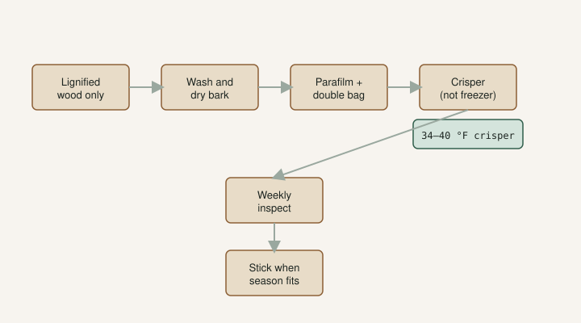

A box shows up in January. You are not ready to stick a tray. The wood looks good. The fridge is right there.

That is when people ruin cuttings they already paid for.

I wrote the cutting standard on FigRoots already: **6–8 inches, three nodes**. That is the stick. Storage is what you do when you cannot plant that stick yet. It is a delay. It is not an improvement. If your climate is ready and the tray has room, **root it**. The crisper is for extras, late arrivals, and the week the heat mat is already full.

## The fridge is for dormant, lignified wood

**Lignified** means the wood hardened. Brown, gray, blackish. Not green. If it looks like a herbaceous tomato sucker, it is not a storage cutting.

**Dormant** means the sap is down. Fresh cut, no milk running. Check the bag it shipped in. Dried sap on the plastic means it was still moving when they packed it.

I already said this in [Lets Talk About Fig Cuttings](https://figroots.com/2025/12/23/lets-talk-about-fig-cuttings/). Green wood does not go in the fridge for later. It rots first. Root it now, or try water, and accept you may lose it. Non-dormant lignified wood supposedly roots faster and keeps worse. I would still rather stick it than invent a six-month nap for a stick that was never asleep.

Texas A&M’s 2015 figs PDF is in the same camp on the farm side: hardwood cuttings taken when the plants are **fully dormant** are the ones they call most commonly used. That is not a fridge recipe. It is the same wood I am willing to bag. Softwood is a now problem. TAMU even flags mist for softwood. I do not fridge that.

If you only remember one rule: **the fridge is for dormant, lignified wood.** Everything else is a now problem. A pretty green stick in a zip bag in July is a mushroom farm you paid postage on.

## Wash, wrap, double-bag, crisper

<!-- figroots-graphic: fridge-storage-flow -->

*Jack’s fridge workflow — see the cuttings post for the spoken version.*

This is the line I gave [The Fig Jam](https://www.thefigjam.co/p/interview-with-a-fig-grower-keith). It is practice, not a month-survival table.

Wash the cuttings. I did not know how dirty they were until we started scrubbing. Soap and water. If you use bleach, stay at the dilution we already published on the [Fig Pop](https://figroots.com/fig-pops/) page: **10 parts water, 1 part bleach**, then you are done talking about bleach. Or a hydrogen peroxide wash, same page. Then **dry the bark**. Wet wood in plastic is a mushroom farm. I will not tell you a soak “sterilizes” a cutting. Wash, dilute what you already know how to dilute, dry.

For a long hold I wrap with **parafilm**. That is the tip I gave when people asked for advice: wrap it, **double-bag**, crisper drawer. Parafilm holds the moisture that is already *in* the wood. It is not a reason to add a soaked towel.

I do not want free water in the bag. Condensation after a warm bundle hits a cold fridge is enough to start slime. Chill the wood first, wipe the plastic, then seal.

Growers on OurFigs argue about slightly damp towels versus bone-dry cling wrap. The thread is a conversation, not a trial we ran. [Example](https://www.ourfigs.com/forum/figs-home/1248015-refrigerated-fig-cuttings-best-practices-duration). The ones who stored wet lost bags to mold. I am in the dry-seal camp. **[VERIFY]** your own fridge; some crispers run wetter than others.

Do not vacuum-pack a winter’s worth of wood because it looks tidy. I have heard too many “I opened it and they were cooked” stories. A zip bag you can open and check is enough. The weekly look is the method. A sealed brick you never open is a surprise.

Write the name and the date on the bag. A brown bundle with no label is how two varieties become one argument in March.

## A thermometer in the drawer, not a guess

Crisper, not the back wall of a freezer-cold fridge. People talk **38–45°F**. That is a common target, not a lab I ran. **[VERIFY] with a cheap thermometer in the drawer.** Frozen cuttings look fine until they turn to mush at room temp.

I will not tell you supermarket crisper settings are all the same. The dial that says “fruit” on one fridge is a swamp on another. Put a thermometer in there. Look at it the first week. If the wood is icing, you are too cold. If buds are pushing in the bag, the drawer is too warm or the wood was never dormant.

The freezer is not storage. A frozen stick is not “extra dormant.” It is ice. I have watched people proud of a January mailbox that rode below freezing, then watched the bark collapse when it thawed. Firm after a thaw can still go in a cup. Mush is trash. Do not fridge a mush you have not thawed and judged.

## The weekly look

Open the bag.

Mold: take out the fuzzy ones. Do not play hero with a green beard. One fuzzy stick will teach the rest. Wash what is left if the bag smells sour, dry it, rewrap. The Damaged Cuttings folder on KC-PC is full of “I waited to see.” Pull it.

Shrivel: the wood went too dry. A *slightly* damp towel can go in for a short time, or you can rehydrate before you root — soak, then dry the bark again. Do not leave them swimming in the fridge. A week-long bath is how you grow slime.

Buds pushing in the bag: the drawer is too warm, or the wood was never dormant. Stick those. Storage is over. Leaves in a bag are a battery with nowhere to drink.

I would rather check fifty sticks on a Sunday than lose a variety I cannot buy again. Sunday is a look, not a science fair. You are hunting fuzz, ice, and wrinkle. You are not rearranging for a photo.

If you ordered ten names, keep them in labeled bags. Mixing a fridge pile is how “Red Sicilian” becomes “the brown one on the left.” Dad uses a paint pen because it stays. A paper tag in a wet bag is compost.

## USDA prefers dormant wood too

USDA’s National Clonal Germplasm Repository at Davis has long preferred **dormant** fig cuttings. They stopped routine summer cutting distribution. That is germplasm talking, not a backyard fridge chart. [USDA ARS NCGR-Davis fig page](https://www.ars.usda.gov/pacific-west-area/davis-ca/natl-clonal-germplasm-rep-tree-fruit-nut-crops-grapes/docs/fig-page/main/). **[VERIFY]** the current public window before you tell someone to “just order from Davis.” Germplasm is a reference, not a vending machine.

I cite them for the wood, not for a month count. They would rather move dormant sticks. I would rather store dormant sticks. Green summer wood is a now drill here too. The calendar draft in this set is when to cut. This page is what you do when the stick is already in your hand and the tray is not ready.

People on forums root wood after many months. Some say a year. I will not print a success rate I did not count. Wood that went in clean, dormant, and sealed lasts longer than wood that went in wet, green, or filthy. After a long hold I wash again before I root.

I will not give you a product that “makes storage safe.” I will not give you a medical speech about chemicals. I will not tell you a wrinkled, moldy, frozen stick is “probably fine.” Throw it out. Take another cutting next dormant season.

## Ready to come out

Unwrap. Fresh cut on the bottom if the old face is tired. A light slit on the base to show cambium if that is how you pop — we already walk that on the [Fig Pop](https://figroots.com/fig-pops/) page. Medium damp, not wet. Squeeze until no water comes out, then add about **30% dry** coir if that is the mix. Heat mat on a **thermostat**, about **75–78°F**, not a bare mat that will cook the cup.

If the cutting was in the fridge a long time, it may be slower than fresh dormant wood. Wait. Leaves before roots is how you get a pretty stick that collapses. That failure has its own draft.

A dehydrated mailer that you then fridge “to rest” is not a rest. Wash, maybe a short soak, dry the bark, stick. I would not file wrinkled wood for three months and hope. The inspection draft is the day the box lands. This page is only the clean, dormant fork.

Store less than you think you need. Root more than you think you can baby. The crisper is a holding pen. It is not a rooting method. If the wood is green, skip the fridge. If the wood is dormant and lignified and you cannot stick it today, wash, wrap, double-bag, crisper, thermometer, Sunday look. That is the whole argument.
