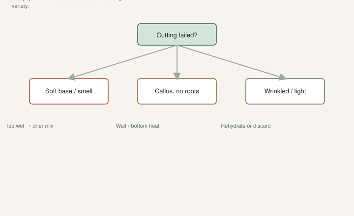

The leaves come out and you relax. A week later the whole thing folds like a cheap tent.

That cutting did not “just fail.” It failed in a way you can name. If you cannot name it, you will do the same thing to the next bag.

I am not going to give you a new miracle mix. We already ran a real comparison — coco coir versus DE, 64 varieties, two cuttings each — and wrote it up. Coir was faster in that basement test. DE was slower and needed more watering attention. Both worked when we did not drown them. Read [the A/B post](https://figroots.com/2026/02/10/rooting-fig-cuttings-coco-coir-vs-diatomaceous-earth-de-lessons-from-my-a-b-test/) for those counts. I will not invent a second trial here.

## Failure 1: rot

<!-- figroots-graphic: rooting-failure-tree -->

*Name the failure mode before you restick — schematic autopsy.*

The base goes dark, soft, sour. Sometimes the bag smells before the leaves tell you.

Cause is almost always **wet**. Not “I watered this morning.” Wet for days. Mix that drips. A cutting jammed to the floor of a bag so the wound sits in a puddle. No air. Warmth on top of that.

Dad’s line is the one I would print on the wall: **do not overwater the rooting mix.** Figs are easy. The mix is where people get clever and kill them.

Fig Pop moisture, the way we already wrote it: hydrate coir, dump the extra, squeeze until **no water comes out** and it still clumps, then add about **30% dry coir** and mix. Damp. Not wet. Pack the bag so the mix stays against the wood. Leave a **1–2 inch gap** under the cutting so the bottom is not sitting in a sump.

A heat mat without a thermostat will roast a wet cup into soup. Set the mat to about **75–78°F** on a controller. Low light. You are not growing a tomato seedling yet.

Wash first. Dirty bark is a head start for slime. Soap, or the dilute bleach already on the Pop page, or peroxide. Dry the bark before it goes in. I keep saying this because I skipped it when I was younger and I could not see the film on the wood until we scrubbed.

If it rotted: throw the mush away. Do not “cut above the rot and restick” unless there is a clean, firm piece with nodes left *and* you change the mix. Same wet bag, same ending.

## Failure 2: callus-only

You pull the stick and there is a white or cream knob at the base. Alive. No roots. Tops may have leaves. Then the leaves cook the cutting because nothing is drinking.

Callus is scar tissue. It is not a root. Some varieties sit there a long time. The A/B writeup even named a slow one in coir. Fast and slow is real. Waiting is part of it.

Callus-only becomes a failure when the environment never gives the next step: bottom heat too low, mix too dry for the roots to push, or you keep peeling the cup open every day “to check.” I check by **weight**. A light cup is thirsty. A heavy cup is not.

DE in our test needed more watering vigilance. It was harder to wet from the top and easier to dry. Coir held a more even humidity under a cover. That is why I reach for coir when I want fewer surprises. DE is still in the room. It is not the enemy. Dry DE is.

If you have callus and a firm cutting after many weeks, do not panic-pot it. Leave it. Some people add a little more bottom heat (still on a thermostat). Some loosen a too-tight pack. I would not drown it to “wake it up.” That is how callus-only becomes rot.

Leaves with no roots: reduce light, do not fertilize, do not transplant. You are holding a battery that is running a screen with the charger unplugged.

## Failure 3: dehydration

The bark wrinkles. Nodes look sunken. The stick is light. Scratch it and you do not see a moist green/white cambium.

Dry air, dry mix, a bag you never closed, a cutting stored wrong and then stuck already empty. Green wood on a sunny windowsill. A DE cup you forgot for five days.

This is the failure people miss because they are afraid of rot, so they run the tray like a desert. You can kill a fig both ways. The hand test on coir is there so you have a middle.

Parafilm on the exposed top helps hold the moisture *inside* the wood while it sits in a cup. That is storage logic applied to a pop. It is not a substitute for mix that actually touches the bark.

A dehydrated cutting can sometimes take a soak before you restick. Then dry the bark and use mix that is actually damp. I would not promise you a save. [VERIFY] by scratch test: brown dry wood through the cambium is firewood.

## The other ways you think it failed (and maybe it didn’t)

**It is just slow.** Some names root in ten days. Some sit. Our coir tray in that test had roots around day 10 on the fast ones and stragglers later. If the wood is firm and the mix is right, wait.

**You potted up like you were potting a weed.** Fig-pop roots are brittle. The Pop page says it. I have broken a nice root ball by squeezing the bag. Open it. Support the mix. Do not shake it clean.

**Outdoor dirt.** We have stuck cuttings in a raised bed and in pots of yard soil and gotten trees. Shade, water once or twice a week, not a swamp. Lower hit rate is fine when the wood is free. That is already on the [Outdoor](https://figroots.com/outdoor/) page. Do not compare that to a basement tray and call the tray a scam.

**You started with junk.** Soft, moldy, pencil-thin green, one node, a crushed bundle from a hot truck. Storage mistakes belong to the fridge draft. Rooting will not resurrect a corpse.

## A short autopsy

Pull the stick.

- Soft, dark, stinks: rot. Drier mix. Air gap. Clean wood.
- Firm, white knob, no roots: callus-only. Time, even moisture, bottom heat you can measure.
- Light, wrinkled, dry scratch: dehydrated. You ran it too dry or you stored it empty.

Write the variety and the failure on the cup. Patterns show up. One name always sits. One corner of the mat always cooks. One bag always drips.

I still wash first, squeeze the coir, leave the gap, and leave the cup alone. That is boring. Boring is how a stick becomes a tree.
