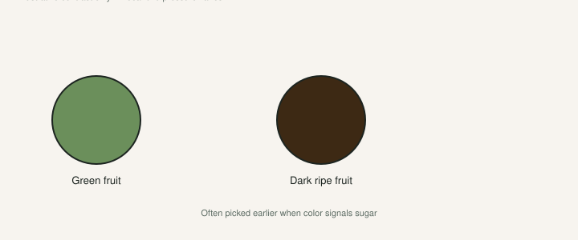

Jack will tell you his least favorite part of fig season after a dead tree: birds hitting fruit that is almost ripe. That is on [The Fig Jam](https://www.thefigjam.co/p/interview-with-a-fig-grower-keith), not a story I made up for this page. I have stood under a tree at dusk and counted pecks I did not hear happen.

[Pick The Right Fig](https://figroots.com/2025/07/02/pick-the-right-fig-for-you/) put it in one line. If you have a lot of birds, a **green fig might get eaten less than a dark one**. That is not folklore we invented. It is how contrast works on a tree. A purple-black fig on green leaves is a billboard. A ripe green fig looks like a leaf that got thick.

It is not invisibility. It is a head start. Birds still cost the most fruit.

## Birds first, because they cost the most fruit

<!-- figroots-graphic: birds-color-chart -->

*Illustrative contrast — local bird pressure still wins.*

Figs have to ripen on the tree. You cannot pick them hard and finish them on the counter like a peach you almost got right. Soft means now. Morning is when I want to be out there. A lot of the damage is breakfast.

University of Arkansas Extension names the crowd we have: **birds, squirrels, and raccoons**. They like figs just as much as people do. Bird netting can help. Keep the fruit picked so split and decayed fruit does not turn the tree into a wasp kitchen. I am not writing a spray schedule. UAEX already said figs normally do not need one.

A dark dessert fig photographs well. It also reads from the fence line. If you only planted dark names because that is what looks like a fig in a catalog, you built a bird feeder with extra steps. I still grow dark fruit I like. I net the trees we actually eat, or I pick them like a job. The library can take a tax. The pantry cannot.

Wasps will find a ripe dark fig as fast as a bird will. I do not spray them. I pick the fruit and I pull the trash. A tree you only visit on Saturday is a public kitchen.

A peck is a split you did not make. It sours by afternoon. The split-versus-sour draft is the bucket. This page is why the necklace started. Do not blame only the eye when a mockingbird started it.

## Green ripe lasts longer on the eye

Green-skinned ripe fruit needs a different eye. You pick by **feel**, not by color. Neck soft. Fruit hangs heavy. A dark fig you can grade from the porch. A green one you have to walk and touch. That is the trade: fewer bird hits, more walking.

LSU AgCenter’s 2015 fig note on **Champagne** is the other color lesson. Champagne is yellow. Charlie Johnson said birds seem to see the yellow figs better, so they are more of a problem. Green-hiding is not the same as yellow-ripe. A yellow fig on green leaves is a lamp. Do not plant a row of yellow names as your “stealth” crop and then write me a sad letter.

I will not invent a tasting score for Champagne. That is LSU’s fruit note, not our plate. Jack’s ranked fruit from the interview — **Red Sicilian**, **Syrian Dark #2**, **Jack Lilly**, **NSDC**, **Negra d’Agde** — is fruit we ate. Some of those are dark. We still grow them. Color is a tactic, not a flavor law. If you want a darker fig because that is the flavor you love, grow it. Just know you will share it unless you cover it.

The green ones are for the mornings you slept in. They are not a force field. A hungry flock will learn a green tree. I have watched it. The head start is still worth planting if birds are the tax you actually pay.

## Net the pantry trees

Net what you can reach. Accept losses on the tree you cannot bag.

I would rather look at netting than at a row of hollow skins. It is ugly. It catches mowers and your own head. It still works. UAEX named it. I will not rank brands. **[VERIFY]** the mesh against the birds you have. A hole a cardinal can walk through is decoration.

I net the two trees we actually put in jars. That is the pantry. The celebrity in a **#3** at the back of the block can take a peck if I am late. The collecting-versus-eating draft is that order. This page is the beak.

A pot you can roll under a hoop the week a variety ripens is a pest tool, not just a winter tool. An in-ground tree is a community resource. Plan the week’s harvest, not a weekend visit. The daily-picking draft is the ripe window. This page is why you do not skip Monday.

Pull the windfalls. A splitter left on the branch is a bar. UAEX is right that split or decayed fruit attracts wasps, bees, ants, and flies, and then picking becomes a fight. I have walked away from a tree with a stung wrist because I wanted one more fig that was already trash.

Do not build a compost pile of rotten figs under the canopy and then wonder where the trouble lives.

## Scare devices I will not rank

CDs, owls, foil tape, a radio, a fake snake — people swear by all of it. I will not print a scare-device winner I have not counted. Bibliography already refused that ranking. **[VERIFY]** on your birds. They get brave.

A device that worked in May is a perch in July. Move it if you use it. I would not skip netting the pantry because a pinwheel looked busy.

I will not recommend poisons. I will not give you a raccoon-trapping manual. Fence, net, pick, move the pot.

Dogs will eat figs. Chickens will if they can reach. Jack has the chickens. The fig is not a chicken feed program unless you left it on the ground.

## Beetles belong with the sour draft

Dried-fruit beetles do not care about your photo. They care about a hole.

Texas A&M’s plant disease handbook: souring plus the dried-fruit beetle. Plant closed eyes if you can — they name Celeste, Texas Everbearing, Alma. Magnolia and Kadota take more open-eye trouble. UAEX: water in the eye plus heat after rain. That whole argument lives in the split-versus-sour draft. I will not restage two buckets here.

A tight-eye green fig is doing two jobs at once: harder for a bird to clock from the fence, a better door against a beetle taxi. Tight is not a vault. Physics can still split a balloon. I am still not a fan of Celeste and Brown Turkey as dessert, so far. I still understand why the county agent keeps saying their names.

Pull the splitters. The beetle chapter is the eye and the trash. This chapter is the beak.

## Four-leggers, and a Saturday I would actually run

Squirrels take bites and drop the rest. Raccoons clean a bush at night like they paid rent. An in-ground tool tree by the woods is a night kitchen. I would not plant my only tree of a dark, open-eye, late fig by the birdbath and then write a sad post.

This is the Saturday I would run if the pantry tree is coloring and the birds have found it.

I walk at first light, not at 11. I pick by feel on the green-ripe names and by eye on the dark ones. Soft fruit in the bowl. Splitters and pecks in the other. I do not leave a necklace. If the flush is on, the net goes up that morning, not “this weekend.” The pot of a name I will not share gets rolled closer to the house. The in-ground tree I cannot roll gets the net or it gets the tax.

Color is a tactic. Clean picking is a tactic. Variety is a tactic. None of them replace being outside when the fruit is soft.

Figs still have fewer spray chores than peaches. That is true. “No pests” is not true the week the fruit is good. Birds cost the most fruit. Net the pantry. Pick the rest. Leave the scare-device championship in someone else’s video.
