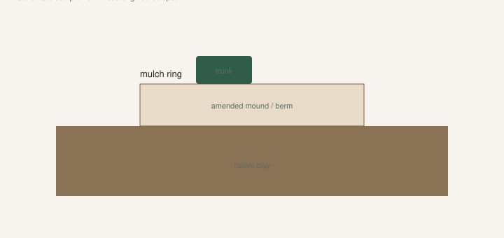

I have watched a thunderstorm turn a new planting into a birdbath. The fig sat in it overnight. People love to say figs are tough. Tough is not gills.

[Pick The Right Fig](https://figroots.com/2025/07/02/pick-the-right-fig-for-you/) said most figs can take harder soil — clay, rock — and that you still want air. They hate being drowned. That is the whole soil chapter. The rest is how you keep a South Arkansas hole from becoming a cup.

Run the puddle test **before** you shop a tree. A $40 name in a lake is a donation.

## Dig the hole. Fill it. Come back in the morning.

<!-- figroots-graphic: drainage-cross-section -->

*Bed profile schematic — not a engineered drainage spec.*

Dig the hole. Fill it with water. If it is still there hours later — if it is still a puddle the next morning — do not put a fig in it.

I want that test before you buy the plant, not after you have a leafy stick in a bucket and a Saturday of optimism. The hole is the climate. The variety is the second question.

You can cheat the hole by making it bigger and backfilling with fluffy mix. That cheat is how you build an underground bathtub: water leaves the pretty mix and hits the clay wall, then sits. The plant is in a pot with no drainage holes, buried. I would rather plant **high**.

A berm. A raised bed. A mound. Stick the tree so the crown is above the grade that floods. We have rooted cuttings in a raised bed with yard dirt — shade, not wet, 4 inches apart, a couple of inches of wood above the line. That is already on the [Outdoor](https://figroots.com/outdoor/) page. Same physics for a finished tree. Height is drainage you do not have to explain.

I will not give you a recipe of “X inches of sand plus Y of peat” as if I soil-tested your county. **[VERIFY]** with a local agent if you want lime and numbers. I will give you the grower move: **up, not deeper.**

## TAMU: clay is fine if water moves

Texas A&M’s 2015 figs PDF: plant in **well-drained** soil. Figs will grow in soils ranging from coarse sands to **relatively heavy clay**. The damage they name on sand is root-knot, not clay itself. Clay is not the villain. A sealed clay bowl is.

UAEX: well-drained soil, full sun, fibrous shallow roots, drought drop if it gets too dry. Same shallow mat. Dry week: fruit drop. Wet week in a bathtub: roots sour, leaves yellow, and you fertilize a corpse.

Sand has the other problem. Drainage is easy. Root-knot is not. If you are on sand, pots or a clean imported bed matter more than “fluffing the clay.” The nematode draft is that hole. This page is the clay bathtub.

NC State wants well-drained ground too, and they will not cultivate a shallow fig — mulch instead. I am with them on the hoe. You will cut the mat.

I have used topsoil, compost, manure that has aged enough not to burn. I have also killed time and money trying to turn a wet spot into a fig orchard. The wet spot won.

## Do not build an underground pot of mix

The pretty hole is the scar I want to spare you.

You dig a clay pit. You fill it with Promix and perlite. The tree looks happy for a month. Then a three-inch rain, and the mix is a cup sitting in a clay bowl. The water has nowhere to go. The crown sits wet. The leaves yellow. You add fertilizer because yellow means hungry in every video.

Yellow is often wet feet. Dig before you dump nitrogen on a plant that cannot breathe.

Plant the crown high. Let the native clay be the wall that sheds, not the cup that holds. If you amend, amend at the surface and out, not a secret pot underground. A raised bed of imported mix on top of clay is a different sentence — the water can run off the bed. A buried cylinder of mix cannot.

A raised-bed row at 4-inch spacing is a nursery, not an orchard. Dig the keepers out before the roots write a knot you will hate next March. UAEX’s 25-to-30-foot mature size is a well-fed, unfrozen tree. Most of ours never get that speech. Still: do not plant two keepers in a bathtub and call it a collection.

## Mulch the mat. Keep it off the trunk.

Shallow roots cook and dry. Organic mulch is the cheap climate control TAMU tells you to use. It keeps the swings down. It feeds the top inch. **Pull it off the trunk.** A wet collar against bark is how you grow slime at the crown.

We have used leaves, chips, and the kind of farm leftovers you have when you also keep chickens. I do not care which church of mulch you attend. I care that August sun is not hitting bare clay that baked into pottery around the roots.

Do not compost rust leaves against the trunk and call it mulch. The rust draft is that blanket. Move them out.

Water when the top of the root zone is actually dry, not when the calendar says Tuesday. Stop watering on a schedule you copied from a desert video. Feel the ground.

## What I put in a pot versus what I put in a hole

Pot mix I want open: perlite you can see, castings or a bagged mix that does not smear like pie dough. Promix HP for people who want a known bag. If water sits on the surface, the pot is lying. The mix draft in this set is that sentence.

In-ground I am less precious. Native clay that **sheds water**, amended at the surface, planted a little high.

Do not take a rare cutting from a trusted seller and graduate it into mystery Florida sand or a ditch. The [Introduction](https://figroots.com/an-introduction-to-figs/) already flagged nematodes in some local soils. Yard dirt is fine when you know it is fine. It is not a shortcut for a rare name. [Outdoor](https://figroots.com/outdoor/) uses yard dirt for **bulk** starts of wood we can replace. That is free rootstock logic. That is not a rare-name logic.

Air in the canopy is part of “soil.” A fig packed into a corner with no morning sun will hold leaf wetness and fruit wetness. That looks like a soil problem. It is a siting problem. TAMU likes south or east of a building so morning sun dries fruit and foliage after a night rain. You still need **6–8 hours**. A raised bed in a north alley is a well-drained disappointment.

## If the tree is already drowning

Stop the hose. Feel the ground.

If the hole is a sump, I would rather lift the tree in the dormant season and reset it high than “add gypsum and hope.” I have not run a gypsum trial I will quote. Bibliography already refused that proof. **[VERIFY]** if someone local swears by it on your clay.

A yellow tree in a wet pot is not asking for more shade. It is asking for air. Knock it. If the mix is a swamp, you already know. Spring is kinder for a reset than July. The before-June draft is a pot-up clock. A drowning in-ground tree is a winter-or-March job unless the plant is dying now.

Do not confuse a bathtub with nematodes. Galls are beads on roots. Wet feet is a sour smell and brown roots without knots. Dig before you write a novel. The knots, if they are there, will not be subtle.

Figs will grow in ugly dirt. They will not grow in a pond. Raise them. Mulch them. Water when the root zone is actually dry. If the puddle test fails, shop a different hole, not a different catalog. The tree you have not bought yet is the one you can still save.
