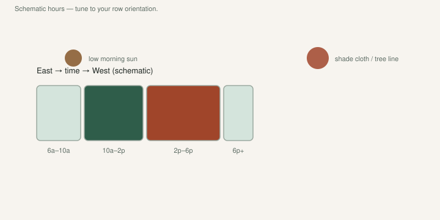

A fig can have all the growing degree days in the county and still taste like a dry sponge if you fried it.

[Pick The Right Fig](https://figroots.com/2025/07/02/pick-the-right-fig-for-you/) split the country in one clause: full sun in the North; in the South they need **some shade in the summer, and lots of water**. People skip that sentence because every generic fruit article says “full sun.” Generic fruit articles were not written in South Arkansas in July.

Morning sun. Afternoon shade. **6–8 hours** still. A black pot on gravel is an oven. Do not cargo-cult a California deficit recipe onto that oven.

## Morning sun, afternoon shade

<!-- figroots-graphic: shade-day-chart -->

*Tune shade to your row — hours shown are illustrative.*

Morning sun dries leaves and fruit after a wet night. That is the sun I want. It also stacks heat without turning a black nursery pot into a Dutch oven.

Afternoon sun on a gravel drive, a tin wall, or a concrete pad is a different climate. Pots show it first. Leaves droop at 2 p.m., recover at dusk, and you think you got away with it. Do that enough days and you get burned edges, stalled figs, and drop.

In-ground trees hide it longer. Shallow roots still cook under bare clay. Mulch. If you planted against a west wall that reflects heat, you built a reflector oven. An east wall is the one extension keeps recommending for winter *and* it is kinder in August. The east-wall draft is that siting. This page is the July day.

I would not plant a fig in deep shade and call it “Southern best practice.” UAEX: a minimum of **6–8 hours** of sunlight if you hope to harvest fruit. Shade here means **afternoon relief**, not a north porch. TAMU’s 2015 PDF still wants full sun, then south or east of a building so morning sun dries fruit and foliage after an evening rain. Those two sentences live together. Hours, then which hours.

Up north, I would take every hour of sun I could steal. Short season, weak sun, you do not give away light. Do not copy our shade talk onto a zone 6 pot in Michigan and then wonder why nothing ripens.

A 30–40% cloth over a pot yard in July is a tool. I would not wrap an in-ground tree in cloth all season and starve it of morning light. Dappled shade from a pine in the afternoon is how a lot of old Southern figs always lived — east of a house, south of a tree line, not in a parking lot.

Young cuttings and fresh pot-ups get more shade than a hardened 5-gallon. Shade after a move is not optional in our June. The before-June draft is why you should have moved them already.

## A black pot on gravel is an oven

We like black plastic because it moves and it takes a paint-pen line. In July on gravel it also soaks heat. Roots in a thin can see every degree, summer and winter. The shuffle draft is the move. This page is why you move them off the griddle.

Lift the pot. Light means water. Heavy means wait. A #3 on a hot pad will lie to you if you poke the top inch and call it done.

Pots in our heat can need water **daily** in a bad week. That is not the Outdoor page schedule. Hold that thought.

I would not cook a fresh pot-up on asphalt at 2 p.m. Morning. Shade. Water ready. I have done the 3 p.m. version. The plant told me about it for two weeks.

Terracotta looks good, dries out, and cracks. I would not collect in terracotta in zone **8a**.

## Even water. Not a California deficit.

UAEX: dry trees drop fruit. Also storms, cool weather after set, weak trees. Drought is the one you can do something about. TAMU: shallow, fibrous roots, relatively sensitive to drought stress. Even moisture while they size. A swamp after a drought is how you split fruit the week it should have been jam.

Kong, Lampinen, Shackel, and Crisosto (2013) put numbers on side cracks and ostiole-end splits, and regulated deficit irrigation at **55% ETc** helped **Brown Turkey** and **Sierra** in that California orchard. That is not an Arkansas pot recipe. I will not cargo-cult 55% ETc onto a #3 in zone **8a**. Starving an Arkansas pot in July is how you get drop, then a binge, then a split. The split-versus-sour draft already left that number in the paper it came from. Our pots need even water and a walk at 7 a.m.

Keep the root zone from swinging like a screen door. Mulch so the shallow roots do not see every cloud. If you flood a dry pot the night before a storm, you helped the split. Turn it off when the fruit is softening, or run it even all month so there is no binge. Even is the word. Hero is the split.

We fertigate when we water in the growing season — water-soluble feed in the hose, some slow-release in the pot — because that is how we got serious shoot growth. Winter is the opposite: barely moist, almost no feed. The fertigation draft is the dose. This page is the climate the dose lives in.

We use sprinklers on the pot block because hand-watering a collection is how you start skipping rows. Overhead water wets fruit. I know that. Drip is cleaner near harvest. If I had ten trees I would drip. We have not published a trial that says sprinklers cost us X percent of a crop. **[VERIFY]** on your fruit in a wet August.

Rain barrels in winter, well water in summer — know what you have. I will not lecture you about municipal chlorine. I will say: do not water at noon so you can watch steam. Morning is saner. Leaves can dry before night. The rust draft is why dusk sprinklers are a gift to a fungus.

In-ground, once established, is kinder. Not “ignore it.” The first two summers I would still water when the county is crunchy. A 25-foot fig you never watered after planting is a tree you gambled.

## Weekly water is for bulk starts

The [Outdoor](https://figroots.com/outdoor/) page parks bulk starts in the shade and waters about **once or twice a week**. That is a start tray of wood we can replace. It is not a fruiting tree in August. Do not run a loaded **#5** on that schedule in a heat wave because you memorized a winter-rooting sentence.

Bulk starts: shade, weekly, lower hit rate, dirt we trust for tools. Fruiting pots: lift them, water when they are light, afternoon relief, pick in the morning. Different job. Different thirst.

A cutting in a cup on a heat mat is a third job. Damp mix, not a hose calendar. The Pop page already said if you get the moisture right you are not watering until pot-up. Do not “help” a sealed bag with a daily drink.

## Wilt is a question, not a diagnosis

Midday wilt that recovers: heat. Check the pot weight anyway.

Wilt that stays at dawn: you are late, or the roots are gone — rot, nematodes, a drowned hole.

Crispy brown from the edge in: salt, sunburn, or a pot that went bone-dry and then got a flood. Ease it back. Do not soak a desiccated pot in a tub overnight and call it mercy if the mix is already hydrophobic. Water, wait, water again.

A yellow tree in a wet pot is not asking for more shade. It is asking for air.

If I were starting twenty trees here: morning sun, afternoon shade or a cloth I can roll, pots off black asphalt if I can help it, mulch, a hose I will actually use. Fertigate while they are growing, not because a bottle said “weekly” in January.

If I only had one in-ground tree: east side of the house, mulch, water the first summers, pick in the morning. If the west side is the only side, I would still plant it, and I would not pretend the reflected heat is “free GDD.”

South heat is not a bonus level. It is the climate. Give them shade when the sun is cruel, and water like you mean the fruit to stay on the tree. Leave the 55% ETc number in California. Our July is a drink, a cloth, and a wall that does not fry the can.
