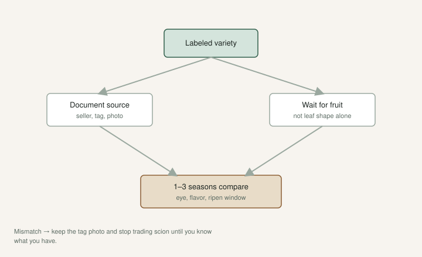

You can root a stick in a month. You cannot know what you rooted until it fruits.

That gap is where the fig market makes its money and loses its friends.

[An Introduction to Figs](https://figroots.com/an-introduction-to-figs/) already yelled this. Variety changes flavor, quality, ripening time, and whether the plant belongs in your climate. It usually takes **a year or more, sometimes two or three**, to verify the fruit is correct to type. Marketplace reviews close before anyone has had a fig. We said avoid the casual listing sites. We said look for a real nursery presence. We said we are not on commission.

I am not going to soften it. A wrong name is not a cute surprise. It is two summers of water, pot mix, and winter space for a tree you did not want.

Wait for fruit. Keep the note. Tell the truth on the pot.

## What “true to type” means here

The fruit matches the variety you paid for — eye, skin, pulp, season, growth habit — within the range that clone actually has.

It does not mean your fig tastes exactly like a photo from California. Climate moves sugar and size. It does mean you did not receive a random brown backyard fig with a celebrity sticker.

UAEX warns about **name confusion** in the nursery trade. Brown Turkey is a crowd. The same plant wears two tags. Fifty names in stores, hundreds on lists. LSU’s Charlie Johnson said a pass-along fig can wear as many as **25 names** because someone got a cutting from someone who got it from someone. “Unknown” that fruits well is a better honest label than a famous name on a mutt.

We still trial trees a long time. I have said on [The Fig Jam](https://www.thefigjam.co/p/interview-with-a-fig-grower-keith) that I am not a fan of Brown Turkey or Celeste *so far*. We do not cut them down on year one. We may graft over later. The root system can live. The name on the pot should still be true.

Jack can rank fruit he has eaten. He cannot rank a name that has not fruited. That is the discipline. His list — **Red Sicilian**, **Syrian Dark #2**, **Jack Lilly**, **NSDC**, **Negra d’Agde** — is a plate, not a catalog. A folder named `El Dorado Fig` on KC-PC is still not automatic proof of type. Same patience.

## Where the wood comes from

Best: a neighbor’s tree you have eaten from. You know the fruit. You know it lives in your weather. Take **6–8 inch**, three-node cuttings from that tree and you already skipped the marketplace.

Next: a grower with a reputation that survives a season on the forums, a website, a phone number, a license if their state requires one. Search the person, not the five-star burst on a sales page.

Last: a stranger with a rare name and a short story. Keep your money.

UC Davis used to send public scionwood. I got wood there years ago. That window is not the same now — USDA’s National Clonal Germplasm Repository has preferred dormant cuttings and stopped routine summer cutting distribution. **[VERIFY]** current distribution rules before you tell someone to “just order from Davis.” Germplasm is a reference, not a vending machine.

Big-box trees can be cheap and wrong, and the Intro page already flagged the worse problem: soil moved across state lines, disease riders, tags you cannot trust. I would not build a collection off a parking-lot cart.

If you sell cuttings, fruit them or say you have not. “As received” is honest. “Confirmed” is a claim. I would not put confirmed on a stick I have not eaten.

## What I write down so I do not argue with myself

- Source and date the cutting arrived
- What the seller claimed (eye, season, flavor family)
- First fruit date, size, skin, pulp, eye, three taste words
- A photo of the fruit **on the tree** and cut on a plate

If the plate and the claim keep missing, the label is the suspect. Not your palate.

Do not “correct” a tree by buying a second copy of the same name from the same kind of listing. Buy from a different, better source, or eat what you have and stop calling it the celebrity.

Paint pen on the pot. The name walks off paper in a hose storm. The labeling draft is the hardware. This page is why the hardware matters. A true-to-type fight that started because two cups mixed in a June rush is a fight you started with dirty hands.

## How long I actually wait

<!-- figroots-graphic: variety-verify-flow -->

*True-to-type takes seasons — document while you wait.*

Year one: you might get a fig. You might get a lie. A stressed pot throws odd fruit. A first fig can be small, pale, or split. I taste it. I do not write a verdict. The Intro said you may get figs the first year and more by the second, and it takes about **three years** for the tree to get well-established. I still get greedy. I still wait.

Year two: better. If it is wildly off — wrong color family, open eye when the name is famous-tight, a main-crop season that makes no sense — I get suspicious.

Year three: I am ready to call it, or to call the seller, or to relabel the pot as what it *is* and move on. Some trees we still have not cut because a long trial is cheaper than a wrong execution.

A first fig in a drought week is not a flavor family. A splitter after a binge is not a variety indictment. The drop draft and the split draft are weather. Type is the plate across years.

I still lose trees. Dead-outs at inventory still sting, especially the new names. I try to look at the ones that lived. A wrong label that lives is a different sting. Relabel. Do not ship it onward under the old name. That is how the mess spreads.

## Do not ship confirmed until you have eaten it

Dad told the Fig Jam the thing I would print on a shipping label: **patience is the most important ingredient.** Ask for help. The community will talk. They will also argue. Fruit on a plate ends more arguments than a thread.

If you trade, say what you know. “As received from X, not fruited” is a clean sentence. “Confirmed LSU Purple” on a stick you have not tasted is how a shrug becomes a county of shrugs. LSU letters on a tag are a clue. The plate is the proof. The LSU draft is that homework. This page is the rule for every name.

A Facebook “LSU Tiger” from a stranger is the true-to-type problem with a prettier acronym. I would rather have one fruited tool tree from a known yard than three unfruited celebrity tags from a swap.

## A buyer’s pause

Before you click: can this person describe the ostiole, the season, and the flavor without copying a blog? Have they grown it through a wet August? Will they still answer mail in fourteen months?

If the answer is a shrug, you are not buying a variety. You are buying a lottery ticket with leaves.

I would not start a neighbor on a rare name. I would start them on a tree they can eat, from a person who has fruit, or from a nursery that is not a parking lot. Celeste and a Turkey type are tools. I am still not a fan so far. I still tell a one-tree yard to plant a tool first. Flavor can wait in a **#3**.

Wait for fruit. Keep the note. Tell the truth on the pot. That is how a collection stays a collection instead of a pile of stories. A cutting is a promise. Fruit is the proof. The review window that closed in thirty days never tasted either one.
