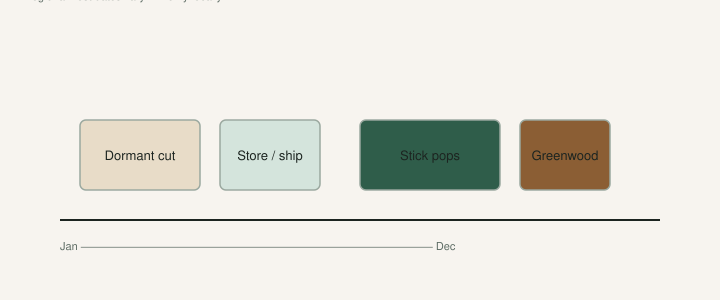

The worst cuttings I have opened were not “bad varieties.” They were good wood that spent three days in a hot mailbox because somebody shipped winter sticks in May, or summer sticks in July, and called it a season.

The calendar is not the boss. The **wood** is the boss.

Industry stick, because people skip it: **6–8 inches, three nodes**, lignified if you can get it. Pencil-thick or better for pops. That does not change when the month changes.

## Two seasons, not twelve

**Dormant lignified.** Trees have dropped or are dropping. Sap is down. Wood is brown/gray. This is what you cut, ship, fridge, and stick on a mat. This is the wood the USDA fig repository prefers now — they said they stopped routine **summer** cutting distribution because dormant wood roots better and demand was high. [VERIFY] if you are ordering germplasm; rules move.

**Green / semi-lignified.** Leaves on. Sap runs. This wood can root. It does not store. I already said that in [Lets Talk About Fig Cuttings](https://figroots.com/2025/12/23/lets-talk-about-fig-cuttings/). If it arrives green, you are in a now drill: wash, stick, or water-root. Fridge is how you turn it to slime.

Air layers are a third clock. We already posted [fall air-layer timing by zone](https://figroots.com/2025/09/18/setting-fall-airlayers-in-zones-6-9/). In-ground trees need an earlier start than pots you can walk into a greenhouse. That page is the air-layer calendar. This page is sticks.

## South Arkansas (our 8a) as the example

<!-- figroots-graphic: cuttings-calendar -->

*US-wide bands — verify frost dates for your zip.*

I will start where we actually live, then fan out.

**Late fall–winter.** Best cutting window. Wood is going or gone dormant. We prune, we take 6–8" sticks, we wash, we root what we have space for, we parafilm-and-crisper the rest. Double bag. Check.

**Late winter–early spring.** Still dormant if the winter meant it. This is when a lot of mail-order wood moves. Stick it if the mat is ready. Store it if you are waiting on last frost to put cups outside. Do not leave a box on a porch that hits 80°F in an Arkansas February surprise.

**Spring push.** Trees are moving. Wood you cut now may bleed. Semi-lignified. Root soon. I would not build a storage bag out of it.

**Summer.** Heat. Storms. Green wood cooks in a truck. If you take a summer cutting, treat it like a perishable. Shade, moisture in the mix not around the bark, no fridge nap. Outdoor sticking in shade (the [Outdoor](https://figroots.com/outdoor/) pots and beds) is a real method when you have extra wood and you do not want a basement full of cups. Water weekly-ish, not a swamp. Separate at 7–10 leaves or wait for fall dormancy. That wood is replaceable. A named stick from a mailbox is not. Do not mix those jobs.

**Early fall.** Wood starts to harden. A semi-lignified stick can still root. Storage gets safer as they lignify and the nights drop. Do not ship a soft green bundle across the country in September and call it dormant because the calendar said fall.

I would rather take extra dormant wood in January and fridge the surplus than invent a July shipping season because I ran out. The fridge draft is the delay. This page is which month even belongs in a bag.

## Other US regions (honest ranges, not frost tables)

I am not going to fake your last-frost date. I will tell you what the wood is doing.

**Gulf Coast / deep South (roughly 8b–10).** Dormant window is short and sloppy. Trees may never look “dead” the way a zone 6 pot does. Cut when nights are cool and the sap is quiet, not when a website in Michigan says January. You have a long outdoor rooting season. You also have rot pressure. Dry the bark.

**Upper South / Mid-Atlantic (7–8).** A real winter. Cut after leaf drop. Store through the worst cold if you are not ready. Outdoor cups wait until the tray will not freeze solid every night. Main-crop wood next summer is the prize, not a June breba on a stick you have not rooted yet.

**Lower Midwest / inland South.** Same winter logic, harder snaps. Do not store cuttings in an unheated shed that hits 10°F. The crisper is the point.

**Northeast / inland New England.** Short season. Dormant wood is a late-fall and winter object. Root indoors on a thermostat. Do not rush cups outside to “get them hardened” during a freeze-thaw circus. Your GDD problem is real; start the tree early in a pot if you want fruit.

**Pacific Northwest.** Mild winters, weak summer heat. Dormant wood is easy to take. Ripening is the fight, not the cutting. Stick early so the plant has a year on it. Late varieties are a heat problem, not a calendar-of-sticks problem.

**Desert Southwest.** Dry air kills cuttings in a bag and on a bench. Seal storage. Watch dehydration in the cup. Outdoor sticking needs shade or you will make raisins. Heat is not the same as humidity; rot still happens if you panic-water.

**California coastal / Central Valley.** Long, clean dormant harvest if you are in a real winter inland. Coastal trees can stay greener. Do not assume a CA seller’s “January cutting” is dormant just because the zip code sounds figgy. Scratch, look, no sap.

Every one of those lines is a **pattern**, not a NOAA station. [VERIFY] against your tree: leaf drop, sap, bark color.

A zone number on a tag is not a cutting calendar. 8a here is not 8a on a West Coast slope. Look at the wood.

## The day a box lands

Open it that day. Shade. Inventory. Damaged sticks get documented — we already posted [Damaged Fig Cuttings](https://figroots.com/) for refunds and replacements. Then decide: stick or fridge. Not “I’ll deal with it Saturday” on a kitchen counter.

Scratch one. Moist cream cambium: alive. Brown dust: firewood. Sap on the plastic: it was moving when they packed it. Treat it as non-dormant. Root soon. Wrinkled from a hot truck: soak, dry the bark, stick now. Do not file it for February.

Unlabeled sticks are unknowns the minute you own them. Write “box 3, unlabeled.” Do not write a celebrity name in hope.

## Shipping without cooking the stick

If I am sending wood, I send it **dormant**, packed so it cannot slosh, and I do not put it in a truck in a heat wave for fun. A week in a hot box is not a storage method. Summer sticks are perishable. Winter sticks in a May mailbox are cooked wood with a tracking number.

Parafilm, a dry seal, a label that survives the bag. The fridge draft is the hold. This page is: do not create a hold the weather will ruin.

## What I would put on the shop wall

- Green? Root now.
- Dormant, lignified, you have a mat? Root now, or fridge like you mean it.
- Dormant, no space? Parafilm, double bag, crisper, weekly look.
- Summer mail in a heat wave? Do not.
- Outdoor dirt method? Shade, extra wood, patience, fall separation if you want.

The month is a hint. The wood is the fact. If you can tell lignified from green and dormant from moving, you do not need a pretty wheel. If you cannot tell, do not ship, do not store, and go back to the cuttings post with a stick in your hand.
