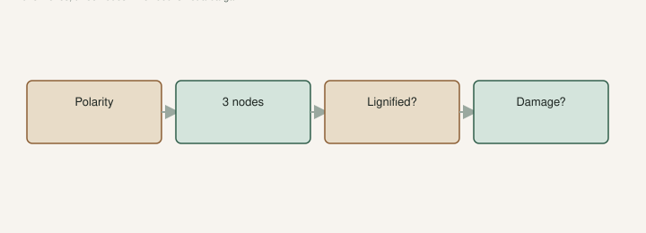

You can kill a good variety by sticking it upside down. You can also baby a stick that was already dead when it left the seller.

I want the wood in my hand for ten seconds before it sees mix. The [cuttings post](https://figroots.com/2025/12/23/lets-talk-about-fig-cuttings/) already set the standard: **6–8 inches, three nodes**. This is how you tell if the stick in the bag is that, or a leftover.

## Which end is up

<!-- figroots-graphic: cutting-read-checklist -->

*Read the stick before you stick it — schematic only.*

Figs have polarity. The end that was toward the sky grows the shoot. The end that was toward the roots is where you want the callus.

Look at the nodes. Buds point up the stick, the way they grew. A heel — a bit of older wood at the base — is a clue if they cut at a junction. If someone mailed you a perfectly even rod with no buds you can read, do not guess. Scratch lightly. The bud side is usually a little raised.

If you stick it backwards, you can still get a callus. You may also get a confused plant or nothing. I would recut and orient it before I invent a new method.

Mark the top with a dot of paint or a wrap of parafilm if you are lining up a tray. At 11 p.m. all brown sticks look the same.

A heel at the base — a bit of older wood where they cut at a junction — is a gift if you get one. It tells you which end was down. If someone mailed a perfectly even rod with no buds you can read, do not guess. Recut and orient before you invent a method.

## Count nodes like they matter

A node is where a leaf was, and where a bud sits. Three nodes is the floor we already publish. Two of those can go in the mix. One or two stay up for the shoot.

A one-node chip can root. People do it. I would not build a collection on chips unless the wood is rare and I have nothing else. Thin, one-node, green — that is three strikes. The Fig Pop page wants **pencil-thick** for a reason. A whip the size of a soda straw dries out before it drinks.

If the seller sent a 14-inch cane, you can make two cuttings if there are enough nodes on each piece. That is what we did in the [coir vs DE test](https://figroots.com/2026/02/10/rooting-fig-cuttings-coco-coir-vs-diatomaceous-earth-de-lessons-from-my-a-b-test/) — long wood, split, one into each media. Do not split a 6-inch stick into two 3-inch hopes.

## Lignified, green, or pretending

Brown, gray, blackish bark: lignified. Green: not. Semi-lignified is the tan middle that still feels a little alive in the hand.

Green wood can root. It does not store. I will say that until people stop putting June sticks in the crisper.

Dormant lignified: no milk on a fresh cut, no dried sap all over the bag. That is fridge wood if you cannot stick it today. See the storage draft.

A stick that looks brown but snaps like a cracker and shows brown dry inside is firewood. Scratch the cambium. You want a moist green or cream line, not chocolate dust.

Do this in shade, not on a dashboard. A cutting can look fine in a cold box and show brown after it warms. Give it ten minutes on the counter, then scratch. Frozen wood that thaws to mush is trash. Frozen wood that thaws firm can still go in a cup. [VERIFY] with the knife, not with hope.

## Damage you can see in the bag

We already posted signs for refunds on damaged cuttings. I still open every box the day it lands.

Mold on the bark: wash what is firm, trash what is soft. A crushed node in the middle of a three-node stick may leave you two. A flattened whole cane is done.

Wrinkled bark from a hot truck: soak, dry the surface, stick now. Do not file it for February.

Sap everywhere: it was moving when they packed it. Treat it as non-dormant. Root soon.

No label: that is an unknown the minute you own it. Do not write “Black Madeira?” in hope. Write “box 3, unlabeled” and wait for fruit.

A cutting cannot show you the ostiole or the flavor. Bark tells you alive or dead. Nodes tell you whether it meets the **6–8 inch / three node** stick we already publish. The rest is a fruit problem two years from now.

## What I do after I read it

Wash. We scrub now. I did not know how much film was on them until we started. Soap, or the dilute bleach already on the [Fig Pop](https://figroots.com/fig-pops/) page (10 water : 1 bleach), or peroxide. Dry the bark.

Fresh cut on the base if the old face is brown and tired. A light slit to show cambium if that is how you pop. Mix damp, not wet — squeeze until **no water comes out**, then add about **30% dry** coir. Gap under the stick so it is not sitting in a puddle. Heat mat on a **thermostat**, about **75–78°F**, probe in the mix.

If the reading says junk, I do not waste a cup. If the reading says green, I do not waste a fridge bag. If the reading says dormant and my tray is full, parafilm, double-bag, crisper. The fridge is a delay for dormant wood. It is not a holding pen for a stick you already know is moving.

## Heel, mid, and tip

A long cane is not one kind of wood. The heel — a bit of older wood at the base — often roots like it has done this before. The tip can be greener, thinner, more eager to leaf and more eager to dry. The middle is what most 6–8 inch cuttings are.

If I have to choose, I would rather stick a heel and a mid than two whip tips. The A/B test split long wood so each variety had a pair. That only works if each piece still has nodes enough to be a real cutting. A tip with one fat bud and no thickness is a prayer.

A 14-inch cane can make two **6–8 inch** sticks if the nodes are there. Do not split a 6-inch stick into two 3-inch hopes. We already did the long-wood split in the 2023 coir vs DE test. I will not invent a sequel. I will tell you the piece still has to be a cutting when you are done.

Buds at the top of a dormant stick may be flatter. That is not dead. Scratch. If the cambium is cream, wait. If you snap it and it dusts, it is dead.

## What I will not do to “save” a stick

I will not bury a two-inch chip under a dome and call it the standard. I will not strip every bud “so it focuses on roots.” Figs need a node that can shoot. I will not dip a moldy cane in hormone and pretend the hormone is a priest.

Hormone (Clonex, Dip’n Grow) is optional on the Pop page. We have used it. Dad will also tell you a raised bed of yard dirt has rooted wood with nothing on it. I would rather have clean, thick, three-node wood than a $20 gel on a pencil lead.

Ten seconds with the stick in your hand is cheaper than six weeks of watching a corpse leaf out and collapse. Read it first. Then stick it. If the reading is ugly, take another cutting next dormant season from a tree you can walk to. That tree is still the best seller.
