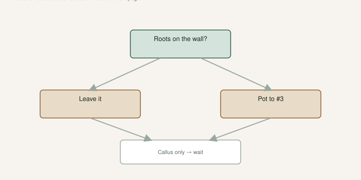

The first time I dumped a fig pop like it was a tomato start, the roots came off in my hand. The leaves looked great. The plant was done.

[Fig Pops](https://figroots.com/fig-pops/) already said it: those roots are brittle. The [Introduction](https://figroots.com/an-introduction-to-figs/) already said pot into a 3-gallon before the thing is a knot, and try to do that **before June**. This is the in-between — when the cup is ready, and when you are just bored. The June deadline is its own draft in this set. This page is the **root check**.

## Ready is roots, not leaves

<!-- figroots-graphic: pot-up-root-check -->

*Leaves lie. Roots on the wall are the check.*

Leaves lie. A cutting will throw a flush on stored food and then fold. I wait until I see roots on the wall of a clear cup, or I feel a web when I squeeze *gently*, or I peek from the bottom holes.

Callus is not roots. That failure has its own draft. If you pot a callus into a gallon of wet Promix, you buried a battery.

White nubs at the wound are scar tissue. Cream threads that run the wall and hold mix when you tip the cup — those are roots. If you cannot tell, wait. Waiting is cheaper than a funeral.

Outdoor bulk starts are a different clock. The [Outdoor](https://figroots.com/outdoor/) page waits for **7–8 nice leaves** in a pot, or **9–10** in a bed, about **60–90 days**, or you wait until fall dormancy and dig then. That wood is in dirt, not a pop bag. Do not mix the calendars.

## How I check without wrecking the cup

I do not dump a tray every morning to “see.” I use three cheap tests.

**Weight.** A light cup is thirsty. A heavy cup is not. Pick it up. You will learn your mix in a week. Peeling the bag open every day is how you break the first root that showed.

**Wall.** Clear cups exist so you can see. Roots on the plastic are the green light I trust more than a leaf. If the cup is opaque, peek the drain holes. A white thread in the hole is closer to ready than a pretty top.

**Gentle squeeze.** The Pop page already said the roots snap. Squeeze the cup, not the stick. A web that springs back is a root ball starting. A stick that wiggles in soup is not.

If the wood is firm and the mix is right and you still see nothing at the wall, you wait. Our coir tray in the 2023 test had fast roots around day 10 and stragglers later. 64 varieties, two cuttings each. I will not invent a sequel. Slow is not a license to pot a callus.

Take it **off the mat** when it has roots. The mat was for the stick, not for a leafy plant. A bound cup on a forgotten mat cooks.

## Callus, leaves, and the battery

Tops out, bottom empty: that plant is spending wood it cannot replace. Reduce light. Do not fertilize. Do not transplant. You are holding a battery with the charger unplugged.

If the top is a full leaf set and the cup is still empty at the holes after many weeks, look at heat and moisture first. Mix too wet? Rot is coming. Mix too dry? Dehydrated wood under a pretty leaf. Then look at the variety. Then wait more. Potting a leafy, rootless stick is how the failure draft ends.

I would not drown a stalling cup to “wake it up.” That is how callus-only becomes rot. I would not pot it into a gallon “to give it room.” Room is not the problem. Roots are the problem.

## How I move a pop

This is the hands. The calendar — **before June** into a **#3** if the plant is already growing in spring — lives in the other pot-up draft. Do not use this page as a dare to transplant into a heat wave.

Open the bag or cup. Do not yank the stick. Support the mix so it stays as a lump. Set the lump in a hole in firmed, damp potting mix — Promix HP if you do not want to think, or a drainy mix you already trust. Do not bury the original nodes under six new inches of swamp.

Water once to settle. Then leave it alone for a few days in **shade**. This is not the week you fertigate. Fertigate once it is growing in the new pot, the way we already tell people after pot-up. TAMU’s 2015 figs PDF says **do not fertilize at planting**. A pot-up is a kind of planting. I listen.

If you shake the roots clean “to see them,” you are collecting photos, not trees. If you broke them and you know it, keep it shadier longer. You are nursing a leak.

A trade gallon is enough from a cup. A **#3** is the nursery pot the Intro named after the cup is root-bound. A jump to a barrel around a cup of roots is a lake. Step up.

## Bound cups vs stalling cups

A pop that is root-bound in a fist of coir will stall and dry out every afternoon. You will think it needs more water. It needs volume. That plant is ready. Move it.

A stalling cup is the opposite: firm wood, few or no roots, maybe leaves. That plant is **not** ready. Leave it. Write the variety and the date on the cup. Patterns show up. One name always sits.

Gnats love a wet cup you left “one more week” on a bound plant. Mosquito Bits (BT) is something we have used. I will not sell it as required. Dry the surface. Do not keep a swamp because you are scared of dehydrating a plant that already has roots.

If the cup is a knot and it is cooking, a modest morning move still beats death. That is the only heat-wave exception I will own, and even then I am moving because the **roots** said so, not because a date on the wall dared me.

## Labels move or the name dies

The name on the cup is the name. Write it on the new pot *before* you commit the plant. Paint pen on black plastic is what Dad uses because it stays. A paper tag in a hose storm is how “Red Sicilian” becomes “green pot by the door.”

If you are potting a tray, do one variety at a time. I have watched people mix two cups and then shrug. That shrug is a two-year identity problem.

Write the pot-up date next to the name. Next year you will know which varieties sat and which ones ran. That note is a root-check log, not a brag.

## Outdoor dirt is a different clock

When you lift a bed start, wait for dormancy if you can. Summer digs work. They also break more roots. Shade, water, do not fertilize the day you rip it out. Same Outdoor page: you can also leave them until fall and separate then.

A raised-bed row at 4-inch spacing is a nursery. It is not a finished orchard. Get them out before they write a knot.

Do not use the 60–90 day outdoor line on a heat-mat pop. Do not use the “roots on the cup wall” line on a bed of dirt you cannot see. Different methods. Different patience.

A bed start you lift in July needs the same gentle hands and more water. A bed start you lift in dormancy is a stick with a beard. Easier.

## After the move, the first two weeks

Shade. That is not optional in our June. A pop that lived under a bench does not want a gravel pad on day one.

Water when the pot is light, not when the calendar says. A fresh #3 can sit wet if you panicked. Heavy pot, yellowing: you drowned the move.

No fertigation until you see new growth that is not the old pale leaves it already had. Then the feed draft starts.

If you only remember one check from this page: roots on the wall, mix still in a lump, name written first. If you only remember one date, it lives in the before-June draft. This page is whether the plant has earned the pot.
