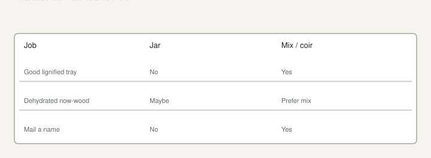

Somebody always swears water is easier. They show a jar on a windowsill and a white nubble. Then they pot it, the roots snap, and they come back asking why pops are “more complicated.”

Water is a tool. It is not the Fig Pop method. The [Introduction](https://figroots.com/an-introduction-to-figs/) already said you can root in water in a pinch. The [cuttings post](https://figroots.com/2025/12/23/lets-talk-about-fig-cuttings/) said green wood may belong there because it will not store. I agree with both. I do not agree with turning every dormant **6–8 inch**, three-node stick into aquarium decoration.

Mix is the default. Coir, a drainy mix, squeeze test, heat mat on a **thermostat**. That is the work we already published. Water is the emergency lane.

## When I would put a stick in a jar

<!-- figroots-graphic: water-root-when -->

*Emergency lane — not a second method we ran a trial on.*

**Green wood you got today.** Soft, leaking sap, cannot go in the crisper. A jar is faster than building a tray if you have one stick. The cuttings post already said non-lignified wood does not store and rots the fastest. I would rather see white in a jar than fuzz in a bag.

**A dehydrated mailer.** Wrinkled bark, still a green scratch. A soak, then a jar *or* a proper damp mix. I have seen people skip the dry-the-bark step and grow slime. Water is not a week-long bath for a moldy cane. If the scratch is brown and dry through the cambium, you are holding firewood. **[VERIFY]** by scratch. I will not promise a save.

**Curiosity on one stick.** One. Not a box. You want to watch a root because you have never seen one. Fine. Change the water. Pot it like it will break. Do not build a religion out of the photo.

**You have no mix and you refuse to wait.** Better a jar than a dry cup of mystery dirt from a ditch that might have nematodes. The Introduction already flagged local soil. The nematode draft is why I will not “save money” on a rare name with yard dirt.

I would not water-root a box of fifty dormant cuttings because a video said roots look cool in glass.

## When I would not

A good lignified, dormant bundle and a bag of coir on the bench: skip the jar. Stick it. [Fig Pops](https://figroots.com/fig-pops/) already named the moisture: squeeze until **no water comes out**, then add about **30% dry** coir. Heat mat **75–78°F** on a controller. Leave a **1–2 inch gap** under the stick. That is the default lane.

Outdoor bulk wood we can replace: shade, weekly water, yard dirt or a cheap pot, per the [Outdoor](https://figroots.com/outdoor/) page. No jar. That wood is a tool. A jar is attention. Attention belongs on names you cannot buy again.

I would not fridge green wood “until I feel like water-rooting it Saturday.” Green does not store. I would not submerge a whole stick. I would not put fertilizer in the jar. There is nothing to feed yet. You will burn a cutting that cannot eat.

A hot south window in Arkansas in July is soup by Thursday. I said low light. I will say it again. A north counter is enough. Once it is potted, then you can talk about morning sun.

If your whole system is jars on a kitchen counter next to bananas, you will get fungus and fruit flies and a story. I would spend the money on a bag of coir and a cheap thermostat before I bought a third mason jar.

## What water roots actually are

The stick sits in wet. Callus forms. Roots that grow in water are fat, brittle, and used to drinking from a lake. The day you move them to Promix they have to learn soil. That transplant is where people lose the plant they were so proud of.

Fig-pop roots are already snap-happy. We said that on the Pop page. Water roots are worse. They look like a win in glass. They are glass-grown noodles. Treat them like they will break, because they will.

Change the water. If it goes cloudy, you are growing bacteria, not figs. I would change it often enough that it never smells. I will not give you a fake “every 48 hours or 92% succeed.” **[VERIFY]** against your jar. Warm rooms go sour faster. I will not print a success rate I did not count. The [coir vs DE](https://figroots.com/2026/02/10/rooting-fig-cuttings-coco-coir-vs-diatomaceous-earth-de-lessons-from-my-a-b-test/) counts are from cups in a 2023 basement test — 64 varieties, two cuttings each. That was not a jar trial. I will not invent a sequel in water.

Keep the nodes you want for roots *in* the water and a node *out* for the shoot. Polarity still matters. A whole stick submerged is a rot project.

A clear jar lets you stare. Staring is how people lift the stick every day and break the nubble. A cup of water with a cardboard collar works. I still change it.

Charcoal in the jar, a bubbler, a fish tank — I have heard all of it. I have not run those as a trial I will quote. **[VERIFY]** if you like gadgets. I would rather spend the gadget money on coir and a thermostat.

A dirty jar from last year’s flowers is how you start behind. Wash it.

## How I would pot a water root if I had one

Treat it like a pop, only worse.

Do not rinse the roots under a tap for a photo. Do not shake them clean. Slide the stick into a hole in damp mix — Promix HP if you do not want to think, or the coir mix you already trust. Support the noodles. Shade. Do not fertigate the first week. Do not put it on a bare heat mat. The mat was for the stick, not for a leafy plant with glass roots.

If the roots are two inches of white, a small cup is enough. A **#3** of wet mix is a drowning. The before-June draft is a calendar for a plant that already has a root ball. A water-rooted stick is not that plant yet.

White, firm, a few millimeters to a couple of inches: pot. Waiting for a wig of six-inch water roots is waiting for a transplant nightmare. Strong in water is not strong in soil. I would move them when there are a few roots you can see, not a wig.

When the roots are brown in the water: that is not a good brown. That is rot. Recut above it if there is length, fresh water, or switch to damp mix. If there is no length, you are done. Do not “wait and see” on slime. The Damaged Cuttings folder is that wait.

After the move, the first week is shade and a drink, not a tour of the gravel pad at 2 p.m. Black plastic on gravel will cook a new root system as fast as it cooks a #3. Afternoon shade is not optional in zone **8a**.

## The honest comparison

Fig Pops: mix you can squeeze, gap under the stick, **75–78°F** on a controller, leave it alone.

Outdoor dirt: shade, water about **once or twice a week** on bulk starts, free wood, lower hit rate, no jar. Different clock. Different patience.

Water: emergency lane for green or lonely sticks, or one stick you wanted to watch.

I will not tell you water is sterile. I will not tell you it is “more natural.” I will not tell you it avoids rot — rot loves standing water. I will not tell you a water root is a better tree. It is the same clone if the wood was true. The method is just how you got it alive.

TAMU’s 2015 PDF still points home growers at dormant hardwood in mix, not a windowsill jar. Softwood, they say, usually wants mist. A jar is not mist. A jar is standing water. Know which job you signed up for.

Green stick, today, no mix: jar, change the water, pot like the roots will break. Dehydrated now-wood with a green scratch: soak, then jar or damp mix, your call, no fridge nap. Dormant bundle, winter, you have coir: skip the jar. That is the whole argument. If someone tells you water is always easier, ask them how many they potted through July. The easy part is the photo. The hard part is the week after.
