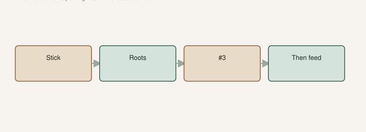

Jack’s line on [The Fig Jam](https://www.thefigjam.co/p/interview-with-a-fig-grower-keith) was simple: fertigate. The growth after we started was obvious. His least-favorite chore was still walking fertilizer around hundreds of pots.

A cutting in a cup does not get that treatment. There is nothing down there to drink a feast. You feed a **plant**.

## Fertigate the plant, not the stick

<!-- figroots-graphic: fertigate-after-plant -->

*Feed the plant, not the stick. Mixer settings [VERIFY].*

Once a tree is potted and growing, we put water-soluble fertilizer in the water. Miracle-Gro is what Jack named. Schultz slow-release in the pot in summer. I am not married to a brand. I am married to **regular weak feed while they are moving**, not a heroic dump in March and then neglect.

On a collection we use a brass siphon mixer and sprinklers on days it does not rain. Hand-watering gets old. That is our hardware, not a commandment. Ten trees can be a watering can. **[VERIFY] your mixer** — ratio, brand, how hard your water hits it. I will not print a siphon setting as a law. Ours is a brass unit on a hose. Yours may throw a different cup of concentrate. Read the bag. Watch the leaves.

The [Introduction](https://figroots.com/an-introduction-to-figs/) already said after you pot up you should start fertigating every time you water, with a water-soluble feed. That sentence assumes a rooted plant in a **3-gallon**, not a stick in a pop bag.

Texas A&M talks small, frequent nitrogen on figs. That matches how we behave better than a lawn-sized handful of 13-13-13 dumped on a #3.

## When I would not feed

**Rooting.** Mix damp. No Miracle-Gro tea in a pop. You will burn a stick or grow algae. [Fig Pops](https://figroots.com/fig-pops/) is moisture and a thermostat, not a feed program.

**The week you pot up.** Roots are broken even if you were careful. Water. Shade. Feed after it stands up again. The before-June draft is the calendar. This is the hour you do not celebrate with a cocktail.

**A brand-new in-ground hole.** TAMU’s 2015 figs PDF: **do not fertilize at planting.** Water the tree to settle the soil. The initial growth comes from stored carbohydrate in the young trunk and roots. I listen. Cut back a dormant plant some to match lost roots if that is the job. Do not strip a leafy July plant to plant it, and do not dump a lawn spreader in the hole to “help.”

**Winter pots in the shop.** Cool, barely moist, little or no fertilizer. They are not supposed to build a jungle under glass in January. We hand-water from rain barrels and mostly skip the food. The trees are often not fully dormant in a mild **8a** shop, but they are not in a growth program. The [Winter Protection](https://figroots.com/winter-protection/) page already said barely moist, not a heated den.

**A yellow tree sitting in a swamp.** That plant cannot eat. Fix the water. Yellow is often wet feet or nematodes, not hunger. Dumping nitrogen on drowned roots is how you make soup. Galls look like the root swallowed BBs. Dig before you buy a third bag.

## Late nitrogen makes tender wood

NC State’s fig culture page is blunt. Overfertilizing with nitrogen promotes **succulent growth late in the growing season**, and that wood is more susceptible to winter injury. Excessive nitrogen also means light fruiting, splitting, and souring in their writeup.

I would not chase “more figs” with more nitrogen in August on a plant that is trying to ripen. You will get leaves. You may get split fruit if you also flood it. You may get pretty green sticks that the first real cold will bite.

NC State’s rate talk — a pound of 8-8-8 per year of age, on *their* soil, up to a cap — is a North Carolina in-ground conversation. It is not a #3 in Saline County. I will not copy their lawn math onto our cans. I will take the late-nitrogen warning. If a plant is already putting more than a foot or two of new wood, they say reduce or drop nitrogen. We watched **one to three feet** of spring push on a lot of pots in a season we were paying attention. That is a conversation, not a target I will guarantee for your hose. **[VERIFY]** on your own flush.

I would rather see a pale mix every time you water than a black sludge once a month. “Fertigate” means the fertilizer rides with the irrigation. If you only feed when you remember a holiday, you will get a flush and a stall.

Read the bag. Half of what a houseplant bottle screams is plenty for a fig in a pot in our heat, because you are watering often. Salt builds up in a #3. A clear-water watering now and then helps. I have not run a leach trial I will quote. **[VERIFY]** if the leaf edges burn. A white crust on the mix is how the pot tells you.

Slow-release in the pot is backup for the week you only run plain water. It is not a reason to skip the hose feed in high summer. In winter I would not charge a shop pot with a full dose of pellets and then forget it. Cool and wet plus food is algae and gnats. Mosquito Bits (BT) is something we have used for gnats. I will not sell it as required.

## One to three feet is a conversation, not a rate

Keith’s Fig Jam line: we use water-soluble fertilizer when we water, and some slow-release in the pots in summer to help vegetative growth. We have seen about **one to three feet** of new growth on most trees in a spring we were watching.

I will say that because we saw it. I will not turn it into a guarantee for your water, your mix, and your mixer. I will not invent a second trial with percentages. I will not tell you a brand bought you a foot of wood.

In-ground is less needy. A tree in clay that drains, mulched, with rain, does not want a weekly cocktail forever. Small, frequent nitrogen in spring as TAMU says. A weak tree that dropped fruit may have been dry, not hungry. UAEX lists drought, storms, and cool weather after set as drop causes. Fix the hose before you buy a bloom booster. There is no bloom booster that replaces a root system.

Year one and two in a hole: light feed once they are growing, not a farmer’s nitrogen program. The first-two-summers draft is the water story. This is the food footnote. A weed-and-feed on shallow fig roots is a way to write a bad year. Keep the lawn fight away from the ring.

## The chore is the collection

Jack hates fertilizing that many pots because there are that many pots. That is a collecting problem. If you have four trees, this is a ten-minute walk. Forty trees: a mixer or you will skip rows. Four hundred: you are in our problem. Admit the collection is the reason the fertilizer is a job. Do not blame the fig.

Label the ones you already fed if you are walking a block with a cup. I have double-fed a row and skipped a row in the same evening. The skipped row tells on you two weeks later.

Four trees: a can and a walk. Do not buy a siphon because a collection video looked busy. Buy a siphon when skipping rows is the actual failure.

Feed the plant, not the stick. Feed in the season it is growing. Stop when you put the pot in the shop. No fertilizer at planting. No hero nitrogen in August if you still want wood that will harden. That is fertigation without a sermon. If the tree is yellow and heavy, put the bag down and check the roots. Hunger is not the only pale. **[VERIFY]** the mixer, the bag, and the flush you actually got — not a number I invented for your hose.
