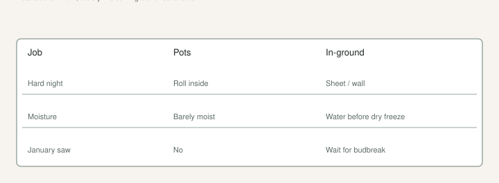

We already keep a [Winter Protection](https://figroots.com/winter-protection/) page. This is the Arkansas version of that argument: zone **8a**, rollercoaster winters, pots that will freeze through, in-ground wood that may or may not be there in March.

UAEX is blunt. North counties take the worst swings. A fig can die to the ground and still throw main-crop fruit on new shoots. Breba rarely rides through our winter on unprotected wood. If you prune like you live in San Diego, you will meet March with a hat rack and a story.

## Pots: the shuffle is the protection

<!-- figroots-graphic: winter-pot-vs-ground -->

*8a conversation — not a heated-den catalog.*

A #3 on a porch in January is a block of ice with a stick in it. Roots in a thin black pot see every degree.

We roll pots into a shop, a glass frontage, a hoop. The Winter page says keep them above about **40°F** if you can, and do not park them in a **heated living room**. Figs want a rest. A 70°F den with a heater and a curious dog is not rest. You will get weak growth and pests.

Water: barely moist. Overwater in the cold and you drown them, or the water freezes and kills the roots. We use rain barrels and we do not fertigate. Summer habits kill winter pots. A hose program from July is how you ice a root ball in January.

A hoop house we have been building is extra space, not a tropical house. If it does not stay above a hard freeze, you still have a problem. [VERIFY] night lows in *your* structure with a cheap thermometer. Hope is not a sensor.

Wrap the pot if it has to stay out: bubble wrap, a bigger tub of leaves, something between the plastic and the sky. Cover the top if a freeze is coming. I would still rather move the pot. A #3 is a thin can. Roots in a thin can see every degree, summer and winter. The shuffle draft is the wagon. This page is why January is a move.

## In-ground: save a trunk if you care about next year’s wood

Young trees and new trunks burn first. TAMU talks cages stuffed with hay or leaves, and hay mounded a couple of feet on older plants. UAEX likes an east wall or brick that knocks wind and throws heat back. You still need **6–8 hours** of sun in the growing season. A warm grave in deep shade is still shade.

I would protect a first-year in-ground tree every winter until it has a real trunk. After that, in 8a south, I am more willing to let a cold year cut it back and take main crop. North Arkansas: I would not be so casual. UAEX talks winter injury worse in the north of the state. The older Democrat-Gazette clip treats something around **15°F** as a dieback conversation for unprotected wood. TAMU’s 2015 PDF uses something like **17°F** as a mature-wood conversation number. A black nursery pot does not get the courtesy of mature wood.

Christmas lights in a teepee, a barrel over a young bush — the Winter page already lists the hardware. Use what you will actually install on a Sunday when the forecast turns. A perfect design you never built is a dead sapling.

Water the ground before a hard freeze if the fall was dry. TAMU says a dry freeze bites worse. I have not logged soil moisture vs kill on our place. [VERIFY] if you are on a ridge that never sees rain in November.

## A freeze-night walk in 8a

Forecast says low 20s. That is the walk.

Cans first. Anything still on the porch comes in. Shop, glass, hoop — somewhere the roots are not at 15°F. Barely moist before they go, not a soak. A wet #3 that freezes is a block of ice with a stick in it.

Young in-ground trunks next. Barrel, wrap, lights if that is what you will actually plug in. East wall trees get a head start they earned in siting. A first-year hole by the north fence does not.

I do not fertilize. I do not prune. I do not celebrate a green tip on a shop window. I count pots and I go inside.

After the night: wait. Live wood is easier to see at budbreak than in a panic on January 12.

## After the freeze, do not panic-prune in January

Dead wood is easier to see at budbreak. If you hat-rack a Celeste in late winter you may delete the crop. UAEX said that. Brown Turkey types shrug more. Read the breba draft before you pick up the saw.

When it suckers, Texas A&M’s picture is the one I like: let the thicket come, then keep five or six strong shoots, thin over a couple of weeks so you do not strip every leaf at once. That is next year’s main-crop factory.

Cut dead twigs once you know they are dead. They are seats for other fungi. That is sanitation, not sculpture.

## What winter is not

It is not the season to start a fertilizer program. It is not the season to pot up a sulking cutting into a #5. It is not the season to ship green wood across the country.

It is the season to take **lignified dormant cuttings** if the wood is good: 6–8 inches, three nodes. Jack’s calendar. The tree can spare a stick. You cannot spare a frozen pot you forgot on the north side of the shop.

It is not the season to start a collection of green mail-order wood. USDA’s Davis fig page prefers dormant cuttings and stopped routine summer distribution. [VERIFY] if you are ordering germplasm; rules move. A January stick is the honest one.

## Mice, voles, and a pile of leaves

A cage of leaves is also a hotel. I have not lost a collection to rodents I will put a number on. I have heard enough chewed bark stories to look in the spring. [VERIFY] your own wrap. A trunk wrap that stays wet against bark is another slime collar. Pull it when the risk has passed. TAMU says take the cages off after freeze danger. I agree. A forgotten wrap in May is a problem you built.

## Pots that stay too warm

A glass shop that hits 80 on a sun day in January will push buds. Then a 20° night on the glass will burn them. Vent. Cloth. Move the tender ones off the glass. The late-freeze draft is this problem with a calendar.

Do not celebrate green tips in January. Celebrate wood that stayed asleep. A shop that will not stay above a hard freeze still needs a thermometer. [VERIFY] the night low on the glass, not the thermostat on the wall in the next room.

Breba nubs that push in a warm shop and then take 20° on the pane are the late-freeze draft. Main crop will still come on new wood if the roots lived. The roots only live if the pot was not a block of ice and not a 70° den.

## Cuttings from a winter prune

If the wood is lignified and dormant, take 6–8 inches, three nodes, while you are already out there. Do not strip a tree you wanted fruit from. The prune-vs-cuttings draft is the fight. Winter is just when the wood is honest.

Protect the roots in plastic. Protect young in-ground trunks if you care. Count live wood in March before you name the variety a failure. Winter here is a filter. Plan for it. The filter is allowed to be boring: move the pots, barely water, wait to saw. Boring is how you still have a collection in April.
