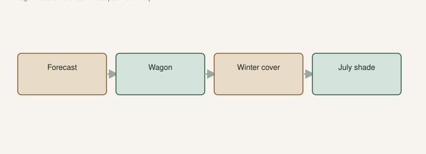

A #3 on a gravel pad in January is a block of ice with a stick in it. The same pot on that pad in July is a Dutch oven. We do not have a greenhouse-catalog problem. We have a climate we can roll.

The [Fig Jam interview](https://www.thefigjam.co/p/interview-with-a-fig-grower-keith) put the honest count in public: hundreds of trees, most in **3- and 5-gallon** cans, a couple dozen in the ground. The ground is the keepers. The pots are the library. The library has to **move**. [Pick The Right Fig](https://figroots.com/2025/07/02/pick-the-right-fig-for-you/) already split the South from the North on shade and water. The [Winter Protection](https://figroots.com/winter-protection/) page already said pots above about **40°F**, barely moist, not a heated den. The shuffle is how those sentences become hardware.

People only talk about the freeze. July has a shuffle too.

## Winter is a move, not a spa

<!-- figroots-graphic: shuffle-two-moves -->

*Night low and afternoon high — not the daytime slogan.*

Before the night that will freeze a thin pot solid, the cans come in. Shop. Glass frontage. Hoop. Somewhere the roots are not at 15°F. UAEX talks winter injury worse in the north of the state, and TAMU’s figs PDF uses something like **17°F** as a mature-wood conversation number. A black nursery pot does not get the courtesy of mature wood. Roots in a thin can see every degree.

Barely moist. No fertigation. No **70°F** den. Figs want a rest. A living room with a heater and a curious dog is not rest. You will get weak shoots and scale, and then you will blame January. The Winter page already said this. I will keep saying it because the first winter people bring a fig into the house they grow a sad indoor plant and call it a fig.

I label with a **paint pen** because a paper tag dies in the move. I group by “needs a drink” and “leave it alone” if I can, but honesty says a big shuffle is messy. You will miss a pot on the north side of a bench. That pot will be the rare one.

Black plastic is what I like because it moves and it takes a Posca line. Pretty terracotta looks good, dries out, and cracks in a freeze. I would not collect in terracotta in zone **8a**.

A pot you cannot lift in January is a pot that is too wet or too big for the life you are living. Either open the mix or admit it wants a hole. The first-two-summers draft in this set is that hole. Until then, the wagon is the method.

## A wagon night

This is the night I actually run, not a diagram.

The forecast is a **28°F** low even though tomorrow’s slogan is 60. That is a move night. I look at the night low, not the daytime headline. I would rather move a block a day early than a day late. Late is ice in a #3. Early is an extra trip. I can live with a trip.

Wagon at the aisle so I trip over it. Two people if the #5s are wet. Do not drag a pot on its rim across gravel. You will crack it and dump mix. I have. Paint-pen names face the aisle. A label on the back of a pot against a wall is how you water “the brown one” twice and skip the rare one.

We roll the first row into the shop. Barely moist — I lift a few. Light means a small drink after they are inside. Heavy means I already panicked with the hose. Group if I can: the ones that just took rain versus the ones that sat under a bench. After a move, the dry ones hide in the wet-looking crowd.

Walk the pad after. The pot you forgot is the one on the north side, behind a bench, with the name you would not want to replace. I have found that pot in the morning. I do not recommend the morning version.

We crowded a woodshop. We built more cover. That is inventory pressure, not a catalog. If you have six pots, a garage corner that stays above a hard freeze is enough. If you have hundreds, you are in our math. Do not copy our square footage. Copy the idea: roots not at 15°F, trees not at 70°F with a heater.

## July: the same pot, a different oven

The same can that needed a shop in January needs **afternoon shade** in July. Gravel, concrete, a tin wall — those are ovens. [Outdoor](https://figroots.com/outdoor/) already said shade. The summer-shade draft in this set is the climate. The shuffle is the hardware: slide the block under a bench, a cloth, an east wall, a tree line that still gives morning sun.

You still want something like **6–8 hours** of sun if you want fruit. Shade here means afternoon relief, not a north porch. Up north, I would steal every hour of light. Do not copy this July talk onto a zone 6 pad and then wonder why nothing ripens.

If you cannot move them, cloth. If you cannot cloth, water like you mean it and accept cooked roots. I would move them.

West-pad pots come off the gravel first. East-pad pots can wait a week. Walk at 2 p.m. The ones that are cooked will tell you. Leaves droop, recover at dusk, and you think you got away with it. Do that enough days and you get burned edges, stalled figs, and drop.

I have moved a block under cloth and then forgotten the cloth in a week of rain. The cloth became a steam bag. Peel it back when the heat breaks. Morning sun still matters.

Sprinklers on the summer pad are how we keep from walking ourselves into the ground. Overhead wets fruit. I know. Ten trees: drip. A collection: you pick your compromise. We have not published a split-count trial on sprinklers versus drip. [VERIFY] on your pad.

## The forecast I actually use

Night low versus afternoon high. They are different moves.

A **28°F** night is a winter shuffle even if tomorrow’s slogan is 60. A **102°F** afternoon is a shade night even if the morning was kind. I do not wait for the radio. I look at the number that will hit the plastic. Sitting is allowed the rest of the year, as long as you still water. Forgetting the forecast is not.

A pot you shuffle into a dark corner and forget will etiolate or dry out. A pot you shuffle onto a new pad and do not water the same day will wilt, and you will blame the variety. Walk the block after you move it. Lift a few. Light means water. Heavy means you panicked.

## What a shuffle costs, and when I stop

Time. Space. A shop that smells like wet Promix. A wife who has opinions about the glass frontage. It also costs mistakes. Paint-pen names that face the wall. A dry pot hiding in a wet-looking row. A #5 you dragged on its rim.

When a variety has fruited true, I like the fruit, the hole drains, and I am done playing musical chairs, it goes in the ground. The first two summers I still water. After that the shuffle is over for that name. If I cannot give a name a hole, it stays in the library and it keeps rolling. That is collecting. Admit it.

A fig you cannot move and cannot protect is a fig you will replace. In Arkansas, for pots, the shuffle is not extra. It is the method. Put the wagon where you will trip over it in October. That is how the method happens.

If you only remember one move, remember the night before the hard freeze. If you remember two, remember the first 100° week. Those two moves save more plants than a new fertilizer. I would rather own a smaller library I can actually roll than a row of #5s I pretend will “be fine on the porch.” The porch is where #3s go to freeze. The gravel is where they go to cook. The wagon is how they do neither.
