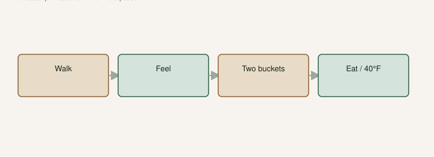

I have lost more good figs to “I’ll get them after supper” than I have lost to a bad winter.

A fig has to ripen on the tree. [An Introduction to Figs](https://figroots.com/an-introduction-to-figs/) already said that. University of Arkansas Extension said the fruit is perishable, and when a tree is in production you may need to pick every day. Soft neck, a little give, fruit that hangs instead of standing proud — that fig is done arguing. It will not finish into jam on a windowsill if you picked it hard to beat the birds. You beat the birds to a sour marble.

Ripe is a morning job in zone **8a**. Heat climbs. Birds eat breakfast. Wasps clock in. A fig that was perfect at 7 a.m. is a husk at 2.

## Soften, hang, then pick

<!-- figroots-graphic: morning-pick-flow -->

*Soft means now. A wet week is a day, not a weekend visit.*

NC State’s fig culture page is blunt: fresh figs are not tasty until they are **soft and ripe**, so you pick them just as the fruit begins to soften. Mississippi State’s Celeste-versus-Southern-Brown-Turkey note adds the cue I actually use on a dark fig I can see from the porch: skin fully colored, fruit softened, and if the **neck wilts and the fig hangs down**, it is time. That MSU page also said kitchen life is short — typically **two or three days** after you pick. I will not turn that into a fridge-month guarantee. Eat them.

I do not grade with a calendar. I grade with a neck. A fig that still stands stiff on a woody stem is working. A fig that droops on a wilted neck is a bowl, not a plan.

A drop of nectar at the eye is a rumor, not a rule. Some tight eyes never weep. Some open eyes weep and then sour. Taste one. If it is still latex-bitter, wait. If it is sweet and jammy, pick the rest that feel the same. NC State said you cannot sun-dry figs in their humidity. Ours is not drier. This page is fresh fruit.

## Green-ripe is a hand job

Dark figs you can grade from the porch. Color, sag, a droop at the neck. Green-ripe figs you have to touch. That is the trade in the bird draft in this set: fewer pecks on a green skin, more walking with your fingers.

I pinch. I do not yank. A green fig that has gone ripe still has a little give at the neck and the body. A green fig that is still a marble does not. If you only pick by porch color you will donate the green-ripe names to the birds, or you will pick them hard and then tell people you do not like figs. Do not shake a tree like an apple. Tomorrow’s fruit will not ripen in the grass.

## Daily in a flush, not when I remember

UAEX: when they are on, daily picking may be needed. That is not a sales line. A productive berry type in a good week will bury you. Jack likes **Red Sicilian** on [The Fig Jam](https://www.thefigjam.co/p/interview-with-a-fig-grower-keith) because it makes fruit. Fruit that sits becomes trash and then a beetle hotel. UAEX already said decaying and splitting fruit pulls wasps, bees, ants, and flies into the next pick.

I would rather have a bowl on the counter and a jar started than a heroic Saturday and a carpet of vinegar.

If you work in town, pick before the truck or after, not “Sunday.” A **#3** you can roll closer to the back door the week it ripens is a harvest tool. We already said pot-up to about a 3-gallon before June so the plant can grow. That same can sits where you will see it at dawn. Roll it back out after the flush if it still needs **6–8 hours** of sun.

This is the week I actually run.

The first name on the pantry row has started. I write that date on the shop board before I pick the second fig. Then I walk. Morning. Hands. I feel the green-skinned ones. I take the ones that hang. I leave the ones that stand. I do not “get a few extra for Thursday.” Thursday is a different fruit. If I will be gone two days in a flush, I pick everything that is close. Close is better than a pecked hollow. I will eat a few that wanted one more morning. I will not eat the ones the birds take.

Net the two trees you put in jars if birds are heavy. Ugly. Effective. UAEX named birds, squirrels, and raccoons. They were not being colorful.

## Two buckets, once, in a wet week

This is a wet week. Dawn is already warm. I take **two buckets** to the first pantry tree — the one we actually eat — before I walk the library. One bucket for fruit that still smells like a fig. One for vinegar and bird husks. I pick with both hands. I do not put a cracked fig in my palm “to decide later.” The nose decides now.

I do this **once** on that walk. Two buckets. One sort. One bucket is how sour fruit rides home with the good ones. The good ones then taste like the trash. Separate them in the yard, not on the counter. Walk the same tree tomorrow. A wet week is not a one-pick event. The once is the sort, not the week.

Split this morning, still a fig: eat it or cook it now. Kong, Lampinen, Shackel, and Crisosto (2013) showed side cracks and ostiole-end splits shorten life — California work, same grower footnote: a crack is a clock. Sour: trash, far from the canopy. Do not leave a vinegar necklace under the tree.

A pot by the back door that week is how a working person cheats the clock without skipping the two-bucket sort.

## Latex, gloves, and the hard fig you should not have picked

White sap. It will itch some people. UAEX says gloves if you are one of them. NC State says the same if your skin is sensitive to milky latex. Janet Carson’s Arkansas Democrat-Gazette column said sap can irritate. I am not writing a medical pamphlet. If your wrists burn, wear sleeves and stop wiping your eyes. Wash. The sap on an unripe pick is also why those figs taste like a rubber band. Wait.

I do not pick hard “for later.” Grocery figs are picked for later. That is why people think they do not like figs. NC State and Carson both said you may pick a few days early *for preserves* so the fruit holds in the pot. That is a jam job, not a fresh-plate job. Do not pick a marble and call it patience.

## Forty degrees is a pause, not a plan

A whole, sound fig can sit in a fridge for a short time. NC State put that pause at about **40°F** to retard spoilage and souring. That is a pause, not a storage crop. MSU’s two-to-three-day kitchen life is the honest clock on the counter. Cold slows a sound fig. It does not reverse a sour or heal a split. I put a bowl in the fridge for lunch. I do not leave fruit in a hot cab.

Eat the best ones standing up. Cook the rest the same day. Give fruit away while it is still a compliment. Pull missed fruit. Ground figs are raccoon dessert and a fly farm. UAEX already named the mouths that find them.

## Write the start date

Write the date a variety started. That is your growing-degree-day notebook without the math. Penn State can tell you what a degree-day *is*. The GDD draft in this set is the heat budget. This page is the ripe date. Next year you will know when to take a morning off.

I write: name, first soften, first trash day if the week went wet. Dates a future August can use. If you only have Saturday, you will lose Friday’s ripe fruit. A pot by the back door the week it starts is the cheat.

Ripe is now. The window in a humid hot week is short on purpose. Show up. The tree will not hold your calendar. It holds sugar until something with a mouth arrives. Be first.
