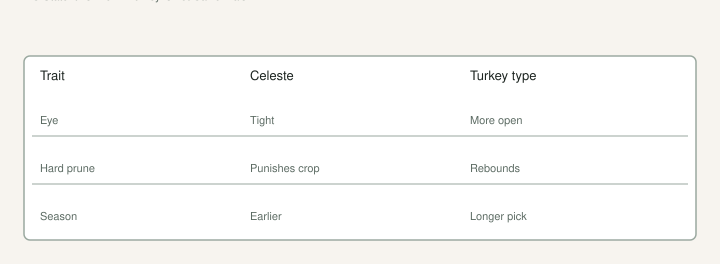

I have said out loud, on [The Fig Jam](https://www.thefigjam.co/p/interview-with-a-fig-grower-keith), that I am not a fan of Brown Turkey or Celeste for eating, so far. We still have them. We give a long trial. We would graft over before we would throw a live root system in a pile.

That is not hypocrisy. That is two jobs. **Climate tool** and **dessert**. County extension is in the tool business. I am in both. A tool fig can feed a kid in a year the celebrities are still sticks. A boring fig with a live hole is still a hole I can change later.

## Two jobs, not one personality

People pick a fig the way they pick a hat. They want a name that sounds like a personality. Celeste and a Turkey type are not a personality. They are hardware.

University of Arkansas Extension names them because they live here, they are the two you can actually find, and they are common figs — the only horticultural type UAEX says we can grow. LSU still talks Celeste as the Louisiana yard standard. None of that is a flavor review.

I will keep saying the Fig Jam line until the fruit changes my mind: not a fan so far. I will also keep the trees. A long trial is how we still have plants I would graft before I would cut. If you want a conversation on the plate, trial a berry type in a **#3** you can afford to lose. Do not skip the tool tree to prove you have taste.

## What UAEX actually wrote

<!-- figroots-graphic: celeste-turkey-tools -->

*County-agent tools. Not a personality. Fruit still has to be eaten.*

Celeste: most cold-hardy of the common yard figs they talk about. Small brown fruit. Ripens usually before Brown Turkey. **Tight eye.** Helps keep beetles and souring out. Does **not** bounce from a hard late-winter prune. Chop it and you may delete the crop. UAEX’s words: if you severely prune a Celeste in late winter, you will greatly limit that season’s fruit.

Brown Turkey, often sold as Texas Everbearing: a bit less hardy, a bit later, a longer pick, and it **fruits after freeze or a severe prune**. That is why people call it everbearing. A lot of that is main crop on current wood, not a breba you can bank. UAEX already said breba rarely overwinters in Arkansas. Main crop on this year’s wood is the crop.

Fruit souring in a wet August still happens. Tight eye is a screen, not a vault. Water in the eye plus heat after rain is the UAEX souring story. Celeste’s closed eye helps. It does not make August polite.

Texas A&M’s plant disease handbook names Celeste, Texas Everbearing, and Alma as closed-eye plants if you can. Magnolia and Kadota take more open-eye trouble. Disease talk, not a dessert ranking. NC State puts Celeste’s start around **mid-July** in North Carolina. That is their calendar, not Searcy’s. [VERIFY] your first soften. Write the date.

## Eye, prune, rebound, season — in the yard, not in a table

I will not give you a grid. I will walk them.

**Eye.** Celeste: tight. That is the county-agent reason it sours less when the week is wet. A Turkey type: TAMU still files Texas Everbearing with the closed-eye set, but the fruit you buy under “Brown Turkey” is a pile. Look at the ostiole on *your* fruit. [VERIFY] on the plate. Tight is a door. Physics can still split a balloon. Biology still needs an opening, a beetle, and a wet warm morning. The split-versus-sour draft is that week.

**Prune.** Celeste hates a hard late-winter hat-rack if you wanted fruit. Leave enough last year’s wood that the tree can make this year’s crop. Dead wood is a different job. A Turkey type will forgive a chop that would starve a Celeste. If you treat every tree like a Turkey, you will call Celeste a bad variety and UAEX will have already told you why. The pruning-for-cuttings draft in this set is the bag-versus-bowl version of this sentence.

**Rebound.** Winter bites. Celeste is the hardier wood and the slower crop recovery after a kill or a severe prune. Brown Turkey / Texas Everbearing is the one that still tends to bear on the resprout. NC State said both Brown Turkey and Brunswick produce fair-to-good crops on suckers the season after freeze injury. TAMU’s freeze-recovery chapter — five or six trunks when the shoots are about two feet — is how you turn that thicket back into a bush. Celeste may live and still owe you a lean year if you panicked with the saw in January.

**Season.** Celeste is earlier. Turkey type is later and longer. Mississippi State said Southern Brown Turkey ripens over about a **60-day** stretch. UAEX said Brown Turkey bears for a relatively long period. That is a harvest job, not a personality. Earlier fruit in 8a is a gift when August turns into a steam bath. Later fruit is a glut if you will actually pick it, and a vinegar necklace if you will not. You still want **6–8 hours** of sun. A tool tree in deep shade is still shade.

Flavor sits beside those four, not on top of them. Sugar. Useful. Not a conversation. Do not expect a Celeste to taste like **Negra d’Agde**. Jack ranked fruit we ate. I still prefer those berry types. Taste a tree-ripe Celeste in a dry week before you write the tree off. Then keep your opinion. Mine is still: not a fan so far.

## Brown Turkey is a pile of names

UAEX warned about name confusion. Your neighbor’s “Turkey” may not be your box-store “Turkey.” Taste it. Watch the eye. Watch the season. Then decide if you even care what the tag said.

NC State said the Brown Turkey they mean is also sold as **Texas Everbearing** and **Harrison**, and it is **not** to be confused with the Brown Turkey variety of California. That sentence has wrecked more forum threads than a freeze. If a California photo is the plant you wanted, say so out loud and then go look at what you actually have. A coppery-brown yard fig in Arkansas is not a California shipping fig because the tag used two words.

Celeste has aliases too. Small, early, tight, sugar-leaning — that pattern matters more than a spelling. “Texas Everbearing” on a tag is usually a Brown Turkey type that fruits over a long stretch on new wood. It is not a machine that fruits in January in a shop. It is not a promise of breba. Read the breba draft.

If two neighbors have “Everbearing” and the fruit does not match, believe the fruit. Name pile. The unknown-names draft is what you write on the pot when the pile wins.

## What I tell a neighbor who wants just one fig

I tell them Celeste or a Turkey type from a person who has fruit, or from a nursery that is not a parking lot. I tell them tight eye, water, east wall if they have it — UAEX likes that wall for wind and a little radiated heat; you still need the sun hours. I do not tell them to start with a late berry name and a YouTube prune.

If they already have a grandpa tree, I tell them to take cuttings of *that* — **6–8 inches**, three nodes, lignified if they can — and eat it before they shop. That tree already proved the county.

A child who wants figs should get a tree that lives. Celeste and a Turkey type are how a lot of us started, or how a grandpa started, which is how Jack started. You can add the berry conversation later. You cannot add it if the first tree died and the kid decided figs are a hassle.

Plant one tool tree before you plant twelve internet names. Eat the tool fruit in a year the celebrities are still cups. Then spend money. A **#3** before June is still the pot-up clock. TAMU said no fertilizer at planting. I listen.

## Keep them, graft them, tell the truth on the plate

A healthy boring tree is rootstock. We have said we would graft over. That is permission to keep the hole. Do not sneer at a county-agent fig if your Black Madeira is still a cup. Do not pretend a tool fig is a dessert fig to win a forum argument.

When I am done being fair to a dull fruit, the hole stays. Scion from a name I trust. Relabel. Suckers off. The tool tree did its job: it taught the hole, it fed somebody, it waited.

A grocery turkey is not the test. A hard February prune on Celeste is how a useful tree becomes a leaf bush. Leave the wood if you want the fruit. A freeze year is how a Turkey type earns its keep. I can not be a fan of the flavor and still be a fan of the tree that lived. Those are different compliments.
