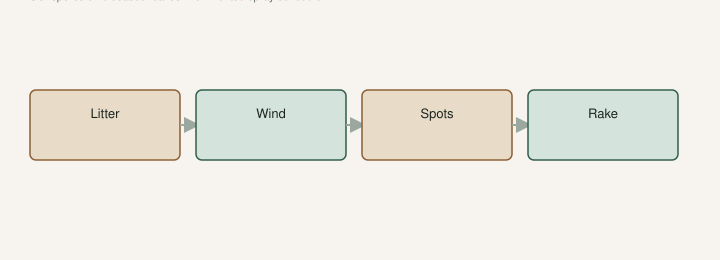

Texas A&M’s 2015 figs PDF names fig rust as the greatest disease threat to fig production in Texas, and they use the name I will use: ***Cerotelium fici***. The older handbook page says *Physopella fici* — same fungus, older hat. Yellow-green flecks that go yellow-brown. Blisters on the underside. Brown spores. Then a tree that can strip in a couple of ugly weeks.

Gulf and lower South see it more than a dry ridge. We still see leaf trouble in **8a** when August is a steam bath. I will not pretend every yellow leaf on our place is rust I cultured in a lab. **[VERIFY]** with a county agent if a tree is stripping and you want a name.

## Spores on litter, a wet-summer cycle

<!-- figroots-graphic: rust-litter-cycle -->

*Fruit is not the rust host. Rake is the program.*

LSU AgCenter’s 2015 fig note is the cycle I want in grower English. The spores live on diseased leaves on the ground. Wind blows them into new leaves. Infected leaves turn brown and fall. New leaves appear. In a wet summer that defoliation-and-regrowth can happen **three or four times**.

Johnson said it often gets loud as fruit hits maturity — full-blown by July after the fruits mature, in their Louisiana telling. That is the insult: the week you want leaves to pull sugar, the leaves walk off.

TAMU 2015: more severe in rainy areas and seasons. Infected leaves turn brown, orange fruiting structures on the lower leaf, severely affected leaves fall prematurely, tree weakened and unable to adequately ripen the crop. Rake and destroy the infected leaves.

I pick up leaves. I do not build a wet blanket of rust under the canopy. Do not compost rust leaves against the trunk and call it mulch. That is a blanket the fungus already likes. Move them out.

Prune for morning sun and a breeze. A wet, still interior is a closet. Johnson: keep space under the tree open for air, center clear for sunlight. The tight-eye draft wanted air for fruit. Rust wants the same air.

Water the dirt, not the midnight leaf if you can. Overhead sprinklers on a pot block wet foliage. We do it anyway on a collection. I would not run them at dusk so the leaves sit wet all night. Morning water, if you must go overhead, so leaves can dry. That hour is the rust chapter you actually control.

## Fruit is not the rust host

LSU AgCenter Pub. 1802 is the disease PDF: yellow then reddish spots, blisters under the leaf, and **fruit is not the rust host**. The fungus is a leaf problem. The crop suffers because the leaves walk off, not because the fig is the rust’s house.

That is why a sour fig is a different bucket. Sour is eye, beetles, yeast. Split is water and skin. Rust is foliage. Use the right name so you do not spray a vinegar fig for a leaf fungus, or rake a sour necklace and call it rust control.

Do not confuse rust with a hungry pot or wet feet. Yellow from drowning is a whole plant looking sick. Rust is spots that spread. Mosaic is a different pattern — oak-leaf, rings, distortion — and it rides cuttings and a mite. TAMU lists mosaic as a virus. You do not compost that away with a rake the same way. You start with cleaner wood. I will not diagnose your photo. If you are unsure, photo the underside and ask someone who has seen rust, not a group that guesses. Do not ship wood you think is mosaic.

A lot of backyard trees live with some rust and still give fruit. Complete defoliation is the year you notice. That year, pick what you can and clean up.

## Airflow and a rake are the program I will own

Sanitation first. TAMU said it. LSU said it. Destroy litter. Keep air moving. Morning sun on wet leaves is a drying tool.

Shade cloth that never comes off plus wet nights is a rust closet. Peel it when the heat breaks.

A weak, dry, or drowned tree rusts uglier in my experience. I have not counted spots. I have watched the tired ones strip first. Keep water even. Do not starve a pot in July and then blame only the fungus.

I would not butcher a tree in August because the leaves look bad. I would not fertigate like a maniac to “grow new leaves” into a rust week. Grow a sane plant in spring so August has something to work with. NC State already warned that extra nitrogen late makes succulent wood heading into winter. A rust week is not a lawn program.

If the leaves are going and the figs are softening, you are in a race. Daily harvest. Trash the splitters. Next year’s wood is this year’s shoot — a stripped tree still has a chance if the wood lives. Water the hole or the pot so the remaining leaves — or the bark — are not also in a drought.

Fall cleanup: leaves out of the canopy zone. I am not promising that ends rust. I am promising you did the part that does not require a license.

A half-naked tree can still finish fruit if the wood is alive and you water the hole. Then rake. The fruit that is softening still wants a morning pick. Rust is not a reason to abandon a flush.

## No spray schedule I will invent

TAMU 2015: no conventional fungicides approved to control fig rust, in that Texas telling. Organic materials containing copper are “generally effective” *if applied at the onset*, in that same PDF. The older handbook has a timing story: start when first leaves are grown, continue as new growth comes, **do not spray when fruit is about a quarter inch** because residue makes the fruit ugly, resume after harvest.

Products change. Labels win. Louisiana label law is not Arkansas label law. LSU’s 1802 PDF has said no fungicide labeled for fig rust in Louisiana as of that document. LSU’s 2024 tree note mentions copper for rust and thread blight **in Louisiana**. I will not copy a PDF onto your hose. **[VERIFY] with your county agent** before anyone sells you a spray story for a tree in Arkansas.

I will not print a homemade mix as a cure. I will not tell you a bottle “clears rust in days.” If you spray, you are on the label and on your own county rules. A pretty spray schedule you do not follow is not a program. A rake you use is.

## Leaves later, more winter bite

LSU 2015 again, because it belongs on the rust page too. New varieties tolerate rust better and hold their leaves longer. Trees with rust resistance stay green later into the fall and can take **more winter cold damage**. Trees that rust lose leaves earlier, harden off more quickly, and that makes them more cold tolerant in Johnson’s telling.

That is the tradeoff, not a sales pitch. A “rust-resistant” LSU name that holds a canopy into November is a gift in a wet July and a question the first night in the teens. The LSU draft is the names. This page is the leaf.

I would not hope for rust to harden a tree. I would not plant a late-holding name on a north ridge and then blame the fungus when January bites green wood. Site, water, a variety that can finish, a rake. Then pick the fruit that is still there.

Rust is humid-South tax. Clean the floor. Give the morning sun a shot at the interior. Name it before you spray it. Then stop staring at a spray aisle at 9 p.m. Morning sun and a clean floor are the program you can run without a license.
