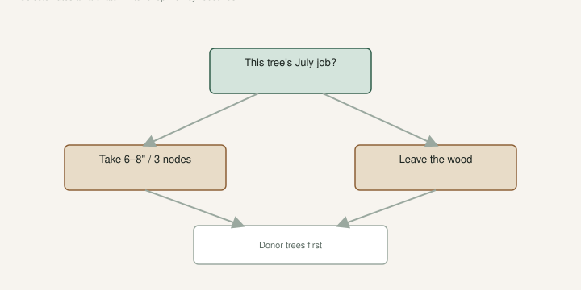

Jack’s job on a prune day is cuttings: **6–8 inches, three nodes**, lignified if we can get it. My job is to remember that every stick in that bag used to be a fig we were going to eat.

Those jobs fight.

Breba lives on last year’s wood. Main crop lives on this year’s shoot. University of Arkansas Extension said Celeste will punish a hard late-winter chop. A Turkey type — Brown Turkey / Texas Everbearing — rebounds and still tends to bear. If you treat every tree like a Turkey, you will starve a Celeste and then call it a bad variety. UAEX already told you that. I am still not a fan of either as dessert so far. I still will not prune them as if they were the same plant.

[Lets Talk About Fig Cuttings](https://figroots.com/2025/12/23/lets-talk-about-fig-cuttings/) is the stick. The breba draft in this set is the two crops. This page is the card on the shed before the loppers come out.

## The card on the shed: wood or fruit

<!-- figroots-graphic: prune-card -->

*Every stick is a fig you will not eat on that branch.*

Ask what this tree is for **this year**. Write it. Hand Jack the card.

**Wood.** Take what you need from the ends. Do not hat-rack a dessert variety you wanted fruit from. Take extra from the tool trees and the ones you will graft over.

**Fruit.** Tip if you must. Thin a thicket. Leave last year’s shoots if you are hunting breba (rare here, still real in a pot you protected). Leave enough buds for a main-crop factory. UAEX: in Arkansas the main crop on current wood is predominantly what we harvest. Breba rarely rides the winter on unprotected wood.

**Small enough to roll.** You will prune. You will lose crop. Own it. That is the pot life.

Do not “clean it up” because January is boring. Dead wood at budbreak is a better mark than a nervous saw in December. Mixing wood and fruit on the same plant in the same week is how people get mad at figs. I have skipped the card and then stared at a pile of sticks that used to be a crop.

## Celeste hates the chop. Turkey rebounds.

Celeste is the example UAEX uses, and it is a good one. Tight eye. Cold-hardy. Chop it hard in late winter and you **greatly limit that season’s fruit**. Celeste does not shrug and re-shoot a full crop the way some trees do.

Brown Turkey / Texas Everbearing is less hardy, but it fruits on the resprout. That is why people call it everbearing. A lot of that talk is main-crop figs on new wood, not a bankable breba. If you need cuttings and you also want a bowl, take the wood off the Turkey-type donor first. Leave the Celeste alone unless the card says wood.

I take more wood off a Turkey type I will not cry over. I take less off a berry name I have not fruited yet. That is not favoritism. That is knowing which plant is a donor. A donor can look ugly and still be useful. A dessert tree that looks “tidy” in February can look empty in July.

LSU talks prune late February to early March in Louisiana. Our winters are not theirs. [VERIFY] your own budbreak before you copy a Gulf calendar onto a ridge in Arkansas. The rule I will stand on is UAEX’s: do not hard-prune Celeste in late winter if you wanted fruit.

## Count sticks for the tray you will actually stick

A 14-inch cane can be two cuttings. That is two figs you will not eat on that branch. Fine, if the plant is a donor. Not fine if it was your only early tree.

If the tray holds twenty cups, take twenty-four sticks, not a grocery bag. Extra wood molds in a shop you forgot. The tree keeps the rest. A smaller tray that gets stuck is more plants than a bag that becomes a Damaged Cuttings photo. The storage draft is for extras you will actually check, not for a personality.

Polarity. Three nodes. Wash. Stick or fridge. That is Jack’s pages. The tree does not care that the stick became a pop. The tree cares that the shoot is gone.

Label the bag with the tree’s true name, not “the brown one.” Prune day is how mislabels are born. If Jack needs a tray and I need fruit, we take wood from the donor trees first. The dessert names keep their shoots. That is the only peace treaty that works.

## A prune day

Card on the shed before coffee. Two trees marked **wood**: a Turkey type I will not cry over, and a tool plant we use as a donor. One tree marked **fruit**: a Celeste I am leaving alone except dead wood. One berry name marked **wait** — I have not eaten it yet, so I am not filling a tray from it.

Jack takes **6–8 inch, three-node** sticks from the wood trees only. We count them onto the bench for the cups we will actually stick this week. Twenty-four, not a trash bag. Bags get dated and named before they leave the yard. Anything brown, dry, and scratch-dead goes in the burn pile, not the fridge. Dead wood is not fruiting wood. It is also not a cutting.

I walk the Celeste last, with the card in my pocket, so I am not tempted to “just take a few” because the wood looks good. UAEX already told me what that chop costs in June. The few I want come off the donor. If Jack still needs more sticks after the Turkey type, we stop. We do not start on the dessert names to fill a feeling. The tree cannot grow back a crop we already bagged.

Dead wood at budbreak can come off when you can tell. That is sanitation. TAMU’s disease notes treat dead wood as a seat for other fungi. That is not the same job as taking last year’s live fruiting wood for a tray. I would rather leave a live twig I do not need than cut a live twig I needed. The tray can be smaller.

After a freeze, let it show live wood. Thin suckers to a handful of trunks over a couple of weeks — TAMU’s freeze-recovery talk is five or six trunks when shoots are about two feet, over two or three weeks. You are building next year’s main crop, not filling a shipping box. If you need cuttings from a frozen-back tree, take them from wood that is actually alive. Scratch. Brown dry sticks are firewood.

I do not like a heavy summer prune on a fruiting fig in our heat. You remove leaf that is pulling the fruit. You also invite sunburn on bark that was shaded. Tip a wild whip if it is in the path. Do not sculpture in July. Green wood is a now problem if you cut it. I would rather take dormant wood. If I take summer wood, I treat it like produce and I do not strip a tree that is trying to ripen fruit.

Air layers are a different clock. We already posted [fall timing by zone](https://figroots.com/2025/09/18/setting-fall-airlayers-in-zones-6-9/). An air layer is a committed branch, not a handful of sticks. Do not peel a ring on your only trunk because the prune day felt ambitious.

## What this tree is supposed to do in July

If the answer is “feed us,” put the loppers down until you have a reason. If the answer is “fill a tray,” take the wood and do not cry in June.

Both answers are honest. The card is cheaper than a regret. I have skipped the card. I have regretted the pile. Donor trees first. Celeste keeps her shoots. Dead wood is a different job from fruiting wood. Count the sticks for the tray you will stick, then stop.

A prune day that starts with a card ends with fewer bags in the shop and more figs in August. That is the trade I will keep making.
