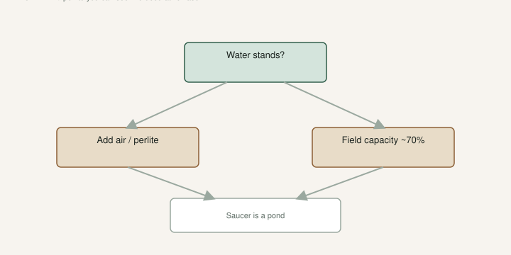

Jack has said the potted trees run a lot of worm castings and perlite. I have built mix from perlite we buy from an expander, plus topsoil, castings, leaf compost, aged chicken manure. Coir and DE are the rooting room more than the 5-gallon language.

I will not sell a secret ratio as law. I will sell this: **if water stands on top, the pot is lying.**

Figs drown quieter than they dry. A wilted plant in a light can is a drink. A wilted plant in a cinder-block can is a swamp. Learn the difference with your hand, not with a product name.

## Promix, field capacity, the feel

<!-- figroots-graphic: mix-drain-test -->

*If water stands on top, the pot is lying.*

[An Introduction to Figs](https://figroots.com/an-introduction-to-figs/) already told beginners to buy a known bag. Promix HP is the one we named. It is consistent. It is not cheap. Field capacity on that page is about **70%** — damp, not dripping — the feel you want when you firm mix around a stick.

The hand test is the same idea as a [Fig Pop](https://figroots.com/fig-pops/). Squeeze a fist. Water should not run. The wad should not dust. If you cannot find that feel, you are guessing every time you water.

I would rather teach a kid the squeeze than hand them a moisture meter they will not calibrate. A meter is fine if you use it. A meter in a drawer is a paperweight.

Air first. Food second. A fig will forgive ugly dirt. It will not forgive a pond in a plastic can. If you only buy one bag this year, buy the one that already has air in it, then add more air until a vegetable gardener argues with you. That argument is the point. Water should leave. If it will not leave, the fig will.

A bag of “moisture control garden soil” that smears like pie dough is a drowning kit. Box-store soil was already a warning on the Intro page. I will not restage that as a new trial. I will say we do not root named wood in mystery local soil, and we do not pot a rare name in a brick.

## Coir pops are not a #3 recipe

Rooting: squeeze the coir until no water comes, then add about **30% dry**, pack, leave the **1–2 inch gap** under the stick the pop page already taught. Heat mat **with a thermostat**, about **75–78°F**. Pencil-thick wood. The industry cutting is still **6–8 inches** and three nodes. None of that is a 3-gallon recipe.

DE in our **2023** basement test needed more watering attention and was harder to wet from above. Both coir and DE worked when we did not flood them. That post has the counts: **64 varieties × 2 cuttings**. I will not invent a sequel. Cite those numbers as *that* test, not as a universal law.

A **#3** of the same sopping coir you used in a pop will sit heavy and grow gnats. Open it up. Perlite you can see is how I sleep. A mix that dries on a two-day rhythm in June, not a two-week rhythm. Pot up to about a 3-gallon **before June** so you are not shocking a swamp-cup into midsummer. The pot-up draft is the calendar. This page is what is in the can.

If you can squeeze a fist of mix and fill a cup with runoff, it is too wet to stick a cutting and too wet to pot a #3. Add air. Wait. Squeeze.

Shallow roots. They do not sit happily in sour soup. UAEX and TAMU both talk fibrous, shallow roots. In a pot that is the whole county. If water stands on the surface after a drink, the pot is lying about drainage, about mix, or about both.

## Copy Jack’s rocks, not just the castings

Jack’s high-casting mix works because of the **perlite** beside it. Castings feed. Castings also hold water. Castings alone in a #3 are a wet cake. If you copy the Fig Jam interview, copy the rocks too.

I have used castings heavy. I have also built mix with expander perlite, topsoil, leaf compost, aged chicken manure from the place. That is practice, not a bagged SKU I will rank. I will not publish a percentage I did not measure. [VERIFY] on a lift test: wet versus dry should be obvious when you pick the can up. If you cannot tell, the mix is too much like clay.

Perlite you can see. If you cannot see air, the fig cannot either. Cheap perlite is dusty. Wet it before you mix if you like having lungs. I am not writing a safety lecture. I am saying I have coughed through a bag and it was dumb.

Fertigate after the plant is growing, not a lawn dump into a wet cake. A swamp plus fertilizer is how you write a sour smell. The fertigation draft is the dose. This page is whether the dose has anywhere to go.

## Do not dump mix into a clay bathtub

In-ground is not a pot. Do not dump a truck of potting mix into a clay bathtub. You built an underground cup with no holes. Plant high. Native dirt that **sheds**. Surface compost. The clay-and-drainage draft in this set is the rest. After a thunderstorm, if the hole is still a lake the next morning, you planted a fig in a pond.

Yard dirt in a pot is how you import nematodes and a brick. NC State and TAMU both put root-knot on sand country as a fig limit. Pick The Right Fig already said nematodes → pots. [Outdoor](https://figroots.com/outdoor/) uses yard dirt for **bulk** starts of wood we can replace. That is free rootstock logic. That is not a rare-name logic.

You still want **6–8 hours** of sun if you want fruit. Mix will not fix a north cave. Mix will not fix a black pot on gravel at 2 p.m. either. The shade-and-water draft is July. Open mix is what lets you water in July without drowning the roots you are trying to save.

## Saucers, vases, and holes

A saucer full of water is a pond you can see. Dump it. Mosquitoes and sour roots like it more than the fig does.

In a shop in winter, a saucer can hide a freeze puck. I would rather have a pot that drips on a tray you empty than a pot that sits in a bath. Barely moist for the winter shuffle. The winter page already said that. A wet puck at **15°F** is how a #3 dies in the roots while the stick still looks brown. The freeze-recovery draft is that corpse.

No hole, no fig. A pretty glazed jar is a vase. Drill it or use it for something that likes soup. I have watched people drown a good name in a gift pot. The gift was the problem. One sad hole in the bottom of a decorative pot is not drainage if the mix is pie dough and the saucer is a lake.

When the mix goes sour: smell. Fungus gnats. A plant that wilts while the pot is a cinder block. Knock it out. If the roots are brown and the center is swamp, you are late. You can tease off slime and repot into open mix in spring. In July I would be slower. Shade. Sometimes it is kinder to wait for dormancy. Do not “fix” a swamp with more fertilizer. Do not fix it with a thicker saucer of water.

## Reuse mix without importing a necklace

I have reused mix that was open and smelled like dirt. I have thrown mix that smelled like a swamp. I will not tell you to pasteurize a pile. I will tell you not to reuse nematode dirt or sour soup on a rare name.

Bulk starts in a bed can have yard dirt. Named cuttings cannot. If the county is sand and knotted, the rare name stays in a pot of clean mix for life. A tool tree you are willing to share with the worms is a different conversation.

If you knock out a plant that lived, and the mix is open, and there are no beads on the roots, I have put that mix back under a bulk start. I have not put mystery garden dirt under Navid’s Unk. Roots are not type, but nematodes do not care what the tag says. They will take the name you liked.

Air in the can. Water that leaves. Castings with rocks, not castings as the can. Coir recipe in the cup, open mix in the **#3**. Promix HP if you want a bag that already tells the truth. A vase is a vase. A bathtub in clay is a bathtub. If water stands, believe it.
