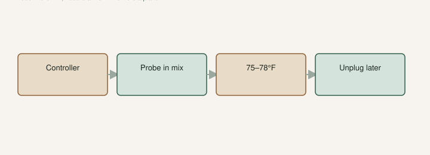

The [Fig Pop](https://figroots.com/fig-pops/) page is not shy. Set the mat to about **78/75°F**. Use a **thermostat**. Otherwise you will roast the cuttings.

I have seen trays go soft and sour on a mat that ran like a griddle. The mix was fine on Monday. The controller was “I’ll watch it.” Nobody watched it.

## The number is 75–78°F, and it needs a controller

<!-- figroots-graphic: mat-thermostat -->

*A mat without a controller cooks the tray.*

Bottom heat is for a **stick**. Roots like a warm floor. Leaves do not need a tanning bed. Low light. You are not growing lettuce.

Fig Pops already named the neighborhood: about **75–78°F**. That is mix temperature with a thermostat in the loop, not a wish on a package dial. A bare mat plugged into the wall does not know that number. It knows on.

I will not pretend 90°F is “faster.” Faster to rot, maybe. Heat will not turn a slow name into a ten-day rooter. Our [coir vs DE](https://figroots.com/2026/02/10/rooting-fig-cuttings-coco-coir-vs-diatomaceous-earth-de-lessons-from-my-a-b-test/) tray had fast and slow in the same basement — 64 varieties, two cuttings each. If you crank the mat to hurry, you hurry soup.

Once there are roots and a plant, take it off the mat. A leafy pop on a hot mat dries from the top and cooks from the bottom. That is how you get the collapse in the failure draft. The pot-up draft is the root check. This page is why the mat goes dark when the cup has a beard.

I would buy the controller before I bought a third hormone. Hormone is optional on the Pop page. The thermostat is not.

## Probe in the mix, not the air

Cheap mats lie. Rooms change. A probe in the **mix**, not on the plastic, not in the air above the tray, tells you what the cutting feels. If you do not have a probe, you are guessing.

Air over a tray can read 72 while the cup on the mat is 88. A thermostat that hangs its sensor in the room is controlling the wrong climate. Tape the probe into one cup of mix you will not sell. Leave it there until you believe the controller. Then you can move it.

A mat on insulation behaves differently than a mat on a cold concrete floor. If the floor is stealing heat, the dial that says 78 may be 68 in the mix. If the floor is a heater, the mix may be 90. The probe ends the argument. Measure the cup, not the room.

A basement that stayed steady is part of why the 2023 coir vs DE tray was clean. A sunroom that hits 95 at 2 p.m. is a different machine. The mat on top of that is how you make stew. Zone **8a** South Arkansas will cook a tray if you forget the thermostat. That sentence is not theory. It is summer in a shop.

## A bare mat cooks the tray

A mat without a controller runs until the mix is soup or the breaker trips. I have smelled that tray. Monday it looked damp and honest. Wednesday the bases were dark and the bag stank. The wood was not a bad variety. The floor was a griddle.

“I’ll watch it” is not a thermostat. Nobody watches a basement at 2 a.m. The controller is the thing that can turn the mat off when the probe hits the number you set.

If the only heat mat you can buy is a cheap pad with a picture of seedlings and no probe jack, I would skip it and root at room temperature rather than gamble. A cold tray is a delay. A hot tray is a smell. I know which one I can fix in the morning.

I would unplug a mat I cannot measure before I would leave it on overnight in a hot shop.

## Moisture plus heat is the rot pair

Warm and wet is biology class. Fig Pop moisture, the way we already wrote it: hydrate coir, dump the extra, squeeze until **no water comes out** and it still clumps, then add about **30% dry coir**. Damp. Not wet. Leave a **1–2 inch gap** under the stick so the wound is not sitting in a sump.

Do not add heat to a dripping bag and call it a method. That is how Failure 1 in the rooting-failures draft gets written.

If a cup goes light, water. If a cup stays heavy and warm for a week, you may already be late. Smell it. I check by **weight**, not by peeling every cup every morning. Opening the bag to “see roots” is how you break the first one that showed.

DE in that 2023 test needed more watering vigilance. It was harder to wet from the top and easier to dry. Coir held a more even humidity under a cover. Dry DE plus a hot mat is a raisin. Wet coir plus a hot mat with no controller is stew. Both are mix problems riding on heat.

Wash the wood first. Soap, or the dilute bleach already on the Pop page (**10 water : 1 bleach**), or peroxide. Dry the bark. Dirty bark plus warm wet mix is a head start for slime. I will not tell you a wash “kills all pathogens.” Wash, dilute, dry.

Industry stick still applies on a mat: **6–8 inches, three nodes**, pencil-thick if you can get it. A soda-straw whip on a hot floor dries from the top while the base cooks. Thickness is a buffer. The thermostat is the other buffer.

## When I skip the mat

Plenty of people root without one. Our outdoor beds did. Shade, water about once or twice a week on bulk starts, per the [Outdoor](https://figroots.com/outdoor/) page. Slower, dirtier, free wood. Different method. Different patience. That wood does not get a mat dragged onto a porch in June. The porch is already hot.

A house that already sits 70°F, and you refuse to buy a controller: skip the bare mat rather than gamble. Room-temp coir, squeeze test, leave it alone. You will wait longer. You will not come back to soup because a pad stuck on.

A cold garage in January needs the mat more. A July shop does not. I would not run a mat in a hot building “because the guide said 78.” The guide assumed you were not already at 85. Read the wood. Read the room. Then plug the mat into something that can turn it off.

Water-rooting is not a heat-mat job. A jar on a windowsill in Arkansas in July is soup by Thursday. That draft is the emergency lane. This page is the floor under a pop.

## Covers, outages, and leaving town

A dome on a hot mat is a steam oven. The Pop method likes humidity in the bag of mix, not a tropical terrarium you never open. If you cover cups, watch the temperature *inside*. I have seen condensation and soup. The probe still belongs in the mix, under the cover, not in the room.

DE cups under a cover in our test got help when they were dry on top. That was a hydration move, not a heat move. Do not copy a cover onto a mat that is already running hot.

A mat that dies in a cold garage for two days is a stall. A mat that sticks ON in a heat wave is a funeral. The controller should fail in a way you can notice. Walk the tray. Smell it. Touch the cup. If the cup is hotter than your hand likes, unplug.

A tray on a mat with no one home is a bet. If the controller sticks, you come back to soup. If you must leave, I would rather a cooler room and no mat than a hot shop and a prayer.

Power outages go both ways. Winter outage: the tray cools. Summer outage that comes back with the mat stuck on: stew. Walk it when the lights return.

## Off when it is a plant

Roots on the cup wall: that stick earned a pot, or at least a bench off the pad. The mat’s job is done. A leafy plant on bottom heat drinks from a hot floor and dries from the top. That is not “extra GDD.” That is a cooked root ball.

Do not fertigate on the mat. There is nothing down there that wants Miracle-Gro tea while it is still a stick, and a rooted plant on a hot pad does not want salt in a dry cup.

Varieties that sit still sit. Heat is not the only knob. Callus-only gets time, even moisture, and a temperature you can measure. Cranking the dial is how callus-only becomes rot.

Thermostat. Probe in the mix. **75–78°F**. Off when it is a plant. If you skip one purchase, skip the third hormone. Do not skip the controller. The Pop page already told you. Roast trays keep happening because people bought the pad and not the switch.
