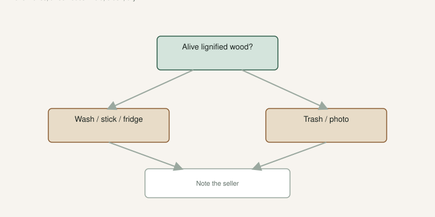

People still leave the box in a hot truck because they are “busy.”

I open it the day it lands. Shade. Hands clean enough not to add dirt. Inventory. Then I decide: stick, fridge, or a photo to the seller.

[Lets Talk About Fig Cuttings](https://figroots.com/2025/12/23/lets-talk-about-fig-cuttings/) already defined the industry stick: **6–8 inches, three nodes**. Lignified versus dormant versus green. Fridge is for dormant wood. This page is what you do in the hour the cardboard hits the porch. The Damaged Cuttings folder on KC-PC is the stills — mold, crush, dehydrate, mailbox damage. Teaching discard. Not a customer-complaint pie chart. I will not invent a percentage of boxes that arrive sad. I will tell you what I look at.

## Open it the day it lands

<!-- figroots-graphic: mailbox-inspect -->

*Open the box the day it lands. Photo the same day.*

If the box hits the porch at 8 p.m. in July, open it. Do not let it sit in a still-hot box until morning. Morning on a porch in Arkansas is still a cook. Shade, kitchen counter, decide. Sleep after the sticks are out of the cardboard oven.

A week on a kitchen counter is not storage. Warm, dark, forgotten — that is how a good box becomes a Damaged Cuttings still. The storage draft is a crisper for clean dormant wood. The porch is not a crisper. The counter is not a rooting room.

If you are too tired to wash, you are not too tired to put the box in a cool room and set an alarm. You are too tired to do it right at midnight. Morning is fine. Saturday next week is not.

If you ordered ten names, make a list before you open the box. Check them off. A missing name is easier to see on paper than in a pile of brown sticks that all look related.

I do this in the shade, not on the tailgate in July. A bundle that looks fine in glare can show slime when you turn it. I count. I scratch one stick if I am unsure about dormant versus cooked. I do not dump the box into a bucket “to sort later.” Later is a mixed pile and a name I will not swear to.

A good name can still have a bad week in a truck. Inspection is not an insult. It is how you keep a collection honest. If the wood is junk and the seller is real, they want the photo. If the seller vanishes, you learned the Intro lesson the expensive way. The [Introduction](https://figroots.com/an-introduction-to-figs/) already told you marketplace reviews close before anyone has had a fig.

## 6–8 inches, three nodes

Count. What they said versus what I got. Names on bags.

Wood. Lignified? Green? Sap in the plastic? The cuttings post is the read: brown, gray, or blackish — anything not green. If they sold you dormant, a fresh cut should not be pumping milk, and the packing should not be painted with dried sap.

If they sold you the industry cutting and you got a two-node whip, that is a count problem. Photograph it. You can still try to root a short stick. You should not pretend it was the standard. TAMU’s 2015 PDF talks **6 to 10 inches** and about **½ to 1 inch** diameter for dormant hardwood. Different house, same idea: a chip is not a cutting.

A 14-inch cane is a gift. You can make two cuttings if nodes allow. Write both cups the same name. Do not invent a second variety because you split a stick.

Polarity still matters when you recut. Tired faces get a fresh bottom. A light slit on the base if that is how you pop — the [Fig Pop](https://figroots.com/fig-pops/) page already walks that. I recut tired faces. I do not recut a crush into a fantasy.

## Mold, crush, dry

**Crush.** The truck sat on it. The bark is mashed. Cambium is meat. Photograph it on a plate with the label in the frame. That is evidence. A later “it looked fine” email is not.

**Mold.** Fuzzy. Sour bag. A clock. Take out the slime. Wash the firm ones. Dry the bark. Trash the green beard. Do not play hero. One fuzzy stick will teach the rest in a bag.

**Dry.** Wrinkled bark. Nodes sunken. Scratch it. Green or white and moist: you still have a stick. A soak, then mix, or water if that is the emergency lane. Brown and dry through: firewood. **[VERIFY]** by scratch. I will not promise a save.

**Frozen mush.** A January northern truck. A frozen bundle looks fine until it warms and collapses. Watch it as it thaws. Do not fridge a mush you have not thawed and judged. Mush is trash. Firm wood after a thaw can still go in a cup.

Smell. Sour bag is a clock. Wash the firm ones. Trash the slime.

I do not argue that a green cutting should have stored. I do not argue that a box I left in the truck for four days is the seller’s winter. I do argue a bundle that was slime when I opened it the afternoon it arrived.

## Photo and a note the same day

Photograph on a plate with the label in the frame. The closed box if it looks cooked. The open bundle. A close-up of mold or a crush. A ruler or a known object if the length is the fight. A two-inch chip is not 6–8 inches and three nodes.

Send the photos the same day if you need a replacement. A week later is a different story. I will not invent how often sellers make it right. Be specific: mold on three of eight, crush on the labeled bag, no sap versus sap everywhere. A vague “they look sad” email is how you get a vague answer.

If the seller makes it right, remember that when you talk. If they vanish, remember that too.

Do not put a dirty, sap-smeared bundle in the crisper “to deal with later.” Later is mold. Wash, dry the bark, then fridge or stick. Inspection day is the fork.

## Then the fork

**Green or moving:** root now. Water if you have nothing else. No crisper. The water-rooting draft is the emergency lane. Mix is still the default if you have coir.

**Dormant, clean, tray ready:** wash, stick. Recut tired faces. Medium damp, not wet. Heat mat on a **thermostat**, about **75–78°F**.

**Dormant, clean, tray full:** dry the bark, parafilm if it is a long hold, double-bag, crisper. Weekly look. Thermometer in the drawer. **38–45°F** is talk. **[VERIFY]** with the thermometer. The storage draft is that hold. USDA’s Davis repository has preferred dormant cuttings and stopped routine summer distribution — same wood preference, different job. Germplasm is not your mailbox.

**Dormant, dirty, wrinkled:** wash, maybe a soak, dry the bark, stick. I would not file dehydrated wood for three months and hope.

**Junk:** photo, note, trash the slime. Do not stick rot to “get your money’s worth.” You will get a cup of soup and a name you will not trust.

## Heat and cold in the mail

I would not ship green wood across the country in July. I would not leave a January box on a porch that hits 10°F overnight if I could help it. The calendar draft is the seller’s job and the buyer’s job.

If it cooked, say so. If it froze, say so. If you waited five days to open it, say that too — to yourself, at least. The seller cannot refund a counter you ignored.

Trusted wood still gets inspected. A neighbor’s tree you have eaten from can still ride a hot truck. The source does not cancel physics.

Open it. Shade. Photo. Decide. The box is not a storage method. The porch is not a rooting room. The stick in your hand is the whole shipment. Treat it like it can still die. Because it can. The seller’s reputation is the next shipment. Your counter is this one.
