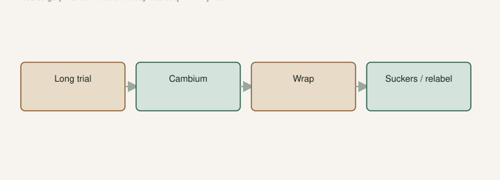

I said on [The Fig Jam](https://www.thefigjam.co/p/interview-with-a-fig-grower-keith) we have not cut some trees we are not fans of yet. Long trial. If they stay boring, we graft over. They live on as rootstock.

That is the polite version of: I will not throw a drained hole and a winter-surviving root system in a pile because the fruit was sugar and nothing else. I am still not a fan of Brown Turkey or Celeste for eating, so far. We still have them. We would graft before we would cut. The tool-tree draft is why they were planted. This page is what the hole is for when the plate stays dull.

I am not writing a surgery manual. I will not pretend a magazine page replaces a person who has grafted in your climate. I will write **when**, and I will write **aftercare**, because that is where people lose the tree they meant to save.

## Keep the hole

<!-- figroots-graphic: graft-keep-hole -->

*Keep the hole. The rootstock will try to take the tree back.*

A healthy common fig. Celeste, a Turkey type, a vigorous unknown that fruited dull. Roots that are not a nematode necklace. A hole that is not a bathtub. University of Arkansas Extension: common figs only here, and they fruit on current wood after a freeze if the roots lived. That root system is the asset. The name on the tag is the part you are allowed to change.

What is not worth grafting: a corpse, a knotted wreck you plan to blame later, a pot the size of a coffee mug, a clay cup that holds a lake after rain. Do not graft onto a drowning, beaded wreck and then blame the scion. The nematode draft and the clay draft are those refusals.

The scion should be a name you have a reason to trust. Grafting a marketplace mystery onto a good tree is how you multiply a lie. The unknown-names draft is the vocabulary. If you have not eaten it, you are not fixing a dud. You are stacking two questions on one trunk.

You can plant a new hole instead. If the ground is good, plant the new name and leave the dud as a donor for cuttings or as a kid’s tree. If space is tight, or the dud is the only in-ground trunk that lived, graft. We have more names than holes. That is the collection talking. Hundreds of pots, a smaller in-ground set — The Fig Jam already put that count in public. The ground is the keepers. A keeper with dull fruit is still a keeper until you change the top.

## A long trial first

Wait until you have disliked the fruit for a fair season, not a fair weekend. A long trial is how we still have trees I am not a fan of. Grafting is the end of the trial, not the start of a mood.

True-to-type still applies. The Intro said a year or more, sometimes two or three, to prove fruit. A dull year-one plate on a baby tree is not a verdict. Buttons that drop in the first heat are not a verdict. The first-two-summers draft is that hose. Graft after the tree has been a tree, or after you have eaten enough fruit to be done being fair.

A freeze year is not the year I take a saw to a name I have not finished judging. Rebuild the thicket first — TAMU’s five or six trunks when the shoots are about two feet — then decide if the plate is still a dud. If the variety was always a tool, rebuild and keep eating. If it was a mislabel, wait for a **pencil-thick** shoot and then change the top.

I will not claim a 100% take rate. I will not claim a week-by-week photo diary I did not keep. I will not write a “best graft for beginners” list that sounds like a thumbnail. I will claim this: keep the root that works. Change the top you do not want to eat. Tell the truth on the label.

## When: pencil-thick, cambium, wrap

Timing I will stand on in print: dormant or waking wood, spring, when the bark slips if you are doing a bark graft. [VERIFY] that week on *your* trees. Budbreak in Searcy is not budbreak on a ridge in the Ozarks, and it is not a Gulf calendar. LSU talks late February to early March in Louisiana. Our winters are not theirs. Scratch. Watch. Do not copy a date off a forum and call it a method.

The scion reads like a cutting. Lignified. A name you trust. **6–8 inches** is more stick than you will insert; you are matching wood, not filling a tray. Three nodes on a cutting is Jack’s industry stick. A graft scion is shorter in the hand and still wants live buds. Green summer wood exists. It also dries out in our heat if you get cute. [VERIFY] your method on a tool tree before you graft the only LSU Purple you own.

Cambium to cambium. That is the whole trick people skip. Clean cuts. Match the green lines. Wrap it so it cannot dry. We have a Grafting folder of stills. I will not tell you a brand you must buy. I will tell you a dull kitchen knife makes a chew, not a graft. Dirt in the cut is not a technique.

I would practice on a Turkey type that always comes back before I use the only stick of a name I waited a year to get. A Celeste that lived through winter is the same kind of engine. UAEX hired those two as climate tools. Understock is a second job they can do. You still want **6–8 hours** of sun on the tree you are about to ask for a new top. Shade will not make the union take. Heat without wrap will cook it.

Pot understock is allowed if the can is real. A **#3** you potted up before June is a plant. A cup on a heat mat at **75–78°F** is a rooted stick. Do not graft a cup and call it a tree. Let it be a plant first.

## Aftercare: the rootstock wants the tree back

This is the week after you believe it took, and the months after that.

Suckers from below the graft are the **old variety**. They will try to take the tree back. They will look healthy. They will steal the new top if you get sentimental. I have watched a “new” tree fruit the old fig because somebody let a sucker run. Cut them. Tie a ribbon below the union so winter-you remembers where the old tree starts. Suckers below the ribbon are the old name.

Water like a plant that just had surgery, not like a lawn. Even moisture. Do not flood a dry pot the night after you wrap. Do not fertilize the week of the cut to “help it.” TAMU said no fertilizer at planting. A graft week is not a feed week. Shade a pot if July arrives before the scion has leaves that can work.

Fruit is still a year-plus on a new scion sometimes. Patience. The true-to-type clock resets for the top. You skipped digging a second hole. You did not skip the plate.

If the wrap dries, the cambium misses, or the summer cooks it, the understock still lives. Try next spring. I will not give you a percentage. I will give you permission to fail on a tool tree before you fail on the only trunk you have.

Do not put five names on one tool tree unless you like a puzzle. A puzzle that suckers is a mess. One good scion, one label, one year of wait. That is enough story for a hole.

## Relabel the day it takes

Paint pen. Same day you believe it. The old name is retired on that trunk. If the graft fails, the old top may still be there — then the old name is still true. Do not get poetic. Do not leave “Celeste” on a pot that is now trying to be a berry type. Do not leave a celebrity on a pot that is still a Turkey.

Received name in the notebook either way. Clone piles are real. Freeze years mix bushes. Suckers are the old name. The unknown-names draft is what you write if the scion was a guess. It should not have been a guess.

When I am done being fair to a dull fruit, the hole stays. That is improvement without a funeral for the plant. The funeral is for the name. People mix those up and then they have neither. A live turkey-type trunk is not a failure. It is a platform. Use it when the fruit has had a fair trial.

If the graft takes and the fruit is good, the hole was the right investment. If it fails, you still have a tree that lives. That is why we graft instead of dig. Keep the hole. Change the top. Tell the truth on the can.
