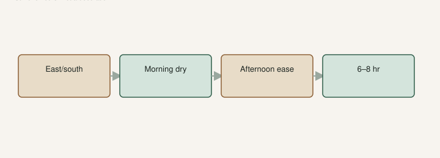

UAEX: plant on the **east** side of a house, or with rock or brick at their back, to block wind and throw heat in winter. You still need **6–8 hours** of sun. TAMU likes **south or east** of a home or barn for the same winter logic, and so morning sun dries fruit and leaves after a night rain.

That is not decorating talk. That is a cheaper hoop house made of a wall you already paid for. A fig is not a foundation shrub you stuck there because the blank siding looked lonely. If you cannot stand at the spot at 2 p.m. in July, the pot you set there will not enjoy it either.

## East or south of a building

<!-- figroots-graphic: east-wall-day -->

*TAMU/UAEX: east or south of a building. West fries.*

Morning light. Fruit that dries. A little less of the west hammer in July. A pocket that can be kinder on a still, cold night.

What it does not give you: a license for a late fig that needs a California fall. GDD is still GDD. A wall is a nudge.

UAEX’s winter-injury talk is worse the farther north you live in Arkansas. TAMU’s figs PDF uses something like **17°F** as a mature-wood conversation number. A black nursery pot does not get the courtesy of mature wood. The wall helps. It does not replace the shuffle for thin plastic.

I have used buildings because we have them. I would not pour a slab to “make a microclimate” and then cook pots on it.

NC State’s fig page likes a **northern** exposure in the Piedmont so plants stay dormant through a warm spell and a sudden freeze. That is their late-freeze logic, not a Searcy fruiting wall. I will not cargo-cult a north wall onto a South Arkansas pantry tree and then wonder why nothing ripens. The late-freeze draft is the April night. This page is the wall you plant against on purpose.

## Morning sun dries fruit

TAMU said it in one clause: morning sun helps the fruit and foliage dry quickly after an evening rain. Rust and souring like wet that stays. A wall that shades the morning is the wrong wall even if it is warm at night.

A roof drip line that dumps on the trunk is also the wrong spot. Move the hole over. Plant high if the eave is a waterfall. The clay draft is the bathtub. An eave is a bathtub with a schedule.

I pick in the morning. Wet fruit in a still east alley that never sees sun is still wet fruit. The wall has to throw light, not just heat. Heat without hours is a green bush.

A brick wall that soaks sun in January can save a young trunk on a still night. It can also wake buds early, and then a late freeze writes the next draft. Walls are a nudge in both directions. Watch the buds in a warm February. The wagon still matters.

## A west wall fries

Winter heat, sometimes. Summer death, often. Reflected sun on a pot is the gravel-pad problem standing up. I would plant a fig on the west side if that is the only side, and I would not pretend it is free ripening units. Shade cloth in July. Water. Slide the pot out a foot if you can. Air behind a pot is part of the wall trick.

A south wall in a northern short-season yard is a gift. A south wall in south Arkansas can be a fryer. Context. The shade-and-water draft is the summer half of this sentence. Morning sun, afternoon relief, **6–8 hours**. West tin at 3 p.m. is not “full sun.” It is an oven.

A north wall in the South is still a shade problem for fruit. Warmth without hours of sun is a green bush. I would put a shade-tolerant ornamental there, not a fig I wanted to eat. A north wall in a hot courtyard that still gets sky is a maybe. Walk it in July. If the fig would be a houseplant, pick another wall.

If the only wall is west, plant anyway if you want a fig, and cloth the afternoon. Do not wait years for a perfect east wall you do not have.

## Still 6–8 hours, not a decoration

A warm alley with three hours of sun is a leaf museum. UAEX will not let you off the hour count because the brick is pretty. Fruit wants light. The wall is a neighbor, not a substitute.

Leave a walk. Leave air. Do not plant a foot from the siding and then act surprised when the trunk rubs paint. UAEX’s 25-to-30-foot mature size is a well-fed, unfrozen tree. Most of ours never get that speech. Still: a fig glued to a wall is a maintenance problem you built.

Wind: a fig on a ridge with a north wind will burn wood you wanted for breba. A wall or a barn that knocks that wind down is winter protection you do not have to wrap every year. Young trunks still want a cage some years. Do not plant in the *shade* of the same barn.

## Pots can steal a wall too

A **#3** against an east wall in April is a smart pad. The same pot in January still wants the shop if a hard freeze is coming. Walls do not replace the shuffle. The [Winter Protection](https://figroots.com/winter-protection/) page already said pots above about **40°F**, barely moist, not a heated den.

Hundreds of cans cannot all live in the east alley. Steal the wall for the pantry tree and the names you will not replace. The library can sit farther out with cloth. The collecting-versus-eating draft is that order.

A pot you can roll into the east pocket the week a variety ripens is a pest tool too. Birds, afternoon fry, a drying morning — same wall, three jobs. Then you can still roll it into the shop in January. An in-ground tree is a community resource. Site it once. Walk it twice a year.

Black plastic against east brick in April is kind. The same can shoved against west brick at 3 p.m. is the gravel problem standing up. I have cooked a #3 that way. I would rather steal a morning wall and a wagon than a west reflector I have to cloth all summer.

## Walk it in July and in January

This is the morning I would actually run before I dig.

I stand at the spot at 2 p.m. in July. If I cannot stand there, I do not plant a black can there. I stand there at dawn in January, or I imagine the north wind with a brick at my back. Both walks count. If you only site a fig from a spring Saturday, you sited a hope.

Hose that reaches. Soil that drains. Room to walk. Morning sun on the fruit. Afternoon relief from a tree line that does not steal the morning. Label the hole with the source if you are planting a name you have not eaten yet. The wall does not confirm a variety.

The wall is a tool. Use the east one if you have it. Still water. Still pick. Still choose a variety that can finish. A brick is not a miracle. It is a better neighbor than a west tin shed. Morning sun on wet fruit is the wall’s real summer job. Winter heat is the bonus. Do not flip those and fry a pot on west brick.
