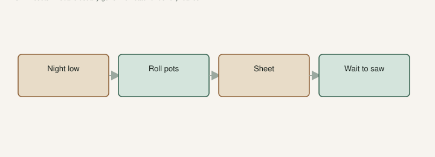

University of Arkansas Extension talks rollercoaster winters. The mean version is not the January 15°. It is the March night after a week of 75.

Buds move. You relax. Then 24°F. The tips go black. Breba, if you had any, is often done. The growing-degree-day toys that let you reset after a freeze are trying to model this. A warm February does not count if March took the wood.

This is not the freeze-to-the-ground chapter. That draft is TAMU’s thicket: shoots about two feet, keep five or six trunks, thin over two or three weeks. This page is the night **after** the buds have already moved. Same species. Different job. If you run them as one panic you will saw live wood in the morning and miss the pots at 9 p.m.

NC State even plants this trap in their site notes: unseasonably warm winter weather can start growth, and a sudden freeze after that can seriously damage the plant. They talk northern exposures in the Piedmont to keep figs dormant. UAEX still likes an east wall here for wind and a little radiated heat, plus **6–8 hours** of sun if you want fruit. I will not cargo-cult a North Carolina north-wall onto a Searcy east-wall and call it the same advice. I will take the shared warning: a warm spell that wakes tips is a bill you have not paid yet.

## GDD starts over

Penn State can tell you what a degree-day *is*. Hobby tools such as the [iGrowFigs GDD calculator](https://apps.igrowfigs.com/gdd/) will pull station weather and let you zero the count after a freeze. [VERIFY] which options you used. The GDD draft in this set is the math. This is the night that breaks the math.

Start the count when the tree is actually growing after the burn — new push, not the false spring you already lost. A Japanese study on ‘Houraishi’ put roughly 2,100 °C-days from budbreak to harvest **in that climate**. That is not Saline County. It is a reminder that the clock is heat after a real start. A late freeze steals the start.

Main crop can still happen. New shoots, current season, heat. UAEX: main crop on current wood is the crop we actually harvest. An early tool fig has a better chance than a late berry type that just lost three weeks. Do not fertilize the next morning to “buy back April.” Do not prune every black tip the next morning to feel useful.

## Pots: roll them in

This is why the shuffle exists. One ugly night: roll them in. A **#3** is easy. That is the can we already said to pot up into before June. A 15-gallon is a decision you should have made in the afternoon, not at 10 p.m. with a flashlight.

Zone **8a** still has these nights. A #3 does not care about a zone map. The [Winter Protection](https://figroots.com/winter-protection/) page already said pots above about **40°F**, barely moist, not a heated den. Barely moist still matters on a freeze night. A wet pot is ice around roots.

If you cannot move them, cover. Cloth, a tote, a barrel. Perfect is less important than done. I would rather cover ten pots badly than cover two pots perfectly and leave the rare one out. The rare one is always the one in the back.

After the night, walk pots first. They freeze through. In-ground can wait an hour. The #3 on the porch cannot. That order has saved more names than a pretty cover I installed on the wrong plant.

If you gambled and lost, wait for the base. If the base is dead, the label comes off. If it moves from the base, you may still be in the freeze-recovery draft — thicket, five or six trunks, patience. A pot that froze in the roots is a different sentence. Smell the mix. Sour and still after the rest of the block is leafing is a corpse.

## A night-of kit that is not cute

<!-- figroots-graphic: late-freeze-kit -->

*The cruel freeze is the one after the buds move.*

This is the night I actually run.

The forecast is a **28°F** low even though tomorrow’s slogan is 60. Tips are already moving. That is a move night. I look at the night low, not the daytime headline.

Wagon in the path so I trip over it. Cloth in a crate. A few totes that fit a **#3**. A headlamp. If the kit is in the attic, you will not use it at 9 p.m. Paint-pen names face the aisle. A label on the back of a pot against a wall is how you cover “the brown one” twice and skip the rare one.

We roll the first row into the shop. Two people if the #5s are wet. Do not drag a pot on its rim across gravel. You will crack it and dump mix. I have.

If two nights are coming, leave the covers on through the day if you can stand it, or be ready to put them back. One night is not always the only night. I would rather cover a pot I did not need to cover than explain a cooked rare name. Extra cloth is cheap.

If you have lights in a teepee, test them in daylight. A dead string on a 24° night is a prop. I would rather have a blanket I know than a wire I have not plugged in since Christmas.

## In-ground: a sheet, not a heater under dry leaves

Young trees first. The east wall helps and does not finish the job.

A sheet on a young tree beats a plan you read. Cloth, a tarpaulin, something you will actually install before dark. TAMU’s winter notes include covering when severe weather is predicted — straw, tarpaulin, other material — in their climate. NC State said the same kind of cover talk. I would rather cover than irrigate the canopy at dusk so it freezes wet, unless you already know that job. I do not.

I would not run a space heater under a dry leaf pile. That is a fire, not a fig tip. I will not dress that up as a method.

Afterward, wait. Black tips are not always dead to the ground. Scratch down the shoot. Green means wait for a new push. The freeze-recovery draft is the thicket chapter if you lost the top. Days, not hours, before you saw. You will cut live wood you cannot see yet if you need to do something with your hands at 8 a.m.

Water if the wind dried the pots. Leave the covers on if another night is coming. Do not fertilize the burn.

## Write the dates. Assume breba is gone.

Date of budbreak. Date of freeze. What died. What fruited anyway. That is a better notebook than a generic “zone 8a” sticker on the pot. Write it on the shop board. Next February you will remember why you do not cheer early green tips.

UAEX: breba rarely overwinters here anyway. After this night, assume the nubs are gone. If they survive, that is extra. Do not prune for breba in a year the tips already burned. Grow main-crop wood. That is the crop 8a actually pays.

If you take cuttings the week after, take them from wood that is still alive. Black mush is not a node. **6–8 inches**, three nodes, lignified if you can get it — Jack’s industry cutting. Not a burned spear. Not a fridge fantasy. The cuttings page already said the fridge is for dormant wood.

When new buds push below the burn, you have a plant. When nothing pushes and the rest of the block is leafing, you have a decision. Cuttings should have been taken in winter. Too late to be clever.

## Shop glass can wake the tips early

A sun-warmed shop that wakes tips in January is the same tax with a roof. Vent. Pull tender pots off the glass. The late freeze can happen inside a structure if the structure taught the plant it was April. The winter page said not a heated den. Glass on a 70° afternoon in February is a den you did not mean to run.

I would rather a shop stay cool and the trees stay asleep than a pretty green tip in a window and a 24° night on the same stick. The shuffle earns its keep on the ugly night. The glass can undo the shuffle in the afternoon if you let pots sleep against it.

Move what you can. Cover what you cannot. Wait before you saw. Then grow this year’s wood like the freeze-recovery draft told you, if the top is gone, or like a normal year if it is not. Hope is allowed in February. A wagon in the afternoon is how hope survives the night. Zone 8a is not a promise. It is an average. Averages do not cover a pot.
