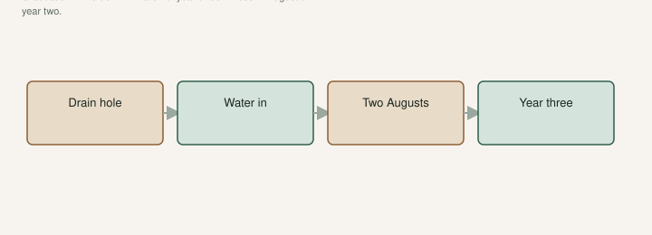

People hear figs are easy and skip the hose. Then August crisps the leaves, the fruit drops, and the variety is “no good here.” The hole is still a pot. You just cannot roll it into the shade.

[An Introduction to Figs](https://figroots.com/an-introduction-to-figs/) said plant in-ground in zone 8 or higher in spring, water in the heat, do not count on fruit, wait for the tree to become a tree about year three. University of Arkansas Extension’s planting window is **late winter through spring** so it can settle before the next winter. I would not plant a leafy July plant to prove a point. Wait.

The hole is a pot you cannot lift for two summers. Treat it that way.

## What I put in the hole

<!-- figroots-graphic: two-summer-hole -->

*The hole is a pot you cannot lift until year three.*

A plant with a real root system, not a two-week pop. A variety I have eaten, or a tool tree I am willing to own. A hole that **drains**. High if the clay holds a lake. East wall if I have one — TAMU likes east or south of a building; UAEX likes an east wall that knocks wind. You still need **6–8 hours** of sun if you want fruit. A warm grave in deep shade is still shade.

Texas A&M’s 2015 figs PDF: water the plant in, **no fertilizer at planting**. You can cut a dormant plant back some to match lost roots. I would not strip a leafy July plant to plant it. The clay-and-drainage draft in this set is the bathtub test. If the hole holds a lake after a thunderstorm, you planted a fig in a pond.

Nematodes: if the county is sand and knotted, the rare name stays in a pot. Pick The Right Fig already said that. A tool tree you are willing to share with the worms is a different conversation.

## Water in. Then water like you cannot lift it.

Shallow roots. New ones. They do not go find the creek. A dry week in July will dump fruit and stall wood. UAEX: dry trees drop fruit. That sentence does not expire because the pot is gone.

A soaker or a slow hose beats a five-second sprinkle that wets dust. I would rather water deep and less often than mist daily, once the plant is in — but in the first August I will not let the hole go bone dry to prove a point. Mulch. Pulled off the trunk. Mulch against bark is a rot collar, not a kindness.

Even water, not a Friday flood after a drought. That Friday flood splits whatever hung on. The split-versus-sour draft is the fruit version. The hole version is the same binge.

Pots you left on the pad still need water too. I have killed a leftover #3 the week I celebrated an in-ground planting. The #3 you slipped off still has mix and maybe a piece of root. Do not leave it on the pad to die “empty.”

Fertigate lightly once it is growing, not a lawn dump at planting. TAMU said no fertilizer in the hole the day you plant. I listen. A weed-and-feed on shallow fig roots is a way to write a bad year. Keep the lawn fight away from the ring.

## A hole’s first August

This is the week I actually run, not a calendar slogan.

The tree went in during late winter or spring, out of a **#3**, into a hole that drained. By August the county is crunchy. I walk it like a pot I cannot pick up. I put the hose on the ring and I wait. Deep soak. Not dust-wet. I lift the mulch at the edge and I want the soil dark more than an inch down. If it is dust under the mulch, I did not water. I decorated.

I do this on a timer in my head: soak, move the hose a quarter turn around the ring, wait again. Shallow roots sit in the top of the county. A five-second sprinkle wets dust and lies. TAMU said water the plant in at planting. August is that same job with heat on it. I would rather soak twice a week in a bad stretch than mist daily and call it care.

Mulch stays off the trunk. The string trimmer does not enter the ring. I have seen more “mystery decline” that was a whip than a disease. The trunk is not a weed. A girdle takes one Saturday. If I have to keep grass down, I use the ring as the line the trimmer does not cross. A guard if the person on the mower is not me.

If fruit shows, I eat it. I do not assume the tree is established because it gave me six figs. Year-one fruit is a bonus, not a graduation. I still water. I still keep the mower off the trunk. Buttons that drop in that first heat are not a variety verdict. They are a teenager in a hole that still drinks like a pot.

If I am leaving for two weeks of heat, I do not plant that week. A neighbor with a hose is part of the method. So is a timer. So is not planting the week you leave. A tree ten yards from a faucet that nobody turns is a wish. I have watched that wish crisp. The faucet was not the mystery.

Stake it loose enough not to girdle, tight enough that wind does not saw the new roots empty. A teenager in a new hole will rock. A rock that never stops is a broken new root. Remove the stake when the trunk stands. A forgotten tie is a hidden girdle in year three. Water is still the main job. The stake is just so the water is not wasted on a plant that loosened itself.

## What I do not expect until year three

A pantry year. Buttons that drop. A late variety that finishes. Breba. Those come later, or not. UAEX: breba rarely overwinters here; main crop on current wood is the crop. Year one I listen to the hose. Year three I listen to the fruit.

I expect wood. A foot or more of honest shoot if we watered and the winter did not steal it. Protect a young trunk the first winter. Cage, leaves, a wrap you will actually install. North counties especially. UAEX is blunt that winter injury is worse north of us. A year-two tree is still a teenager. August of year two still gets the hose. If it dies to the ground and the roots live, you are in the freeze-recovery draft. You have not failed the species. You have paid the 8a tax.

Do not plant a first-year fig in a hole you will not walk to with a hose. If the hose does not reach, the tree is a wish. Move the hole or move the hose. [Outdoor](https://figroots.com/outdoor/) already said water on bulk starts. An in-ground baby is not bulk. It is one plant you decided was worth a hole. The leftover #3 on the pad is still a plant if you tore a start. Water that too, or throw the mix, but do not celebrate the hole by forgetting the can.

## Graduation is not six figs in August

Graduation is a **live trunk in March of year three** and a **hose you still used in August of year two**. Until then, the job is water, mulch off the trunk, and not mowing the bark off. Easy is the third summer. The first two are how you get there.

Now we talk about a crop like a grown-up. Now we talk about grafting over if the fruit is dull. Now we talk about whether the hole earned a better name.

A tree that lives through two Augusts in a hole you watered is a tree. A tree you forgot in August is a stick. The difference is the hose. I would rather plant one hole I will actually walk to than a row I will admire from the porch until the leaves crisp. The porch does not water anything.
