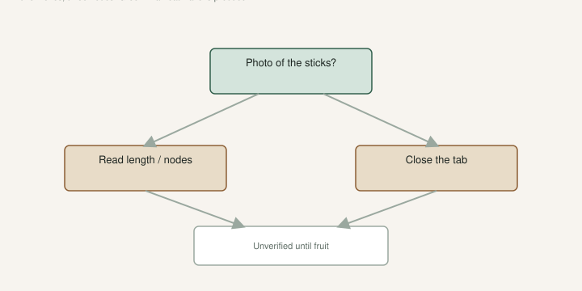

The mailbox draft is what you do when the cardboard is already on the porch. This page is earlier. It is the listing.

[An Introduction to Figs](https://figroots.com/an-introduction-to-figs/) already told you to use trusted sellers and to wait 1–3 years to prove type. I am not writing a lawsuit. I am writing the reasons I close a tab. I will not invent a percentage of “bad boxes.” I will not invent a customer who got burned. I will tell you what I refuse.

## The wood they are selling is not the wood they photographed

<!-- figroots-graphic: listing-red-flags -->

*Close the tab. The mailbox draft is for boxes you already accepted.*

A pretty ripe fig in the thumbnail is not a cutting. It is a hope. I want a photo of the **sticks**: bark, nodes, cut ends, a ruler or a hand for scale. If they will not show the wood, they are selling a name.

Industry stick, because people skip it: **6–8 inches, three nodes**, lignified if it is supposed to store or ship. Pencil-thick for a pop. A one-node green whip in July is not a dormant cutting. If the listing says “dormant” and the photo is a leafy tip, I am gone.

[Lets Talk About Fig Cuttings](https://figroots.com/2025/12/23/lets-talk-about-fig-cuttings/) already split lignified, dormant, and green. Fridge is for dormant wood. A seller who cannot use those words is not ready to take your money for a stick.

## Green in a heat wave is not a season. It is produce.

I will not buy summer wood shipped across a hot country and called a “cutting season.” The calendar draft is the rest. If they ship in a heat wave, they are gambling your mailbox against their cash flow. I have opened those boxes. The Damaged Cuttings folder exists for a reason.

Dormant lignified, packed so it cannot slosh, labeled, in weather that will not cook the truck — that is a sale I understand. A “while supplies last” leafy bundle in August is a now-or-never drill they are making *your* problem.

## The name is louder than the source

“Black Madeira” with no fruit they grew, no year, no “as received,” no zip where the mother sits — that is a forum rumor with a PayPal button. UAEX already said fig names pile up. The true-to-type draft is how long I wait after I *have* the plant. I do not pay celebrity prices for a rumor.

I want: claimed name, how they got it (person, year, “unverified”), and whether they have eaten fruit off *that* wood. “Looks like” is not “is.” If they say confirmed and they have not fruited it, they are lying or they are confused. Either way I am not the person who fixes their tag.

Unknowns can be honest. Navid’s Unk kept Unk on Jack’s tasting list. An honest unknown is cheaper than a fake estate name. I will buy an unknown from a person who will say unknown. I will not buy a famous name from a person who will not say where the mother lives.

## They will not talk about the eye, the season, or the rain

If I am buying a dessert name for South Arkansas, I want to hear tight eye, season, and what rain did. “Amazing berry fig” with a California photo is not a climate. The GDD draft and the tight-eye draft are how we shop. A seller who gets mad when you ask about August rain has not fruited it in humidity, or they do not want to say.

I still buy from people who say “I have not fruited this yet.” That sentence is a gift. I pay stick prices, not proven-tree prices.

## The price is a story

A $6 dormant 6–8 inch stick from extra wood is a trade I understand. A $40 one-node green tip with a celebrity caption is a story. I would rather buy two honest tool-tree sticks and eat next year than fund a caption.

I do not do “mystery boxes” of names. That is how a tray becomes five brown figs and one lie.

## What I write before I click pay

Date. Seller handle. Claimed name. “Unverified” if they have not eaten it. What the photo actually showed (wood, or fruit, or a stock picture). Where they said the mother grows. Then I decide if the mailbox draft is a job I want.

If I would be embarrassed to paste that note into the pot label, I should not buy it. The label draft is the rest of that sentence.

I would rather miss a “must have” than spend two years watering a lie. The Intro’s trusted-seller line is not politeness. It is how a collection stays a collection instead of a refund folder. Walk away is a method. It is cheaper than a heat mat full of mystery wood.

## After you already paid

Then you are in the mailbox draft. Open it the day it lands. Photograph damage the same day. 6–8 inches, three nodes, scratch test. Do not upgrade the tag because you spent money. Money is not type.

If the wood is trash, the photo is the conversation. I will not write a script for a fight. I will say: the stills in Damaged Cuttings are why we shoot first. A shrug on Saturday is how you lose the argument and the stick.

A listing that cannot describe the wood is not a cutting sale. It is a name sale. I buy wood. The name can wait until the plate.

## A listing I would actually open

I want five boring sentences. Length and nodes. Lignified or green. When it was cut. Where the mother sits (state is enough). Whether they have eaten fruit off that wood. If those five are missing, the rest of the ad is perfume.

I will pay a fair price for extra prune wood from a person who fruited it in humidity. I will not pay a fair price for a stock photo and a shipping countdown. The countdown is their cash flow. It is not my season.

A “lot of 10 mixed figs” with no names is honest only if they say unknown. If they say “includes Black Madeira” and they will not show the sticks, I treat the whole lot as unknown and I price it as unknown. If that ruins the deal for them, good. The deal was the problem.

## What a trusted seller sounds like

They tell you when they cannot ship because the truck will cook. They tell you a stick is green. They tell you they have not fruited it. They use 6–8 inches and three nodes without me prompting. They do not get angry when I ask about the eye.

OurFigs and FigFanatics are where people talk. They are not a photo license and they are not a warranty. I still prefer a name I can find again next year over a one-week marketplace account with a new handle. The Intro’s trusted-seller line is that preference, not a club.

I have bought from people I only know as a handle. I wrote the handle on the pot. If the fruit was wrong, I still knew who to stop buying from. A deleted account is how a bad name becomes “the brown one by the door.”

## Shipping they should refuse

Dormant wood in a May heat spike. Green wood in any week the forecast is a cook. A box with no insulation and a wet paper towel that will mold by Tuesday. A label that will wash off in the bag. I would rather they cancel. A cancel is cheaper than a Damaged Cuttings photo I have to take.

If they insist on shipping into a heat wave because “you paid,” they are not a partner. They are a tracking number. I would rather lose the money than take the wood. That is an expensive sentence. It is still cheaper than two years of a lie in a #3.

Walk away is not a personality. It is how the tray stays a tray of wood I can stand behind. The mailbox draft is for the boxes I accepted. This page is for the ones I should never have ordered. I close more tabs than I click. That is the method. It looks like doing nothing. It is the work.
