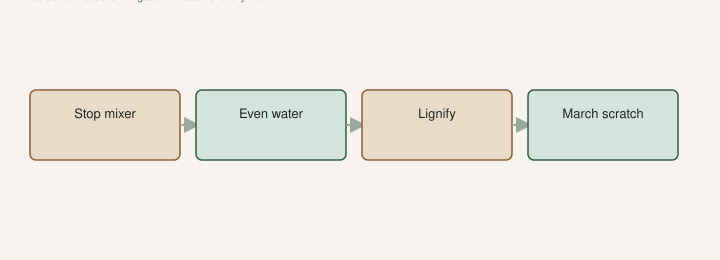

I have fertilized a pot in September because the leaves looked “hungry” and then watched a 24° night take the soft tips. That was not bad luck. That was me asking for a late freeze after I paid for one.

The fertigation draft is when I *would* feed: after it is a plant, in the push, not on a stick. This page is when I stop. NC State’s fig culture page is blunt: overdoing nitrogen late in the season makes succulent growth, and that growth takes winter injury. Excess N also shows up as light fruiting, split, and sour. I am not copying their 8-8-8 recipe onto an Arkansas pot. I am taking the warning.

## What harden-off means here

It is not a California deficit-irrigation paper. It is not starving a pot in July. It is **quit growing a soft shoot into the first real cold**.

Wood that has had time to lignify takes a bite better than a pale spear you grew with a mixer in October. TAMU’s freeze notes already said a tree that is not conditioned, or sitting dry in a weird way, takes more damage. The winter draft is the night-of. This is the month before.

In South Arkansas **8a**, September can still feel like summer. That is the trap. The calendar says fall. The pot says July. I believe the pot, and I stop treating it like July.

## What I turn off

<!-- figroots-graphic: september-stop -->

*NC State: late N makes succulent growth that takes winter injury.*

**Nitrogen I can see.** Fertigation on a collection is a chore. In late summer I shorten it, then I stop. I will not print a calendar date as law. I watch the nights and the shoot color. Soft, fast, apple-green flush in October is a confession. **[VERIFY]** your last useful feed against your own first freeze week. Mine is earlier than a Gulf Coast yard.

**Hero water.** Even moisture while fruit is on. After the flush is over, I do not keep a pot swampy to “keep it happy.” The winter page already said barely moist in the shop. I start walking toward that *before* I roll them in. A wet pot in a freeze is ice around roots. I have said that. I will keep saying it.

I do not bone-dry a tree to force dormancy like a trick. Shallow roots still need a drink in a dry September. UAEX already told you drought dumps fruit and stresses a weak tree. Harden-off is not a drought you invent. It is less push, not a punishment.

## In-ground is slower, not exempt

A hole I cannot lift still gets late-N if I treat it like a lawn. NC State again: if you are getting more than about **1–2 feet** of new growth in a year, you may not need the nitrogen you think you need. That is their conversation number, not a FigRoots trial. I use it as a look: a wild green fountain in October is not “vigor.” It is a bill for March.

Young trunks still get a mulch ring. The clay draft. Pulled off the bark. I do not pile a wet manure collar against a teenager in November and call it love.

## Pots that live in a shop

A glass frontage that stays 70°F is not harden-off. It is a houseplant. The shuffle draft already said we do not want a heated den. Soft tips in January under glass are how the late-freeze draft starts *inside*. Vent. Pull tender pots off the hot pane. Barely moist.

If a pot is still pushing in November because the shop is a sauna, I did not fail the variety. I failed the room.

## What I still do

I still water a dry week. I still pick fruit if a late fig finishes. I still roll pots before a hard night. I still take dormant cuttings when the wood is actually dormant — the calendar draft — instead of cutting soft green in October and filing it in the crisper.

I do not start a late air layer on an in-ground tree in a cooling zone because I got inspired. The fall-layer page already said that. Inspiration is a bad calendar. Harden-off is the same sentence in dirt.

## A September walk

I walk the block at 2 p.m. once the nights have started to drop. Soft apple-green tips on a pot I fed last week: that pot is done with the mixer. Heavy swampy cans: I let them dry toward lift-and-know, not toward dust. In-ground: I look at the last foot of shoot. If it is still candy-green and I have a nitrogen habit, the habit is the problem.

I write the date I stopped feeding. Next March, if the tips burned, I want to know whether I paid for it.

The late freeze will still come. Harden-off does not cancel a 24° night after budbreak. It makes the *ordinary* winter cheaper. I would rather have shorter wood in March than a beautiful September fountain and a thicket. NC State already told you the fountain is how you buy injury. I believe them. I have paid the bill. I am done paying it on purpose.

## What I am not doing

I am not running Kong’s California 55% ETc on an Arkansas pot because a paper reduced splits. That trial was Brown Turkey and Sierra in that climate. Starving a #3 in our July is drop, then a binge, then a split. The split draft already said do not cargo-cult it. Harden-off is a fall sentence, not a harvest-week trick.

I am not “putting them to sleep” with a drought in October while fruit is still softening. If a late fig is on, I water the fruit like I mean it, then I stop the mixer. Two jobs. Same week if I have to.

I am not covering an in-ground tree with a manure blanket against the trunk. Mulch the mat. Off the bark. Mice and voles like a pile. The winter draft already named them.

## Pots versus holes in the same September

A #3 dries and heats faster. It also takes my last nitrogen dose more personally. I stop the mixer on the pot block first. The in-ground tool trees can wait a week. They have more dirt. They also have more wood I still want if January bites.

A pot I will roll into a shop can stay a little greener than a hole that will take 15° on the bark. That is not permission to run 70° and a fertilizer line. That is permission to keep it from going bone dry on a 90° September afternoon while I am hardening the feed.

## How I know it worked

March. Live wood I can scratch. Not a candy-green spear that blackened on the first 24° night. If I have a notebook, I want last fall’s last feed date next to this spring’s burn line. If those two sit on top of each other, I paid for the burn.

If the plant died to the ground and the roots lived, I am in the freeze-recovery draft. Harden-off does not make that impossible. It makes it less often *my* fault.

I would rather look stingy in September than look busy with a mixer. Busy is how we grew the cotton in the shop and the black tips on the east wall. Stingy is how the wood I wanted is still wood. NC State’s 1–2 feet of growth is the look I use, not a ruler I worship. A fountain is a confession. I have confessed. I am done.
