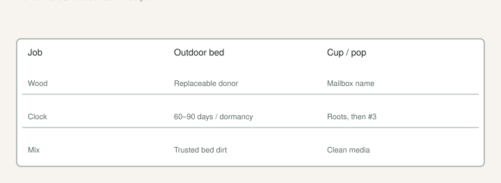

I have stuck a rare name in a raised bed of yard dirt because I was out of cups and I wanted to feel busy. That is how you donate a name to nematodes, a puddle, or a hoe.

[Outdoor](https://figroots.com/outdoor/) already wrote the method: shade, water about once or twice a week on bulk starts, raised-bed dirt that still roots a stick, **7–8 nice leaves** in a pot or **9–10** in a bed, about **60–90 days**, or you wait until fall dormancy and dig then. I am not rewriting their hose. I am telling you which wood I will put in that dirt.

## The job is volume

<!-- figroots-graphic: bulk-vs-cup -->

*Outdoor page numbers stay on that page. Dirt is for wood you can replace.*

A donor tree. A Turkey type I will not cry over. Extra laterals from a prune day after the dessert names kept their shoots. 6–8 inches, three nodes, lignified if I can get it. A grocery bag I will actually stick *this week*, not a bag that molds in the shop.

The prune-day draft is the card: wood or fruit. Outdoor bulk is what I do with the wood card when I do not have forty cups and a mat.

A mailbox celebrity is a cup, clean mix, a thermostat if it is winter, a label on the rim. The nematode draft is why. The Intro already said do not root in mystery local soil if you are in a root-knot county. Outdoor dirt is “free rootstock logic.” It is not Black Madeira logic.

## Shade is the climate control

South Arkansas July will cook a black cup on gravel. It will also cook a stick standing in a bed with no afternoon shade. The Outdoor page put them in shade on purpose. I do not “toughen” bulk starts on a west pad to make them strong. I make raisins.

Morning sun is fine. Afternoon cloth or a tree line is how I keep the weekly water from being a daily funeral. The shade-and-water draft is the rest of July. This page just refuses to pretend a bulk bed is a full-sun orchard.

## Weekly-ish, not a swamp

Once or twice a week is their language. I lift or poke. A bed that smells sour is the potting-mix draft in dirt form. Raised so water leaves. The clay page: do not build a bathtub and call it a fig farm.

I do not fertigate a row of sticks. Feed the plant after it exists. A stick in dirt is still a stick.

## What “replaceable” means on a prune day

If I would be sad to lose every stick in the bed, I used the wrong wood. Replaceable is a Turkey type, extra laterals, a donor I already decided is a donor. The dessert names keep their shoots. That is the prune card again. Outdoor bulk is not a second chance to hat-rack a berry tree because the cups were dirty.

I count sticks for the bed the way I count cups: what I will tend, not what fits in a grocery bag. Extra wood in a forgotten trough is a Damaged Cuttings photo with dirt on it.

## Two clocks. Do not mix them.

**Pop / cup:** roots on the wall, then a **#3 before June** if it is growing. Brittle roots. Do not shake the lump. Heat mat **75–78°F** on a thermostat if you are in the basement. That is Fig Pops and the pot-up drafts.

**Outdoor bulk:** 60–90 days or wait for dormancy. 7–10 leaves as their separation talk. That wood grew in dirt. It is not a pop bag. If you treat a dirt plant like a pop, you will strip roots and then blame the variety. If you treat a pop like a dirt plant, you will drown it or cook it.

I write the clock on the row: “dirt, wait for fall” or “cups, mat.” A helper with a trowel and no clock is how a name goes in the bed.

## What I dig in the fall

Dormant, if I can wait. A plant with a real root, not a two-week white thread. Label that survived the summer — paint pen, because paper in a bed is compost. Then a pot or a hole I believe. The first-two-summers draft is the hole. The #3 draft is the pot.

If I need it in July, I am careful and I accept losses. I do not need a rare name in July from a bed. I need volume.

## What I will not do

I will not stick the only wood from a one-tree yard in a bed I have not puddle-tested. I will not mix last year’s tomato row into a “fig nursery” and then act surprised at galls. LSU 1802 already named tomato, okra, tobacco ground. TAMU already named sand.

I will not call outdoor bulk a Fig Pop. Different moisture, different heat, different wood. The 2023 coir vs DE counts stay in that basement post. I will not invent an outdoor sequel.

Outdoor dirt is how we make extra trees without filling the shop. It is not how we prove a name. Cups for names. Beds for wood we can replace. If you only remember one sentence, remember that one. The Outdoor page is the hands. This page is the permission slip — and the refusal.

## How I stick a bed without pretending it is a lab

I puddle-test the hole or the trough the day before. If water stands until morning, I plant high or I do not plant. The clay draft. I use dirt I already trust for *replaceable* wood — raised-bed mix we have used, not the tomato row, not a sand patch TAMU already warned you about.

Sticks go in at an angle or straight, nodes under, one node out, bark dry enough that I am not burying mud. I do not pack a swamp. I do not run a heat mat under a bed. Outdoor heat is the air. Shade is the thermostat.

I label the row, not each stick, if they are all one donor. If they are not one donor, I am in the wrong method. Mixed names in a bed is how “the brown ones” become a lie at pot-up. Paint the end of a stick if I have to. I have skipped that. I have regretted it.

Spacing is “I can get a trowel between them in October,” not a nursery spec. Crowded is fine for volume. Crowded plus no label is a mess.

## Water week one, then the Outdoor rhythm

The first week I do not let the bed go to dust. After that I am on their once-or-twice-a-week language unless a 100° week says otherwise. Lift a pot on the same pad if I have one — the weight lesson transfers. A bed you flood every afternoon is rot with extra steps.

I do not fertilize the sticks. I do not “tea” them. I do not dunk them in a hormone I will not name as a miracle. Fig Pops already said what we do in a cup. A bed is cruder. Crude is the point. Volume, shade, patience.

## When I would still use a cup

Green summer wood I cannot replace. A mailbox name. A one-node piece I should have refused. Winter, when the bed will freeze and the mat will not. Any stick I would be sad to lose to a hoe.

If I am out of cups, I buy cups. I do not “make do” with a rare name in mystery dirt. That sentence has cost more than a bag of Promix.

Outdoor bulk is how a prune day becomes trees instead of a trash bag in the shop. It is not a shortcut around mix, labels, or nematodes. Shade. Weekly-ish water. 60–90 days or wait for dormancy. Wood you can replace. The Outdoor page already said the numbers. I am saying the permission — and where it stops.
