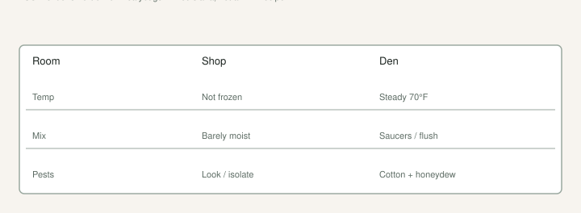

I have brought a block of #3s into a warm shop “to be safe” and then spent February wiping cotton off the stems. That was not a fig problem. That was a houseplant problem I paid for.

The [Winter protection](https://figroots.com/winter-protection/) page already said the job: pots above about **40°F**, not a heated den, **barely moist**. The shuffle draft is how they get there. This page is what grows if you ignore the den sentence.

## What I am looking at

Scale and mealybugs are sap suckers. They look like scabs, or like someone spilled cotton in the crotch of a branch. Honeydew. Ants if you have them. Sooty film. A plant that looks tired while the mix is still heavy.

Texas A&M’s organic desk has written that mealybugs show up now in greenhouses and houseplants — warm, still, a roof. UMass says they usually *enter* a greenhouse on infested plants, hide in crevices and drain holes, and leave honeydew and sooty mold. I will not pretend I ran a count on our shop. I will say: a 70° fig is a foliage crop. Treat it like one when you inspect.

LSU AgCenter’s Louisiana fig notes say light horticultural oil can control mealybugs, and that figs rarely need a spray program. That is Gulf language. **[VERIFY] the label for edible figs in Arkansas** before anyone copies a Louisiana sentence onto a hose. I will not name a product. I will not write a schedule. Rules move.

## Why the den does it

<!-- figroots-graphic: den-vs-shop -->

*Winter page: above ~40°F, not a heated den. [VERIFY] before you spray.*

Soft growth. Dry air on top of wet saucers. No rain to wash anything. Pots touching. A rare name shoved against a dirty bench. You rolled in a crawler with the last plant you bought, or with a cutting you did not look at.

The harden-off draft is how you stop making candy-green tips for them to farm. The winter page is how you stop the sauna. Those two pages are the control program I will own. Soap-and-oil theater is what people reach for when they refuse the room.

A shop that swings cold at night and warm in a sun pane is still better than a steady 70° with a space heater. Soft and steady is the pest weather. I would rather have a plant that sits quiet at 45° than a plant that flushes in January and then shines.

## What I do that is not a spray

**Look.** Undersides. Stem crotches. The pot rim. The drain hole if I am already potting. New plants sit away from the block until I have looked twice.

**Separate.** One cottony pot does not get to lean on the clean row. I am not running a hospital. I am keeping a library from becoming one pot.

**Barely moist.** Gnats and sour mix and soft bark all like the same swamp. Dump the saucer. The mix draft.

**Do not fertilize the den.** Soft flush is food for the cotton. The fertigation draft already said feed the plant in the push, not the stick, and not a winter spear.

**Vent a sun day.** The late-freeze draft said shop glass can wake tips. Same glass grows pests if you never open it.

If I see a light infestation, I will wipe what I can reach. Alcohol on a cloth is a houseplant move people talk about. I will not print it as a fruit-tree recipe. **[VERIFY]** with your agent if you are going to put anything on a plant you still plan to eat from. I would rather isolate and wait for outdoor weather than invent a dunk.

## What I will not do

I will not dunk a collection in a mystery oil because a forum said “smother them.” I will not use a systemic I cannot put on a fruit tree and then act surprised the label said ornamental. The Ask Extension fig-in-a-greenhouse thread is full of that wish. I am not joining it.

I will not keep a rare name in a 70° corner “just this winter” because I like watching leaves. Leaves in January are a bill.

I will not trade a pot I know is cottony without saying so. Same sentence as nematodes. The mess travels.

## A February walk

I walk the aisle with a headlamp because that is when I actually see the white. I lift a few leaves. I check the pots that sat against the wall all month — those are the ones I forget. If I find cotton, that pot moves to a penalty bench. If I find a swamp saucer, I dump it whether or not I see bugs.

Then I look at the thermostat I should not have. If the shop is a den, the cotton is a symptom. Turn the den down. The winter page already told you the temperature that matters is “not frozen,” not “comfortable for me in a T-shirt.”

Scale is not a reason to throw a good name away. It is a reason to stop growing a jungle in a box. Relocate. Barely moist. Look. Isolate. **[VERIFY]** before you spray. I would rather roll pots twice than wipe stems until March. The den is optional. The look is not.

A fig that sits quiet through winter is a fig. A fig that flushes, shines, and drops leaves in a warm shop is a houseplant with a cutting tax. I have grown the houseplant by accident. I am not doing it on purpose again.

## Where they hide on a fig

Crotches. The underside of a still-green leaf. The pot rim where the hose never hits. The drain hole. A label tie. A stake. UMass already said crevices and drain holes on greenhouse crops. A fig in a #3 is that crop with a thicker stick.

I look when I am already watering, not on a special “pest day” I will skip. The cotton does not keep my calendar. A headlamp in February is because I actually do the walk then, not because the bugs prefer night.

Honeydew on a neighboring pot is a clue the cotton pot is not the only one. Ants on a winter pot are a clue. I do not treat ants as the pest. I treat them as a sign.

## Incoming plants

A new #3 from a trade sits on a penalty bench for a look. I knock the pot only if I am already potting — nematodes and cotton can travel together, but I will not wreck roots in January to satisfy curiosity. I look at the top, the rim, the crotch.

A cutting is cleaner than a potted plant. That is the same sentence as the nematode draft. Wood, washed, new mix. A potted “deal” can be a cotton deal. I would rather take a 6–8 inch stick off a plant I trust than roll their whole pot into my aisle.

Box-store foliage sitting in the same shop as the figs is how a houseplant pest becomes a fig pest. I have liked a pretty plant in January. I have paid for it on the fig stems in February. The pretty plant can live in another room.

## When I would throw a pot away

I do not throw a good name away for a few cotton spots. I isolate. I wait for outdoor weather. I take clean wood if the top is a mess and the name still matters.

I will throw mix I do not trust, and I will throw a pot that is all honeydew, sooty, and leafless in a den I already failed. The name can live as cuttings. The pot can go. That is not drama. That is refusing to wipe a corpse all March.

The den is the habit I can break without a sprayer. 40°F and barely moist is already on the Winter page. Scale is what you grow when you decide that page is uncomfortable. I would rather be uncomfortable in a jacket in the shop than comfortable in a T-shirt wiping stems. The jacket is the program. The cotton is the receipt.
