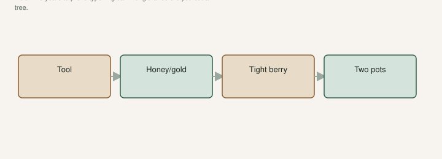

I have called a bench of unfruited cups a “trial.” It was a parking lot. A trial has a question and a date you will look at the fruit.

The Fig Jam interview is on the record: we give a variety a long trial before we cut a tree. I am still not a fan of Brown Turkey or Celeste *so far*. We still have them. That is a trial. Twenty unlabeled celebrities in #3s is a shopping problem.

[Pick The Right Fig](https://figroots.com/2025/07/02/pick-the-right-fig-for-you/) already handed you the questions: heat, eye, breba, pot vs ground, flavor, birds, South shade and water. A trial row is how you answer **one of those** on wood you own. Not all of them on twenty names this week.

## What the row is for

**One climate question per tree.** Will this finish before our nights fall apart? Does the eye hold in a wet August? Do I even like it? Can I keep it alive in a pot if the hole is sand?

If you cannot say the question, you are collecting. The pantry draft is that confession. Collecting is allowed. Do not call it science.

A trial I respect: three eaters in the ground or in #5s I will actually pick, plus two names I have a reason to believe — a tight-eye berry from a person who ate it in the South, an LSU name I will not upgrade until fruit. Then **stop buying** until those plates exist. The Intro said 1–3 years to prove type. That clock starts when the plant is a plant, not when the PayPal receipt prints.

## How I plant a trial without lying to myself

Same exposure if I am comparing finish dates. An east wall for one and a west fry for the other is two climates. The microclimate draft. I write the site on the tag: “east wall, #5, 2026.”

Same water habit. A pot I baby and a pot I forget are not a variety test. They are a shuffle test.

A label that will survive the shuffle. Paint pen, both sides, source, year, unverified. The label draft. A map of the bench dies in November.

I do not plant the trial in a hole I have not puddle-tested. I do not plant the rare name in sand I will not admit has nematodes. Tool trees can take a hole I am still learning. The trial name can wait in a pot.

## What I write down, or the trial did not happen

Date in. Source. Claimed name. Pot vs ground. First bud. First ripe — or first hard-green frost. Eye. Split or sour after rain. Birds. Whether I would eat it again. Whether I would take wood.

That notebook is the GDD draft without pretending I invented a model. It is the true-to-type draft with a date. If I will not write it, I will not remember it, and I will buy the same name twice.

Jack’s plate notes — Red Sicilian, Syrian Dark #2, Jack Lilly, NSDC in rain, Negra d’Agde, Navid’s Unk still Unk — are what a trial looks like when someone actually ate the fruit. They are not a shopping list. They are a method: small words, eye, rain, would-I-again.

## When I end a trial

Fruit I do not like, after a fair year, on a live plant: graft over, keep the hole. The graft draft. A fair year is not a freeze-to-the-ground year plus a late variety. Write that year down and wait.

Never fruited because I never potted up, never watered August, never labeled: that is not a failed variety. That is a failed grower. I have been that grower. I do not get to blame the tag.

Died in a den of scale, or in a swamp pot, or in a mailbox I left until Saturday: same. Fix the method. Then trial the name again if you still care, on *new* wood, with a note.

A tool tree that lived and fed a kid can stay even if I am not a fan of the flavor. That is a different job. The Celeste / Turkey draft. Do not rip a climate tool because the trial row wanted to be prettier.

## How many is enough

Five trees I will pick in a flush week. Not fifty cups I will inventory as dead-outs. The Fig Jam line still stings: new names, dead-outs. A trial row that needs an inventory of ghosts is a collection that escaped.

If a guest asks how many varieties I am “testing,” and the number makes them blink, I am not testing. I am hoarding. Offer them a fig from a pantry tree. The tour of cups does not answer a climate question.

I would rather finish three honest trials than start twenty. The wishlist can wait. The August plate cannot. A trial row is a promise to show up with two buckets and a pen. If I will not make that promise, I should buy jam and leave the celebrities in someone else’s shop.

## What I will not compare

A first-year pot against a ten-year hole. A late freeze year against a clean year. An open-eye giant in a wet August against a tight Celeste and then call the giant “no good here.” The split draft and the tool-tree draft already named those taxes.

I will not score flavor on a grocery fig and a tree-ripe berry in the same sentence. The flavor draft. I will not score a variety I never watered in July. I will not score a tag I lost.

A trial that only exists as a forum argument is not a trial. Fruit on a plate, or it did not happen.

## A five-tree row I would actually run

<!-- figroots-graphic: five-tree-trial -->

*A trial has a question. A parking lot has a receipt.*

One tool tree that lives here — Celeste or a Turkey type from a person who has fruit, even if I am not a fan. One honey or gold I have a reason to believe. One tight-eye berry from a Southern plate, not a California thumbnail. Two wild cards in pots, unverified, east wall if I have it, #5s I can roll.

That is five questions. It is not a parking lot. Year one I expect wood and a few buttons. Year two I expect a plate or an honest miss. Year three I decide: hole, graft, or goodbye. The first-two-summers draft is the hole’s clock. The true-to-type draft is the name’s clock. I do not rush either because a marketplace listing was loud.

If one wild card finishes late and hard-green, that is a GDD answer, not a flavor answer. I write it that way. If I wanted dessert, I already had the berry. If I wanted a family tree, I already had the tool.

## Money and space

Cuttings are cheap. Two years of a wrong #5 are not. Shop space is not. July water is not. Dead-out inventory is not. A trial row with a budget is: five plants, labels, a net for the ones I will eat, a notebook. A trial row without a budget is how the library steals the pantry morning.

I would rather buy the net for three eaters than the twelfth name. Birds do not care that I am “testing.” They test first.

Five trees you pick are a trial. Fifty cups you count in February are a hobby with better stationery. I have lived the hobby. I still live it. I am done calling it a row. The row has a question. The parking lot has a receipt. Only one of those ends in a bowl.
