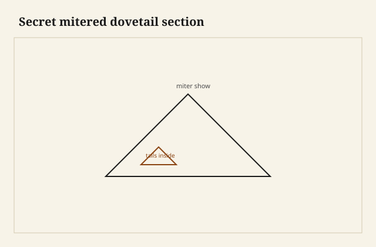
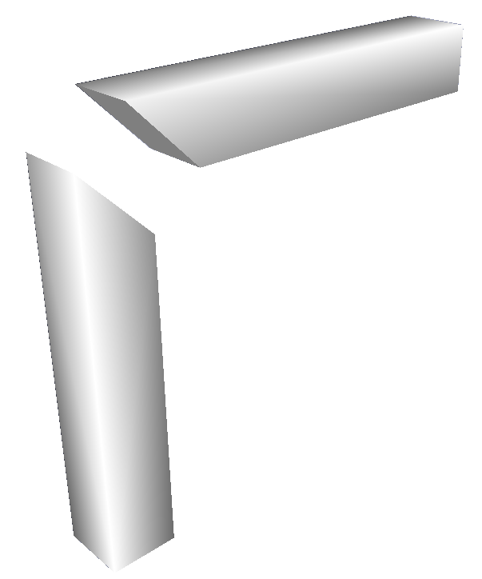

The corner looked like a miter. That was the point. I had the box on the bench under the glass wall, late light, and you could not see a pin or a tail from three feet. You could see a hairline if you got rude with a thumbnail. I got rude. The hairline was on the inside arris, where I had been shy with the chisel, and it would close when the glue swelled the miter a little. The outside was already a single line. That is the only compliment this joint wants.

<figure class="faj-figure">
  
  <figcaption><strong>Figure 1.</strong> Secret mitered dovetail section. Pack schematic (CC0).</figcaption>
</figure>

<figure class="faj-figure faj-museum">
  
  <figcaption><strong>Figure 2.</strong> A miter is a show line; the secret dovetail lives behind it — the plate names the geometry the case study cuts. (<a href="https://commons.wikimedia.org/wiki/File%3AMitre_joint_square.png">Wikimedia Commons</a> — Public domain).</figcaption>
</figure>

<figure class="faj-figure faj-shop-pending">
  
  <figcaption><strong>Photo 3 (pending).</strong> From the outside it is a miter. From the end it is still a dovetail, if you left the meat. Keith BBF shop library — unpublished; photographer unnamed until file metadata is pulled Slot: D:\BBF\BBF Photos — secret mitered dovetail dry-fit, miter closed, tails hidden (filename pending shop pull)</figcaption>
</figure>

A square through-dovetail is honest. It says *box*. A secret miter says *I know you can see the corner and I still will not show you the teeth*. Jewelry boxes, document boxes, a tea caddy that will sit on a mantel. It is not a blanket-chest joint. It is not a job you cut on a Friday because the saw was already out.

## What you are actually cutting

Two boards meet at forty-five on the show faces. Behind that miter, inside the thickness, you have a dovetail: tails on one piece, pins on the other, stopped so they never break the outside. The miter carries the look. The dovetail carries the shear when someone picks the box up by one end.

If you only miter and glue, you have a picture frame. Picture frames hang still. Boxes get opened, racked, set down on one corner. End-grain glue on a miter is a wish. The secret dovetail is the wish plus a mechanical lock you cannot see.

There is a cousin — the secret *lap* dovetail — where one face still shows a half-blind like a drawer. Different argument. Here both faces want to be clean miters. That is why the layout eats thickness. A 3/4-inch side leaves you enough. A 3/8-inch jewelry-box side leaves you a joint for a dollhouse and a nervous breakdown. I will not cut this in thin stock to prove a point.

## Layout: the miter is a fence

Square the ends. Then mark the miter around the four show edges — the two faces and the two edges — so you know what must remain a clean bevel. Everything that holds lives *inside* that fence. If a tail tip breaks the miter line, you will see a dark triangle on the outside forever. That triangle is not charming. It is a tell.

<figure class="faj-figure faj-shop-pending">
  
  <figcaption><strong>Photo 4 (pending).</strong> The miter line is a fence. Everything that holds lives inside it. Keith BBF shop library — unpublished; photographer unnamed until file metadata is pulled Slot: D:\BBF\BBF Photos — secret miter layout on box side, tails marked inside the miter line (filename pending shop pull)</figcaption>
</figure>

I mark the tail sockets on the inside face first, then carry them to the end, then confirm they die before the miter. A cutting gauge set to the tail length (shorter than a through-dovetail — you are not going through) keeps me from getting greedy. Greedy tails blow the miter. Shy tails hold less. The middle is a judgment, not a formula I will print as law.

Some texts walk you through a sequence of rebates: a shallow rebate to establish the miter shelf, then the pins, then the rest of the miter. I have done it that way. I have also sawn the miters last, after the dovetails were chopped, so I could still sneak a pin without wrecking a finished bevel. Last is safer if your miter shooting is good. First is safer if your dovetailing is sloppy. Know which one you are today.

## Chopping in a hole

You are chopping sockets that do not go through. The waste has no exit. A fret saw helps if you can sneak a hole. A forstner from the inside, stopped, is a production habit I will use on a run and not on a single fine box unless the bit is sharp and the fence is true. Most of the time it is chisel work: vertical wall, then a lift, then a vertical wall.

The acute corner of the pin — the one that hides under the miter — is where people leave a hump. The hump holds the miter open by a thousandth you can see in raking light. Pare until the dry-fit shuts on the bevel, not until the inside looks pretty. The inside of a secret joint is allowed to look like work.

## Shooting the miter

A shooting board that only knows ninety is not enough. I keep a 45 donkey or a plane on a cradle. The last pass is a shaving you can read through. If you sand the miter, you have rounded the only line the joint owns. Sand after glue, if you must, on the outside arris, never as a way to close a gap.

Dry-fit with painter’s tape as a clamp. If you need a dead-blow, stop. The dovetail is fat or the miter is long. A long miter is the more common sin. You think you are being precise; you have left the bevel proud of the tails, so the tails never seat and the corner looks closed until January, when the glue line draws a shadow.

## Glue, clamp, and the thing you cannot see

Hide is kind because you can still get back in. PVA is fine if the dry-fit already shut. I glue the tails and I glue the miter. I do not flood the miter; squeeze-out on a show bevel is a stain that does not sand out of oak the way you hope.

Clamps: opposite corners, even pressure, cauls that do not dent. A strap clamp around a small box is honest. Check from above that the box is not winding into a diamond. Secret miters hide a lot. They do not hide a rhombus.

I leave the box in the clamps longer than a through-dovetail. The miter is all end grain wanting to open. Time is cheaper than a corner that creeps overnight.

## When I will not cut this

I will not cut a secret miter on a tool chest that will be dragged. I will not cut it on a toy box a child will sit on. Through-dovetails belong there; they show the work and they take a hit. Secret miters belong where the object is handled like a book.

I will not pretend a splined miter is the same joint. A spline is good. A spline is faster. A spline is not teeth locking across the corner. If the brief is “clean corner, real box, one-off,” I still reach for the secret dovetail. If the brief is “four gift boxes by Saturday,” I spline and I sleep.

## A failure that looked finished

I once left the tail tips a hair proud of the miter line on the inside, thought I had stayed hidden, and finished the box. Under a lamp the outside showed four tiny shadows, one at each corner, like the box had freckles. I could not plane them without changing the dimension. I still have that box. It taught me to mark the fence darker than my optimism.

Another time I cut the miters first on thin walnut and blew a corner out chopping the pin. Walnut will do that when you are prying waste toward a bevel that is already a knife. I patched it with a sliver. I can find the sliver. Nobody else has, which is not the same as the joint being clean.

## A 45 donkey that earns the last shaving

I keep a shooting donkey with a 45 fence and a stop I can sneak. The last pass is a shaving you can read a pencil through. If the donkey is tired — a ding in the fence, a plane that wants to dive — the miter goes long and the tails never seat. I dress the fence before I dress the box. That order has saved more corners than a sharper chisel.

South Arkansas August will open an end-grain miter that looked shut in January. I glue the tails and the bevel, I leave the clamps on overnight, and I do not oil the outside until the corner has sat a day in the glass-wall light. A shadow that shows up then is a long miter I can still sneak. A shadow that shows up after finish is a box I will keep in the shop.

What I want from `D:\BBF`: the closed corner under raking light, and the inside with the tails still visible. No filename. Photographer unnamed until the file says so.

## The judgment

The secret miter is vanity with a job. The vanity is the clean corner. The job is the dovetail you hid so the vanity would last. If you only want the look, use a spline and say so. If you want the box to remain a box when someone lifts one end, stay inside the fence and cut the teeth.
