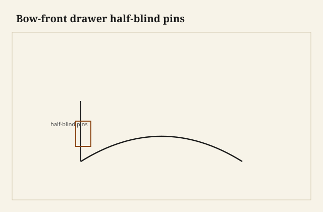
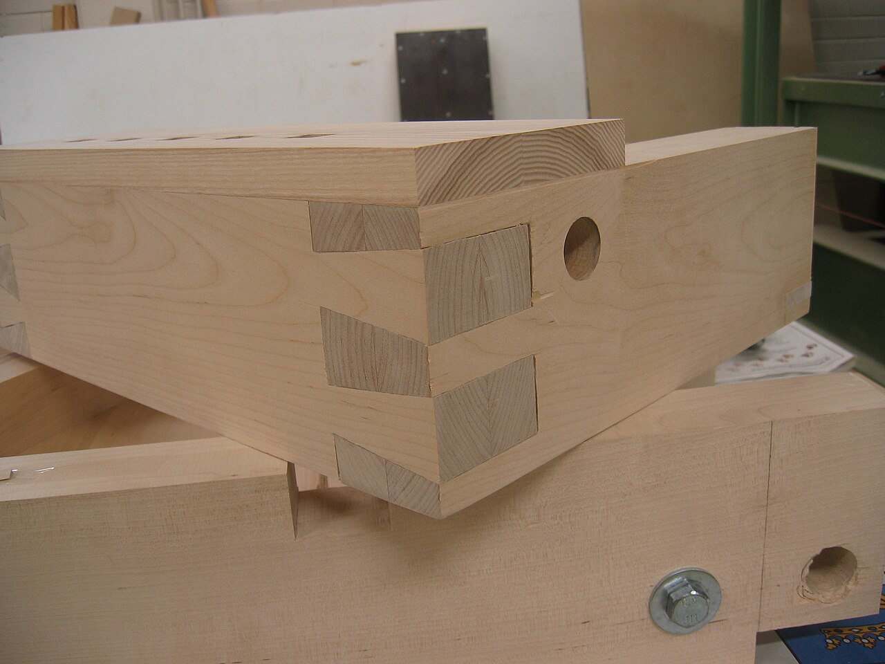

The drawer front was a smile. Not a cartoon smile — a shallow bow, maybe three-eighths out of flat on a 16-inch width, enough that a straightedge rocked and a square lied at both ends. The sides were still straight boards. They always are. Runners, grooves, a back that wants to be a rectangle: the carcase is a square world. The front is the only piece that left. The pins have to meet that leaving.

<figure class="faj-figure">
  
  <figcaption><strong>Figure 1.</strong> Bow-front drawer half-blind pins. Pack schematic (CC0).</figcaption>
</figure>

<figure class="faj-figure faj-museum">
  
  <figcaption><strong>Figure 2.</strong> A bow front still ends in pins — this shop photo shows how tight pins read on a curved meeting. (<a href="https://commons.wikimedia.org/wiki/File%3AFinished_dovetail.jpg">Wikimedia Commons</a> — CC BY-SA 3.0).</figcaption>
</figure>

<figure class="faj-figure faj-shop-pending">
  
  <figcaption><strong>Photo 3 (pending).</strong> The front leaves the square world. The side does not. The pins live in the argument between them. Keith BBF shop library — unpublished; photographer unnamed until file metadata is pulled Slot: D:\BBF\BBF Photos — bow-front drawer, curved front meeting straight side, half-blind pins (filename pending shop pull)</figcaption>
</figure>

I will not start with a history of bombé chests. Those are another shop’s religion. I start with a sideboard drawer that needs to echo a curved apron, or a jewelry-chest drawer that would look dead if it were flat. The joinery problem is the same at every scale: half-blind dovetails in a front whose show face is not the plane your marking gauge expects.

## Make the curve before you mark a pin

If you cut pins on a flat front and then bend it, you have made a different mess — possible with a laminated front, stupid with a solid. I make the curve first.

Three honest ways:

**Solid, shaped.** Start thicker than the finished front. Cut the concave back and the convex face with a plane, a spokeshave, a sander if you must. The ends where the sides will meet need to be *square to the side*, not square to some average of the bow. That means the end is a slight compound: square to the runner, and the face is still curved. You are dressing a winding stick of an end. Take your time.

**Coopered.** Two or three staves, sprung or glued on a form, then dressed as one front. The glue lines should not land in a pin if you can help it. A glue line in a pin socket is a place the chisel will find a change of mind.

**Laminated.** Thin leaves on a form. Stable. Kind. The ends are easier to square. The look is a little quieter than a solid board that grew the curve. I like it for kitchen work. I like solid for a piece that will be opened in a sitting room.

<figure class="faj-figure faj-shop-pending">
  
  <figcaption><strong>Photo 4 (pending).</strong> Make the curve true before you invite the saw. A wandering front makes wandering sockets. Keith BBF shop library — unpublished; photographer unnamed until file metadata is pulled Slot: D:\BBF\BBF Photos — curved drawer front on form, or coopered staves before pins (filename pending shop pull)</figcaption>
</figure>

Do not mark tails until the front is at thickness and the curve is fair. A fair curve is one a batten likes. If the batten shows a flat in the middle, you will see it after finish, and you will also have a baseline that changes its mind.

## Where the gauge rides

On a flat half-blind, the gauge rides the inside face and the end. On a bow front, the inside face is concave. The gauge will rock. I use a block that matches the hollow, or I scribe from a fence that touches the two high spots and I accept that the line is a reference, not a religion. Then I deepen the line with a knife where the pins will be.

The tail board (the side) is still square. Thank God. Cut the tails as usual. The transfer onto the curved front is the part people skip in their heads. You cannot lay the side on the front and trace as if both were flat. The side meets the front along a line that is straight in plan and rides a curve in elevation — actually, for a bow that is only in plan, the meeting line is still a straight vertical if you dressed the end correctly. That is the goal. If the end was dressed drunk, the side will show a gap that opens like a grin.

I clamp the side to the front with the inside faces toward the world I can see, and I knife the pins from the tails with the front supported so it cannot rock. A second pair of hands helps. A cradle that holds the bow helps more.

## Sawing pins in a curve

The saw still wants a straight plate. The end is straight (if you dressed it). The *face* is curved, so your depth at the middle of the front is different from your depth at the ends if you were thinking of the show face as a thickness map. Think from the *inside* face, the one the tails see. Depth of the half-blind sockets is from that inside face, consistent, so the tail tips all die in the same plane. The show face can have more meat in the middle of the bow. That extra meat is not a pin. It is the curve.

Chop as usual. Support the show face. A bow front will split along the grain if you pry toward the thin ends. The ends of a bow are often the thinner leftovers of shaping. Be gentle there. Those are also the corners the customer’s eye hits first.

## The side, the runner, the rack

A bow-front drawer still racks. The curved front is a little stiffer in its plane than a flat front of the same thickness, which fools people into skinny sides. Do not. The sides still do the running. Groove, slip, or runner — the craft pack already argued drawers. Here the extra is: the front’s extra mass in the middle wants to droop if the slips are lazy. I keep the bottom as I would on a heavy flat drawer, and I do not let the bow become an excuse for a thin plywood afterthought glued to a rebate that is not square.

Fit in the opening is a story about the *case* opening, which is still a rectangle, and the *front*, which is not. The gaps at the ends of the bow will look larger than the gap at the middle. That is optics. If you chase them by planing the ends, you will make a front that is short and a middle that still looks proud. Fit the sides and the runners. Live with the optical gap or shadow the case rails to match. I have added a slight hollow to a case rail to echo the bow. That is millwork, and it is allowed.

## Failures

I traced tails onto a front that was still a little proud of fair. The sockets followed a bump. After I faired the face, the bump was gone and the sockets were shallow in the middle. I filled nothing. I cut a new front. Fair first.

I also glued a coopered front with a stave joint landing in a pin. The chisel picked the glue line and the pin wall came out in two species of stubborn. Move the stave joint, or move the pin.

Steam-bending a solid front and then dovetailing it is possible. The springback will move your end angles if you mark before it finishes moving. I wait. [VERIFY] a shop moisture and wait time before anyone prints a schedule.

## A cradle for the transfer

The tool that makes the pin transfer honest is a cradle that holds the bow so the front cannot rock while I knife from the tails. I cut it from a scrap of the same curve — leftover from the form, not a guess — and I clamp the side to the front with the inside faces where I can see them. A second pair of hands is a luxury. The cradle is a habit.

I wait on a steamed or laminated front until a batten likes the face and the ends have stopped walking. [VERIFY] a wait before anyone prints a schedule. I have marked a front that was still smiling from the form, then watched the ends come back a hair and take my pin lines with them.

What I want from `D:\BBF`: the smile meeting a straight side, pins chopped, and the front on the form before any gauge line. No invented file.

## The judgment

A bow-front drawer is a curve you commit to before the saw is invited to the corner. The dovetails are half-blind, like a civilized drawer, and they are also a transfer problem. If the end is square to the side and the sockets are all one depth from the inside face, the bow can be as pretty as it wants. If you mark as if the front were flat, the smile becomes a gap.
