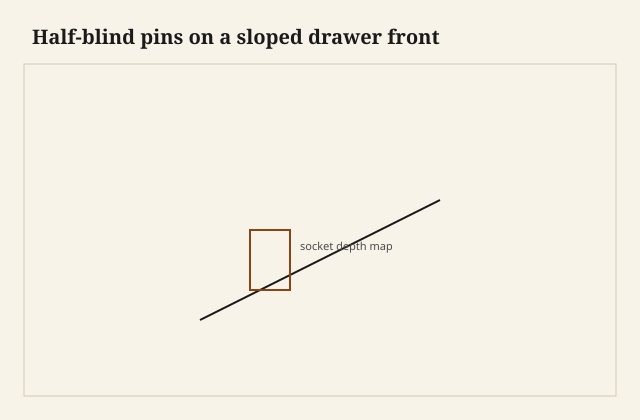

The drawer front was a wedge. Thick at the bottom, a knife at the top, the old lip that throws a shadow on the rail. Pretty. Also a thickness map that changes while you are trying to chop a half-blind socket of one depth. I have blown the knife edge from the inside. The show face grew a dark crescent where a pin wanted out. There is no dignified repair for a crescent on a knife.

<figure class="faj-figure">
  
  <figcaption><strong>Figure 1.</strong> Half-blind pins on a sloped drawer front. Pack schematic (CC0).</figcaption>
</figure>

<figure class="faj-figure faj-museum">
  
  <figcaption><strong>Figure 2.</strong> Half-blind pins on a slope still have to die before the thin edge — a tight corner for comparison. (<a href="https://commons.wikimedia.org/wiki/File%3AFinished_dovetail.jpg">Wikimedia Commons</a> — CC BY-SA 3.0).</figcaption>
</figure>

<figure class="faj-figure faj-shop-pending">
  
  <figcaption><strong>Photo 3 (pending).</strong> The front is a wedge in section. The sockets have to die before they find the thin edge. Keith BBF shop library — unpublished; photographer unnamed until file metadata is pulled Slot: D:\BBF\BBF Photos — sloped or canted drawer front, half-blind pins (filename pending shop pull)</figcaption>
</figure>

This is not the bow-front. The bow bends in plan. This front slants in section: a canted lip, a knife-edge drawer, a sloped fall that is still a drawer and not a desk. The sides are square. The pins are half-blind. The danger is depth.

## Read the wedge

Mark the finished slope. Measure thickness at the top of the socket zone and at the bottom. The sockets live in the *thick* country. If your tail layout wants a pin near the knife, move the pin. I keep the top half-pin lower than my habit on a square front. The knife can be a lip without being a joint.

Depth is from the inside face, consistent, the same as a bow-front. The show face will have more meat at the bottom and almost none at the top. That is the design. Do not “average” a depth. Averages blow knives.

<figure class="faj-figure faj-shop-pending">
  
  <figcaption><strong>Photo 4 (pending).</strong> Depth from the inside face. The show edge can be a knife. The knife is not a pin wall. Keith BBF shop library — unpublished; photographer unnamed until file metadata is pulled Slot: D:\BBF\BBF Photos — thickness map on sloped drawer front, socket depth marked (filename pending shop pull)</figcaption>
</figure>

## Transfer with the lip in the way

A sloped front often has a lip that overlaps the rail. The side does not meet the front at the show edge; it meets it on a shoulder behind the lip. That shoulder is your end. Square it to the side. If the lip is already cut, you cannot easily dress that end without changing the overlap. I cut the lip last when I can. When I cannot — a front already shaped — I sneak the shoulder with a shoulder plane and I check the side for square in the runner’s world, not in the lip’s world.

Knife the pins from the tails with the front supported so the wedge cannot rock. A wedge rocks. A cradle helps. A second clamp that would be overkill on a square front is not overkill here.

## Chopping toward a knife

Bevel down, waste first, stop before you get brave at the top. I chop the bottom sockets first, where the meat is, to get a feel, and I treat the top socket like veneer work. Support the show face with a backing board shaped to the slope, or at least a flat bench and a pad so the knife is not hanging in the air.

A router and a jig: possible, if the jig references the inside face. A jig that references the show face will plunge through the thin end. I have seen it. I have done it on a sample. The sample is in the burn pile.

## The lip is not a joint

People glue the lip as if it were a pin. The lip is a shadow. If you run a tail up into the lip, you have put a socket in a place that chips when the drawer is slammed. Keep tails in the thick body. Let the lip be a plane and a little courage.

Fit: the sloped front will look like it has a wider gap at the top. Optics again. Do not plane the top of the front to chase it unless the case rail is also sloped. Most case rails are square. Live with the shadow or slope the rail a hair to match. Millwork.

## Failures

Crescent in the knife. Recut the front. I will not tell you to patch a knife edge on a show drawer. A patch on a knife is a headline.

I also transferred tails before the lip was faired and then the fairing took a 32nd off the shoulder. The drawer sat proud. I planed the sides and I lost the fit in the opening. Fair, then mark, then cut. The same sentence as the bow-front. It earns its keep.

## A cradle that stops the rock

I cut a V-block from a pine offcut, the included angle matched to the wedge with a sliding bevel locked to the finished slope. The front lies in that V with the inside face up. A toggle through a dog hole keeps it from climbing out when the mallet hits. Without the V, every chop is also a tap that walks the knife toward the floor.

The backing board is the other half of that thought. I bandsaw a scrap to the same slope and I clamp it under the show face so the knife has a friend. Chopping a top socket with the knife hanging in the air is how crescents are born. The backing does not have to be pretty. It has to be there.

For transfer, I still use a marking gauge, but I ride the *inside* face and I set the pin to the socket depth I already chose from the thin country. A gauge that tries to ride the show will walk the slope and give you a depth that changes from pin to pin. I also keep a pair of winding sticks on the inside face before I knife the tails. A twisted wedge transfers a twisted pin. You will chase that twist around the case rail for an afternoon.

## The proud drawer I recut

I had a pecan practice front — thick at the rail, knifed at the top, shop sample — and I marked the tails while the lip was still a square arris I meant to fair later. Later took a 32nd off the shoulder behind the lip. The sides, already cut, sat the drawer proud of the case. I planed the sides to pull it back and I lost the runner fit. The drawer then racked in the opening.

I recut the sides from new stock. I left the new front as a wedge with square ends until the pins were chopped and the sides were fitted to the runners. Then I planed the lip. Then I faired. The overlap became a number I could repeat, not a number I chased. I wrote the shoulder setback on the story stick for that opening. The stick has the runner length on the other edge. Lip world and runner world stay on opposite edges so I do not mix them.

If a pin still wants the knife after that layout, I move the pin. I do not thin the socket to “make it work.” There is no dignified crescent.

## Summer at the thick rail

A knife-edge lip in pecan will chip if I leave it sharp and someone slams the drawer. I ease it with two strokes of a block plane and a piece of paper-backed abrasive, enough that a thumb does not find a blade. I do not ease it into a socket.

Summer swell in this shop makes the sloped front look tighter at the bottom, where the meat is. That is the wedge doing wedge things. It is not a bind if the sides were fitted to the runners with a little shine in July. It is a bind if I fitted the sides to the lip’s overlap and ignored the runner. The runner wins that fight. The lip gets faired later.

January will open the top reveal a hair because the thin knife shrinks faster than the thick rail — the glass wall cooks the knife, the rail stays in the shadow of the case. I do not plane the knife to chase a square rail. The knife will vanish and then I will have no lip and still a gap. If the piece wants a quiet reveal I slope the case rail a little to match. That is millwork I will do on purpose. It is not a save I invent at finish.

## Router from the inside, or not

If I router these, the jig is a fence on the inside face and a depth stop I set from a test cut in a scrap of the same wedge. I do not let a bushing ride the show. I tried that on a sample. The bit came through the knife like a grin. The sample is not in the library on purpose.

A 1/4-inch straight bit, shallow passes, and I chop the pin walls by hand. The router is for waste in the thick country. The top socket stays a chisel. A spinning cutter next to a knife edge is a crescent with a motor.

## What I want from D:\BBF

The wedge in section, end view, sockets drawn in chalk on the thick country only. The V-cradle with a front in it, inside face up. A dry-fit side sitting on the shoulder behind the lip, lip not yet a blade. A backing board under the knife. I will photograph a crescent only if we are teaching, and even then I would rather show the recut front. Filename pending shop pull.

## Next time

Pins stay in the meat. Depth stays a single number from the inside. The lip waits until the sides already run. The knife is a shadow a hand can pass without blood, not a wall for a tail. If the drawing made the top too thin to hold a socket, the drawing already answered. Thicken the knife, or drop the top pin, or admit the front wanted to be square. A slope is allowed to revoke a joint. Listen before you chop toward air.
