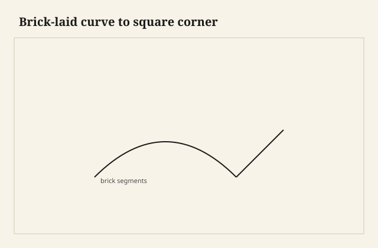
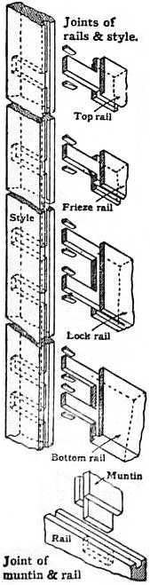

The blank was a staircase of short boards, glued into a quarter-circle, the brick-laid trick you use when a solid would be a propeller and a thin lamination would be a veneer of a curve. I had a corner to make: this radius had to meet a straight case side. People try to dovetail the last brick as if it were a drawer side. Sometimes that works. Sometimes the last brick is 7/8 of end grain and a glue line, and the tail you cut is a wish.

<figure class="faj-figure">
  
  <figcaption><strong>Figure 1.</strong> Brick-laid curve to square corner. Pack schematic (CC0).</figcaption>
</figure>

<figure class="faj-figure faj-museum">
  
  <figcaption><strong>Figure 2.</strong> Brick-laid curves meet square joinery; a joints plate is the honest classroom before the gouge. (<a href="https://commons.wikimedia.org/wiki/File%3AEB1911_Joinery_-_Fig._12.%E2%80%94Joints.jpg">Wikimedia Commons</a> — Public domain).</figcaption>
</figure>

<figure class="faj-figure faj-shop-pending">
  
  <figcaption><strong>Photo 3 (pending).</strong> The radius is a stack of bricks. The corner is still a board if you left one. Keith BBF shop library — unpublished; photographer unnamed until file metadata is pulled Slot: D:\BBF\BBF Photos — brick-laid curve meeting a square corner or dovetail (filename pending shop pull)</figcaption>
</figure>

Brick-laying is curved-work religion. I put this essay in the hybrid pile because the *failure* I care about is the corner: where the stack has to become joinery, not just a shape you carve.

## What a brick-laid curve is

Short lengths, grain running around the bend as much as you can afford, stacked like voussoirs, faces glued, then carved or turned to a fair radius. Pedestals, a heavy apron at a rounded corner, a clock-case hood, a bow that is too thick to laminate honestly. The glue surface is huge. The movement is a committee. The show face, after you carve it, looks like one piece if you matched the grain and if you are lucky.

It is not steam. It is not a bent lamination. Those are other pieces. Bricks are for thickness.

## Leave a brick that can be a joint

If the curve must dovetail to a straight side, I start the stack with a longer brick — a real board — at the end that will be the pin board or the tail board. That end brick is not carved down to a sliver. It keeps thickness and it keeps long grain in the direction the tails want. The carved radius dies *before* the baseline.

If you carve first and join second, you will be cutting pins in a surface that is already a sculpture. Sculpture does not sit well against a marking gauge.

<figure class="faj-figure faj-shop-pending">
  
  <figcaption><strong>Photo 4 (pending).</strong> Leave a brick that can be a pin board. Do not carve the joint away and then look surprised. Keith BBF shop library — unpublished; photographer unnamed until file metadata is pulled Slot: D:\BBF\BBF Photos — bricklaid blank before carving, corner stock left long (filename pending shop pull)</figcaption>
</figure>

A sliding dovetail into the end of a brick stack is ruder. You may be sliding into glue lines. I prefer a floating tenon or a real mortise in that leftover long-grain brick, or I hide a spline in a saw kerf that crosses several bricks and I call it a millwork corner. Dovetails want a board. Give them one.

## Glue lines in the saw

When you must cut teeth in the stack, keep sockets off the glue lines if you can. A chisel that hits a glue line will skate or it will pick. Either way the wall is ugly. Stagger the bricks so a glue line does not run with a pin cheek.

Hide glue between bricks is reversible and slow. PVA is what most shops use and then they live with it. I use PVA for bricks because the clamp time on a stack is already a day, and I do not want a hide joint creeping in a stack of twenty. [VERIFY] whatever the shop actually reaches for before a caption names a bottle.

## Fairing after the joint

I dry-fit the corner, then I fair the radius through the joint so the curve does not flatten at the teeth. A flattening at the joint is the tell that this was bricks. You can leave the tell if the piece is honest. You can fair it if the piece is a pedestal that wants to be a column. Fairing after glue means you will cut into the pin a little. Design the pin to afford that, or fair almost all the way, glue, then kiss the joint with a spokeshave and stop.

## When to refuse the dovetail

A tight radius with thin bricks: refuse. Use a spline, a loose tenon, or make the corner a mitered brick and a hidden bolt if the piece is a pedestal that knocks down. Knockdown is later in this pack. A brick-laid pedestal that unscrews from a block is often the more serious joint than teeth in a glue stack.

## Failures

I dovetailed the last thin brick. The tail was half glue. It sheared in the dry-fit. I added a long brick on the remake and I carved less at the end. The curve is slightly flatter at the corner. I like it better. It looks like a board meeting a bend, which is what happened.

I also faired through a glued corner and opened a pin cheek. The gap was a dark hair on an otherwise pretty radius. I left it. Filling a pin cheek on a show pedestal is a different lie than a crescent on a knife-edge drawer. Still a lie. Fair less.

## Cauls that know a quarter-circle

The stack wants even pressure, not a C-clamp on the pretty face. I bandsaw a pair of outer cauls to the outside radius plus a little, and I line them with cork so a brick cannot print a flat. The inner caul is a plywood rib with the inside curve. Strap clamps around that sandwich pull the voussoirs home. A single bar clamp across a quarter-circle is a clamp that only knows two bricks.

I stagger the vertical joints the way a mason staggers a wall. A stack that is a set of rings with all the verticals lined up is a column with perforations. When a pin cheek has to exist, I want that cheek in one brick, not on a glue plane. I dry-stack with chalk ticks on the edges so I can see the stagger before I wet anything. July in this shop is a race against skinning. I glue in smaller lifts — four or five bricks, wait, then the next lift — rather than butter twenty and watch the first ones skin while I am still aligning the last.

Overnight is cheaper than a banana. I do not carve a loaf that is still creeping. A creeping glue line in a corner brick is a radius that flattens at the teeth before you have touched a gouge.

## The shear I recut

The first practice corner was a clock-hood sample in walnut, shop only. I carved the radius all the way to the end because the drawing looked prettier that way. The last brick was a sliver. I laid out tails on it anyway. In the dry-fit the tail sheared along the glue line with a sound like a postage stamp tearing. I kept the straight case side. I remade the stack with an end board eight inches longer than a voussoir, grain running the way tails like. I carved the radius down to that board and I stopped. The board took pins. The curve stopped being a sculpture one inch before the baseline.

I checked that leftover board with winding sticks before I marked a single tail. A brick loaf can wind if one lift was clamped harder than the next. A twisted pin board on a straight case side is a gap that walks from rim to floor. I planed the leftover board true to the case’s world, not true to the carved radius. The radius can take a kiss later. The pin board cannot take a sculpture’s twist.

When I have to cross a glue line with a chisel, I pare in short bites and I do not pry. A pry on a glue line is a chip that is two species of stubborn. I would rather leave a tiny step I can sand after glue than open a cheek I will be tempted to fill.

## Movement in a committee

A brick-laid corner in South Arkansas is not one board shrinking. Each voussoir has its own grain direction, more or less around the bend, and the leftover pin board is a normal slab that wants to move across its width like any case side. In a dry January the pin board shrinks; the carved radius, being a stack, shrinks in smaller arguments. The tell is a hair at the baseline where board meets bend. I do not glue a spline across that meeting and hope. I leave the fairing able to hide a hair, or I accept the tell as honest.

I will not veneer a brick corner to hide a starved line and then dovetail through the veneer. Veneer on a pin wall is a chip with a species name. Oil will find the glue anyway. A quiet stripe can read as coopering. A cloudy stripe is starved. Recut the lift; do not stain a second lie.

If I cannot afford the leftover board, I do not dovetail the stack. I cut a spline kerf that crosses three bricks, or I loose-tenon into the long-grain leftover I *can* afford, or I bolt the curve to a block. The hybrid topic exists so I can say no.

## What I want from D:\BBF

The stack before the gouge, the long end brick obvious, chalk ticks showing the stagger. The outer caul and strap on a quarter-circle. The meeting after: a board and a bend, baseline visible, no tail sitting on a glue plane. A winding-stick check on the leftover board. Filename pending a real pull. I do not need a photograph of the sheared sliver. I already remember the sound.

## Next time

Bricks make thickness into a curve. The corner is where I decide whether furniture or sculpture wins. I leave a board that can take teeth, or I pick a joint that can take a glue stack. I wait until the loaf has stopped creeping. I fair almost, I glue, I kiss, and I stop before I open a cheek. The radius can look carved. The corner should still look built — because that is what it is, a board I refused to carve away.
